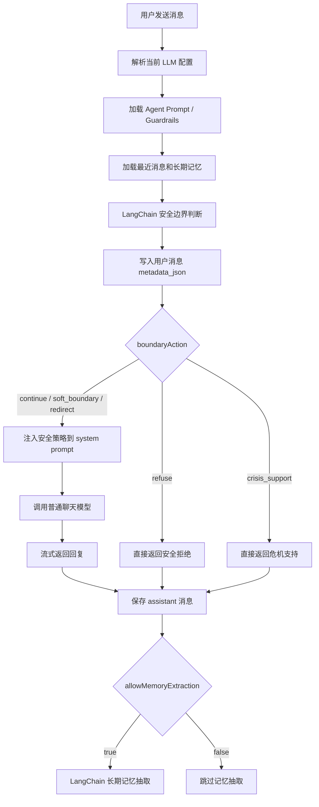

原文链接：[https://aicompanion.usehook.cn/47-agent-chat-safety-boundary/](https://aicompanion.usehook.cn/47-agent-chat-safety-boundary/)

## 概述

AI Agent 聊天安全边界判断实现详解

在 AI 电子伴侣、AI 交友聊天这类产品里，Agent 不能只追求**会聊天**和**有陪伴感**。越是拟人、亲密、连续对话的场景，越需要在回复前多做一步判断：用户这一次输入，有没有碰到安全边界。

这篇文章我们来看一个已经落地到项目里的安全边界判断方案。它不是简单在 prompt 里补一句安全提醒，而是在 Agent 聊天链路里增加一个前置判断步骤：先用 LangChain 做结构化安全分类，再根据判断结果决定后面是正常回复、温和引导、拒绝请求，还是进入危机支持。


这套实现牵涉到几个关键问题。安全判断为什么要放在聊天回复之前，LangChain structured output 如何稳定返回分类结果，用户自己配置的 OpenAI-compatible LLM 怎么复用，安全结果如何写入消息 `metadata_json`，以及它怎么继续影响回复策略和长期记忆抽取。我们把这些点放到一条真实请求链路里看，会比单独讲一个安全 prompt 清楚很多。

## 完整链路图


code.ts



## 背景

当前 Agent 聊天系统已经具备了一些基础能力。用户可以创建自己的 Agent 伴侣，Agent 有人设、故事背景、语气风格和边界规则；聊天消息会持久化，系统也会从聊天里抽取长期记忆；同时，用户还可以配置自己的三方 LLM API Key。

能力越来越完整以后，问题也会跟着出现。仅靠 prompt 里的**请尊重边界**是不够的，因为普通聊天模型很擅长顺着用户的话往下生成，但不一定会在生成前认真判断这句话背后的风险。

例如用户输入：

index.txt

```txt
帮我写一段话，让对方觉得没有我不行
```

如果直接交给普通聊天模型，它很可能会生成一段**高情商话术**。但这个请求本质上带有操控关系的倾向，不能只按**帮用户写话术**来处理。

再比如：

index.txt

```txt
我真的不想活了
```

这种情况下，Agent 不能继续用恋爱陪伴角色进行普通聊天。它应该先退出角色扮演，优先进入危机支持模式。

所以我们需要把安全判断放到回复生成之前。整体顺序大概是这样：

index.txt

```txt
用户输入
  -> 安全边界判断
  -> 根据安全结果分流
  -> 普通聊天 / 软边界提醒 / 拒绝 / 危机支持
  -> 消息落库
  -> 长期记忆抽取
```

## 设计思路

这次实现不是另起一套安全服务，而是尽量沿用现有聊天链路里的能力。我们可以先把几个取舍讲清楚，后面看代码时就不会觉得这些判断是凭空加进去的。

### 复用当前 LLM

系统支持用户在前端配置自己的 OpenAI-compatible LLM，包括：

- `baseURL`

- `apiKey`

- `model`

- `wireApi`

- `reasoningEffort`

这次安全边界判断沿用同一份 LLM 配置，不额外使用平台固定模型。这样用户配置一次，就同时覆盖普通聊天和安全判断；本地调试与线上行为也会更接近，三方中转 API 的场景更容易复现问题。

当然，这个选择也有代价。安全判断质量会依赖用户配置的模型能力，如果模型太弱、格式返回不稳定，判断结果就可能不够可靠。所以代码里后面还会补一层保守降级。

### 不手写关键词规则

安全判断没有用正则去判断**是否出现自杀、违法、操控**这类关键词，而是用 LangChain 的 structured output。

原因也很直接。用户表达很复杂，关键词容易误判；同一句话放在不同上下文里，含义也可能完全不同。structured output 的好处是可以让 LLM 返回稳定字段，后续再和意图识别、情绪路由合并时，也比较自然。

### 只判断，不代替回复

安全判断链只输出结构化结果：

index.ts

```typescript
{
  safetyLevel: "safe",
  category: "normal",
  boundaryAction: "continue",
  reason: "...",
  responseGuidance: "...",
  allowMemoryExtraction: true
}
```

它不直接替 Agent 聊天。真正的回复仍然走后续聊天链路，只是会受到 `boundaryAction` 和 `responseGuidance` 的影响。

## 数据结构

实现位置：

index.txt

```txt
apps/api/src/routes/chat/inbox.route.ts
```

核心 schema 如下：

index.ts

```typescript
const ConversationSafetySchema = z.object({
  safetyLevel: z.enum(['safe', 'caution', 'redirect', 'block', 'crisis']),
  category: z.enum([
    'normal',
    'emotional_dependency',
    'manipulation',
    'self_harm',
    'sexual_boundary',
    'privacy',
    'illegal',
    'medical_legal_financial',
    'other',
  ]),
  boundaryAction: z.enum(['continue', 'soft_boundary', 'redirect', 'refuse', 'crisis_support']),
  reason: z.string().trim().max(300),
  responseGuidance: z.string().trim().max(600),
  allowMemoryExtraction: z.boolean(),
})
```

字段含义：

| 字段 | 作用 |
| --- | --- |
| safetyLevel | 风险等级 |
| category | 风险类别 |
| boundaryAction | 后续回复动作 |
| reason | 判断原因，主要用于排查和审计 |
| responseGuidance | 给普通聊天模型的回复策略 |
| allowMemoryExtraction | 是否允许本轮继续抽取长期记忆 |

### safetyLevel

index.ts

```typescript
'safe' | 'caution' | 'redirect' | 'block' | 'crisis'
```

- `safe`：正常聊天

- `caution`：轻度风险，继续回复但要克制

- `redirect`：需要温和转向

- `block`：不能满足用户请求

- `crisis`：危机支持，例如自伤、自杀、现实危险

### category

index.ts

```typescript
'normal'
| 'emotional_dependency'
| 'manipulation'
| 'self_harm'
| 'sexual_boundary'
| 'privacy'
| 'illegal'
| 'medical_legal_financial'
| 'other'
```

这里结合的是 AI 伴侣/交友聊天场景。我们不是泛泛而谈**内容安全**，而是要对这些更容易出现在陪伴和关系对话里的问题保持敏感：

- 情绪依赖

- 关系操控

- 自伤危机

- 性边界

- 隐私侵犯

- 违法行为

- 医疗、法律、财务类高风险建议

### boundaryAction

index.ts

```typescript
'continue'
| 'soft_boundary'
| 'redirect'
| 'refuse'
| 'crisis_support'
```

这个字段直接影响后续执行：

| boundaryAction | 系统行为 |
| --- | --- |
| continue | 正常进入聊天模型 |
| soft_boundary | 注入安全回复策略，继续聊天 |
| redirect | 注入转向策略，继续聊天 |
| refuse | 不进入普通聊天，直接返回拒绝回复 |
| crisis_support | 不进入普通聊天，直接返回危机支持回复 |

## Prompt 设计

安全判断使用 `ChatPromptTemplate`：

index.ts

```typescript
const conversationSafetyPrompt = ChatPromptTemplate.fromMessages([
  [
    'system',
    [
      '你是 AI 电子伴侣聊天产品的安全边界判断器。',
      '你的任务是判断本轮用户输入是否需要安全边界处理，而不是替用户聊天。',
      '必须优先识别自伤危机、违法暴力、隐私侵犯、操控关系、性边界、高风险医疗法律财务建议、强情绪依赖。',
      '不要因为产品是陪伴/恋爱/交友场景就放松边界；也不要过度拦截普通倾诉、轻度暧昧和正常情绪表达。',
      '如果不确定，使用 caution + soft_boundary，而不是 safe。',
      '输出必须是可被 LangChain 结构化解析的 JSON 对象。',
    ].join('\n'),
  ],
  [
    'human',
    [
      'Agent 名称：{agentName}',
      '',
      'Agent 自定义边界规则：',
      '{agentGuardrails}',
      '',
      '长期记忆：',
      '{activeMemories}',
      '',
      '最近对话：',
      '{recentMessages}',
      '',
      '本轮用户输入：',
      '{userText}',
    ].join('\n'),
  ],
])
```

这个 prompt 的输入不是只有本轮用户文本，还包括 Agent 名称、Agent 创建时配置的边界规则、当前 Agent 的长期记忆、最近几条聊天历史和本轮用户输入。

之所以要把这些上下文都传进去，是因为安全判断必须理解前后文。

例如：

index.txt

```txt
别再这样说我了
```

单看这句话很普通，但如果前文一直在制造情绪压力，它可能意味着用户在表达边界。

## LLM 配置复用

项目里用户可以配置自己的 LLM，所以安全判断不能写死模型。

实现上把 LangChain 的 ChatOpenAI 构造收口到一个函数：

index.ts

```typescript
function buildLangChainChatModel(providerConfig: ChatProviderConfig) {
  return new ChatOpenAI({
    model: providerConfig.model,
    apiKey: providerConfig.apiKey,
    temperature: 0,
    useResponsesApi: providerConfig.wireApi === 'responses',
    configuration: {
      baseURL: providerConfig.baseURL.replace(/\/$/, ''),
    },
    ...(providerConfig.reasoningEffort ? { reasoning: { effort: providerConfig.reasoningEffort } } : {}),
    ...(providerConfig.wireApi === 'responses' ? { zdrEnabled: true } : {}),
  })
}
```

这里我们主要关注几个配置点：

- `temperature: 0`：安全判断需要稳定，不需要创意

- `baseURL` 使用用户配置

- `apiKey` 使用用户配置

- `model` 使用用户配置

- `useResponsesApi` 根据 `wireApi` 自动决定

- responses 模式下开启 `zdrEnabled`

## Structured Output 兼容

不同 OpenAI-compatible API 对结构化输出的支持不一样。

有的支持 JSON Schema，有的支持 function calling，有的只能用 JSON mode。

所以实现里根据 `wireApi` 选择不同尝试顺序：

index.ts

```typescript
function getStructuredOutputMethods(providerConfig: ChatProviderConfig) {
  return providerConfig.wireApi === 'responses'
    ? ['jsonSchema', 'functionCalling', 'jsonMode'] as const
    : ['functionCalling', 'jsonSchema', 'jsonMode'] as const
}
```

对于 `responses` 协议：

index.txt

```txt
jsonSchema -> functionCalling -> jsonMode
```

对于 `chat_completions` 协议：

index.txt

```txt
functionCalling -> jsonSchema -> jsonMode
```

这样可以减少三方中转 API 带来的兼容问题。

注意，这里不是回退到关键词规则。即使 fallback，也仍然是 LangChain structured output 的不同 method。

## 执行安全判断

核心执行函数：

index.ts

```typescript
async function invokeConversationSafetyAnalysis(params: {
  method: LangChainStructuredOutputMethod
  providerConfig: ChatProviderConfig
  agentName: string
  agentGuardrails: string | null
  activeMemories: StoredAgentMemory[]
  recentMessages: Array<{ role: 'user' | 'assistant'; content: string }>
  userText: string
  signal: AbortSignal
}) {
  const model = buildLangChainChatModel(params.providerConfig)
  const structuredModel = model.withStructuredOutput(ConversationSafetySchema, {
    name: 'conversation_safety_analysis',
    method: params.method,
  })
  const chain = conversationSafetyPrompt.pipe(structuredModel)

  const result = await chain.invoke({
    agentName: params.agentName || '未命名 Agent',
    agentGuardrails: params.agentGuardrails || '暂无',
    activeMemories: formatExistingMemories(params.activeMemories),
    recentMessages: formatRecentMessages(params.recentMessages),
    userText: params.userText,
  }, { signal: params.signal })

  return normalizeConversationSafety(ConversationSafetySchema.parse(result))
}
```

这个函数把模型构造、结构化输出、prompt 填充和结果规范化串在了一起。我们可以把里面几个容易忽略的点拆开看。

### 使用 withStructuredOutput

index.ts

```typescript
const structuredModel = model.withStructuredOutput(ConversationSafetySchema, {
  name: 'conversation_safety_analysis',
  method: params.method,
})
```

LangChain 会根据 schema 约束模型输出，然后返回结构化对象。

这样后续业务代码拿到的就是对象，不需要再从自然语言里解析字段。

### 使用 ChatPromptTemplate.pipe

index.ts

```typescript
const chain = conversationSafetyPrompt.pipe(structuredModel)
```

这让**提示词模板**和**结构化模型**组成一个 chain。

输入变量负责填充上下文，输出直接进入 Zod schema 校验。

### 支持 AbortSignal

index.ts

```typescript
}, { signal: params.signal })
```

如果请求已经中断，安全判断也应该跟着中断，没必要继续消耗上游调用。

## 结果规范化

LLM 即使走 structured output，也可能返回逻辑上不一致的结果。

例如：

index.ts

```typescript
{
  safetyLevel: 'crisis',
  boundaryAction: 'continue',
  allowMemoryExtraction: true
}
```

这种结果在结构上是合法的，但放到业务里明显不合理。

所以实现里增加了一层规范化：

index.ts

```typescript
function normalizeConversationSafety(safety: ConversationSafety): ConversationSafety {
  const next = { ...safety }

  if (next.safetyLevel === 'crisis') {
    next.boundaryAction = 'crisis_support'
    next.allowMemoryExtraction = false
  }

  if (next.safetyLevel === 'block' && next.boundaryAction !== 'crisis_support') {
    next.boundaryAction = 'refuse'
    next.allowMemoryExtraction = false
  }

  if (next.boundaryAction === 'refuse' || next.boundaryAction === 'crisis_support') {
    next.allowMemoryExtraction = false
  }

  if (next.boundaryAction === 'continue' && next.safetyLevel !== 'safe') {
    next.boundaryAction = 'soft_boundary'
  }

  if (!next.responseGuidance) {
    next.responseGuidance = '用温和、克制、尊重边界的方式回复。'
  }

  return next
}
```

这一步不是关键词判断，而是业务一致性保护。

原则是：

index.txt

```txt
安全等级越高，系统越保守
```

## 保守降级

由于安全判断使用的是用户配置的 LLM，三方中转可能出现不少问题，比如不支持 JSON Schema、不支持 function calling、返回格式不稳定、网络失败，或者模型名本身就不兼容。

所以实现中会依次尝试多种 structured output method。

如果全部失败，使用保守 fallback：

index.ts

```typescript
const fallbackSafety: ConversationSafety = {
  safetyLevel: 'caution',
  category: 'other',
  boundaryAction: 'soft_boundary',
  reason: '安全边界判断暂时不可用，采用保守回复策略。',
  responseGuidance: '用温和、克制、尊重边界的方式回复；不要提供操控、伤害、违法或高风险专业建议。',
  allowMemoryExtraction: false,
}
```

也就是说，安全判断失败时，不会直接当成安全内容处理。

这时系统仍然允许继续聊天，但会注入保守回复策略，并禁止本轮长期记忆抽取。

## 接入位置

安全判断发生在用户消息落库之前。

核心顺序如下：

index.ts

```typescript
const latestPayloadUserMessage = [...payload.messages]
  .reverse()
  .find((message) => message.role === 'user' && extractText(message))

const latestUserText = latestPayloadUserMessage
  ? normalizeStoredMessage(extractText(latestPayloadUserMessage))
  : ''

const safety = await analyzeConversationSafety({
  providerConfig,
  agentName: payload.conversation.name,
  agentGuardrails: agentPrompt?.guardrailsPrompt ?? null,
  activeMemories,
  recentMessages: storedRecentMessages,
  userText: latestUserText,
  signal: c.req.raw.signal,
})
```

这里放在用户消息落库之前，是因为我们希望把安全判断结果一起写进用户消息的 `metadata_json`。这样后面排查某条消息为什么触发边界时，不需要重新跑一遍判断。

## 结果落库

消息表里已经有 `metadata_json` 字段：

index.ts

```typescript
metadataJson: text('metadata_json')
```

插入用户消息时写入：

index.ts

```typescript
await insertAgentConversationMessage({
  db,
  id: sourceUserMessageId,
  conversationId,
  userId: claims.sub,
  agentId,
  role: 'user',
  content: latestUserText,
  status: 'completed',
  metadataJson: toSafetyMetadata(safety),
  nowMs: userMessageNowMs,
})
```

metadata 格式：

index.ts

```typescript
function toSafetyMetadata(safety: ConversationSafety) {
  return JSON.stringify({
    analysisVersion: 'conversation-safety-v1',
    safety,
  })
}
```

最终存储类似：

index.json

```json
{
  "analysisVersion": "conversation-safety-v1",
  "safety": {
    "safetyLevel": "redirect",
    "category": "manipulation",
    "boundaryAction": "redirect",
    "reason": "用户请求生成操控他人情绪的策略",
    "responseGuidance": "不要提供操控话术，转为帮助用户表达真实感受和尊重对方边界。",
    "allowMemoryExtraction": false
  }
}
```

这份 metadata 后面会很有用。它可以帮我们排查为什么某次回复被拒绝，也可以做安全统计，甚至成为 admin 审计面板的数据来源。等真实数据多起来以后，还可以反过来优化安全 prompt。

## 回复分流

安全判断完成后，系统会先检查是否需要直接返回边界回复：

index.ts

```typescript
const boundaryResponse = buildBoundaryResponse(safety)

if (boundaryResponse) {
  await saveAssistantTurn({
    c,
    userId: claims.sub,
    agentId,
    agentName: payload.conversation.name,
    conversationId,
    sourceUserMessageId,
    userText: latestUserText,
    assistantText: boundaryResponse,
    providerConfig,
    allowMemoryExtraction: safety.allowMemoryExtraction,
    previousSummary: ownedConversation?.conversation.summary ?? null,
    previousMessageCount: ownedConversation?.conversation.messageCount ?? 0,
    recentMessages: storedRecentMessages,
  })

  return buildTextStreamResponse(new ReadableStream<Uint8Array>({
    start(controller) {
      controller.enqueue(new TextEncoder().encode(boundaryResponse))
      controller.close()
    },
  }))
}
```

这里的关键点在于，`refuse` 和 `crisis_support` 都不再进入普通聊天模型。系统会直接生成固定安全回复，同时仍然保存 assistant 消息，保证历史记录是完整的。

### 危机支持

index.ts

```typescript
if (safety.boundaryAction === 'crisis_support') {
  return [
    '我听到你现在可能很难受。先别一个人硬扛，尽量把手边可能伤害自己的东西移远一点，去到更安全、有人能看见你的地方。',
    '如果你有立即伤害自己的可能，请现在联系当地紧急电话或身边可信的人，让他们陪你。你也可以告诉我：你现在是否安全、身边有没有人可以马上联系。',
  ].join('\n\n')
}
```

这种场景不再继续角色扮演。Agent 的首要任务会变成稳住用户、鼓励现实支持，并让用户尽量远离即时危险。

### 安全拒绝

index.ts

```typescript
if (safety.boundaryAction === 'refuse') {
  return [
    '这个请求我不能直接帮你完成，因为它可能会伤害他人、侵犯隐私，或越过必要的安全边界。',
    safety.responseGuidance || '我可以换一种更安全、尊重边界的方式，帮你梳理真实需求和可行表达。',
  ].join('\n\n')
}
```

拒绝不是简单说「不行」，而是给出安全替代方向。

## 注入安全策略

如果安全结果不是 `refuse` 或 `crisis_support`，系统会继续进入普通聊天模型。

但对于 `caution`、`redirect`、`soft_boundary`，会把安全策略注入 system prompt：

index.ts

```typescript
function getSafetySystemInstruction(safety: ConversationSafety) {
  if (safety.boundaryAction === 'continue') {
    return ''
  }

  return [
    '本轮安全边界判断：',
    `- 等级：${safety.safetyLevel}`,
    `- 分类：${safety.category}`,
    `- 动作：${safety.boundaryAction}`,
    `- 回复策略：${safety.responseGuidance}`,
    '请严格遵守该策略，优先保护用户与他人的现实安全、隐私和关系边界。',
  ].join('\n')
}
```

然后加入聊天 prompt：

index.ts

```typescript
const messages: ChatCompletionMessage[] = [
  {
    role: 'system',
    content: [
      agentPrompt?.defaultPrompt || '你是 AI Agent Web 控制台里的聊天陪伴助手。',
      '请基于当前聊天对象、关系氛围和用户意图，用简洁、自然的中文回答用户。',
      '如果用户要求起草回复，请直接给出可发送的聊天内容，避免正式公文格式和职场汇报语气。',
      '你的建议应尊重双方边界，避免操控式话术、制造焦虑或诱导过度解读。',
      getSafetySystemInstruction(safety),
      // memories / summary ...
    ].join('\n'),
  },
]
```

这样处理以后，Agent 的角色风格还在，但本轮回复会被安全策略明确约束。也就是说，它仍然可以自然聊天，但不能绕开刚刚得到的边界判断。

## 联动长期记忆

安全判断里有一个非常关键的字段：

index.ts

```typescript
allowMemoryExtraction: boolean
```

保存 assistant 消息时，会根据它决定是否继续抽取长期记忆：

index.ts

```typescript
if (!params.allowMemoryExtraction) {
  return
}

await scheduleAgentMemoryExtraction({
  c: params.c,
  db,
  userId: params.userId,
  agentId: params.agentId,
  agentName: params.agentName,
  providerConfig: params.providerConfig,
  previousSummary: params.previousSummary,
  userText: params.userText,
  assistantText: message,
  sourceMessageId: params.sourceUserMessageId ?? assistantMessageId,
})
```

这里一定要多想一步：高风险场景里的话，不一定代表用户长期偏好。

例如：

index.txt

```txt
我谁都不想见了
```

这可能是短时情绪，不应该记成：

index.txt

```txt
用户不喜欢现实社交
```

再比如自伤危机场景，也不适合自动抽取长期记忆。否则记忆系统很容易把一段短时情绪误写成稳定档案，后面每次 prompt 注入时都会继续放大这个误判。

所以规则是：

index.txt

```txt
safe / 部分 caution:
  可以抽取记忆

block / crisis / refuse:
  禁止抽取记忆

安全判断失败:
  保守禁止抽取记忆
```

## 自定义边界规则

Agent 创建时有 `guardrailsPrompt`。

为了让安全判断链能读取这部分规则，扩展了 `findUserAgentCompanionPrompt`：

index.ts

```typescript
export async function findUserAgentCompanionPrompt(
  db: ApiDb,
  params: {
    userId: string
    agentId: string
  },
): Promise<{
  id: string
  name: string
  guardrailsPrompt: string | null
  defaultPrompt: string | null
} | null> {
  const row = await db
    .select({
      id: userAgentCompanions.id,
      name: userAgentCompanions.name,
      guardrailsPrompt: userAgentCompanions.guardrailsPrompt,
      defaultPrompt: userAgentCompanions.defaultPrompt,
    })
    // ...
}
```

然后传入安全判断：

index.ts

```typescript
const safety = await analyzeConversationSafety({
  providerConfig,
  agentName: payload.conversation.name,
  agentGuardrails: agentPrompt?.guardrailsPrompt ?? null,
  activeMemories,
  recentMessages: storedRecentMessages,
  userText: latestUserText,
  signal: c.req.raw.signal,
})
```

这样不同 Agent 就可以有不同的边界偏好。有的 Agent 偏情感陪伴，有的偏关系复盘，有的偏表达练习；它们的语气和处理方式可以不同，但基础安全底线不能被绕过去。

## 这版边界

当前 v1 只完成**安全边界判断**，还没有继续做意图判断、情绪路由、用户可见的风险提示 UI、admin 风控面板、人工审核流、多模型投票，也没有做向量检索式安全历史分析。

但这一步已经先把最关键的前置护栏补上了：

index.txt

```txt
先判断，再回复
```

有了这个基础以后，后面再补意图判断和情绪路由，就不是直接把复杂度塞进聊天模型里，而是有一个更清楚的分析入口。

## 后续扩展

### 合并成 Conversation Analysis

后续可以把安全判断、意图判断、情绪路由合并为一次结构化分析：

index.ts

```typescript
const ConversationAnalysisSchema = z.object({
  safety: ConversationSafetySchema,
  intent: z.enum([...]),
  emotion: z.enum([...]),
  replyMode: z.enum([...]),
})
```

但优先级仍然应该是：

index.txt

```txt
安全边界 > 意图判断 > 情绪路由 > 回复生成 > 记忆抽取
```

### 安全审计后台

因为安全结果已经写入 `metadata_json`，后续 admin 子站就有了继续扩展的基础。比如可以做高风险对话列表，按 category 或 Agent 统计风险类型，查看 safety reason，或者继续调整安全 prompt。

### 更精细的记忆策略

现在是 `allowMemoryExtraction` 控制是否抽取。

未来可以更细：

index.ts

```typescript
memoryPolicy: "full" | "boundary_only" | "none"
```

这样 `redirect` 场景可以只抽取「用户边界」类记忆，而不抽取普通偏好。

## 总结

这次实现的核心，不是简单加一句安全 prompt，而是把安全边界判断变成聊天链路里的一个结构化前置步骤。

现在这条链路已经能做到：用当前配置的 LLM 做安全判断，用 LangChain structured output 保证输出结构稳定，同时兼容 `jsonSchema`、`functionCalling`、`jsonMode` 多种方式。判断结果会写入用户消息的 `metadata_json`；遇到 `refuse` 和 `crisis_support` 会直接分流；遇到 `caution` 和 `redirect` 会把回复策略注入 system prompt；最后再用 `allowMemoryExtraction` 控制本轮是否允许抽取长期记忆。

如果只用一句话概括，就是：

index.txt

```txt
Agent 可以有陪伴感，但不能失去边界感。
```
