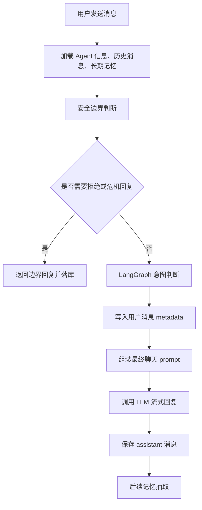
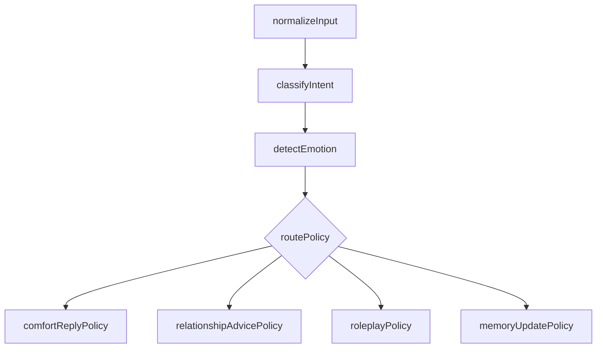

原文链接：[https://aicompanion.usehook.cn/48-agent-chat-intent-langgraph/](https://aicompanion.usehook.cn/48-agent-chat-intent-langgraph/)

## 概述

AI 电子伴侣聊天中的意图识别：用 LangChain 和 LangGraph 落地

在 AI 电子伴侣产品里，用户发来的一句话往往不只是**问问题**。同样一句**我今天好累**，可能是在求安慰，也可能只是想继续聊下去；可能是在表达现实生活里的压力，也可能希望 Agent 主动关心一下，甚至希望系统记住自己最近的状态。

如果聊天系统直接把用户输入丢给大模型，模型通常也能回复，但回复策略会摇摆不定。有时像客服，有时像心理咨询，有时又急着给一大段建议。对 AI 电子伴侣来说，我们可以在真正回复之前先做一层意图识别，把用户当前更需要什么分析出来，再把这个结果作为隐藏策略注入最终回复。

这篇文章我们就把这套已经落地的实现梳理一下：在 API 子站聊天接口中，用 **LangChain 结构化输出** 做意图分类，用 **LangGraph** 编排意图判断流程，把结果写入聊天消息 `metadata_json`，最后再注入到 Agent 回复 prompt 中。

## 目标

这次不是要重做一个复杂的智能体系统，而是在现有聊天链路里补一层轻量、稳定的对话理解。请求进来以后，危险内容先由安全边界拦住；安全通过的消息再进入 LangGraph 意图识别流程；模型通过 LangChain `withStructuredOutput` 输出稳定 JSON；识别结果既会写入用户消息 `metadata_json`，方便后续分析和调试，也会进入最终聊天 prompt，让 Agent 的回应更贴近陪伴场景。

整体链路可以这样看：

code.ts



## 先过安全边界

安全边界和意图判断解决的是两类问题。

安全边界先判断的是：这句话能不能继续聊，应该怎么限制。例如自伤危机、违法请求、隐私侵犯、操控关系等场景，系统必须先保护用户和他人。

意图判断再分析的是：这句话希望 Agent 怎样回应。例如用户是想要安慰、建议、暧昧互动、角色扮演，还是想调整 Agent 的说话方式。

所以落地顺序是：

- 先做安全边界判断。

- 如果安全边界要求 `refuse` 或 `crisis_support`，直接返回边界回复。

- 如果可以继续聊天，再进入意图判断。

这样处理可以避免一个真实问题：当用户输入本身高风险时，系统还在认真分析**用户是不是想要情绪陪伴**，从而冲淡安全策略。

## 依赖接入

API 子站新增了 LangGraph 依赖：

index.json

```json
{
  "dependencies": {
    "@langchain/core": "^1.1.48",
    "@langchain/langgraph": "^1.4.1",
    "@langchain/openai": "^1.4.7"
  }
}
```

这三个包的分工很清楚。`@langchain/core` 提供 prompt、runnable 等基础能力；`@langchain/openai` 负责兼容 OpenAI 协议和 Responses 协议的聊天模型调用；`@langchain/langgraph` 则负责把意图判断拆成更容易维护的图节点。

本次没有新增 D1 迁移，因为之前聊天消息表已经有 `metadata_json` 字段，可以直接保存分析结果。

## 意图分类设计

AI 电子伴侣不是客服系统，因此意图分类不能停留在**问答、投诉、咨询**这种传统分类上。我们定义了一组更贴近陪伴、交友、恋爱互动的意图：

index.ts

```typescript
const CompanionIntentPrimarySchema = z.enum([
  'casual_chat',
  'emotional_support',
  'relationship_advice',
  'romantic_flirt',
  'companionship_presence',
  'roleplay',
  'life_sharing',
  'memory_update',
  'preference_setting',
  'agent_feedback',
  'conversation_repair',
  'date_or_activity_planning',
  'creative_request',
  'meta_question',
  'unclear',
])
```

为了方便后面使用，我们可以先按用途理解这些意图：

- 陪伴类：`casual_chat`、`companionship_presence`、`life_sharing`

- 情绪类：`emotional_support`、`conversation_repair`

- 关系类：`relationship_advice`、`romantic_flirt`

- 玩法类：`roleplay`、`creative_request`

- 配置类：`memory_update`、`preference_setting`、`agent_feedback`

- 兜底类：`meta_question`、`unclear`

这里要特别小心：不要把所有带情绪的输入都分类成**建议**。很多时候用户并不想听解决方案，只是想被接住。

## 结构化输出 Schema

意图判断不能只返回一个字符串，否则后面很难稳定使用。最终使用 Zod 定义完整结构：

index.ts

```typescript
const ConversationIntentSchema = z.object({
  primary: CompanionIntentPrimarySchema,
  secondary: z.array(CompanionIntentPrimarySchema).max(3),
  confidence: z.number().min(0).max(1),
  userNeed: z.enum([
    'be_heard',
    'be_comforted',
    'get_advice',
    'get_reply_draft',
    'play_along',
    'feel_connected',
    'set_boundary',
    'update_memory',
    'adjust_agent',
    'unknown',
  ]),
  requestedAgentAction: z.enum([
    'answer_directly',
    'comfort_first',
    'ask_follow_up',
    'draft_message',
    'analyze_situation',
    'roleplay_response',
    'remember_fact',
    'adjust_style',
    'repair_misunderstanding',
    'continue_topic',
  ]),
  relationshipSignal: z.enum([
    'neutral',
    'warming_up',
    'seeking_closeness',
    'testing_boundary',
    'feeling_hurt',
    'pulling_away',
    'dependency_risk',
    'conflict',
  ]),
  replyExpectation: z.object({
    depth: z.enum(['short', 'medium', 'deep']),
    warmth: z.enum(['low', 'medium', 'high']),
    directness: z.enum(['gentle', 'balanced', 'direct']),
    shouldAskQuestion: z.boolean(),
  }),
  shouldClarify: z.boolean(),
  clarifyingQuestion: z.string().trim().max(200).nullable(),
  promptGuidance: z.string().trim().max(600),
})
```

这个结构里不能只看 `primary`。`userNeed` 记录用户真正想被如何对待，`requestedAgentAction` 记录 Agent 应该采取什么回复动作，`relationshipSignal` 描述当前关系氛围是升温、疏远、冲突，还是依赖风险。`replyExpectation` 用来控制回复长度、温度和直接程度，`promptGuidance` 则给最终回复模型一段简短策略。

所以意图判断不只是**打标签**，它要直接服务后面的回复生成。

## Prompt 设计

意图判断的 prompt 会先把职责讲清楚：你不是来聊天的，而是来分析用户意图的。

核心 prompt 如下：

index.ts

```typescript
const conversationIntentPrompt = ChatPromptTemplate.fromMessages([
  [
    'system',
    [
      '你是 AI 电子伴侣聊天产品的意图识别器。',
      '你的任务不是回复用户，而是判断用户在当前亲密陪伴/交友聊天场景中的真实沟通意图。',
      '必须结合最近对话、长期记忆、Agent 人设边界和安全边界结果来判断。',
      '优先区分：普通闲聊、情绪陪伴、恋爱暧昧、角色扮演、生活分享、关系建议、记忆更新、偏好设置、对 Agent 的反馈、误会修复。',
      '不要把所有问题都归为关系建议；用户只是想被陪伴、被听见或维持互动时，要识别为陪伴类意图。',
      '当用户表达模糊但情绪明确时，先判断情绪和期待，再决定是否需要追问。',
      '输出必须是可被 LangChain 结构化解析的 JSON 对象。',
    ].join('\n'),
  ],
  [
    'human',
    [
      'Agent 名称：{agentName}',
      '',
      'Agent 自定义边界规则：',
      '{agentGuardrails}',
      '',
      '安全边界判断：',
      '{safety}',
      '',
      '长期记忆：',
      '{activeMemories}',
      '',
      '最近对话：',
      '{recentMessages}',
      '',
      '本轮用户输入：',
      '{userText}',
    ].join('\n'),
  ],
])
```

这里输入的不只有本轮用户文本，还包括 Agent 名称、Agent 自定义边界规则、当前安全边界结果、当前用户和 Agent 的长期记忆，以及最近聊天消息。上下文越完整，意图判断越不容易只看字面意思。

为什么要把安全边界结果也传进去？因为有些意图和风险是交织在一起的。例如用户明显出现强情绪依赖时，意图可能仍然是**寻求陪伴**，但最终回复不能强化依赖，需要更克制。

## LangChain 结构化输出

意图判断调用模型时，没有让模型自由输出文本，而是使用 `withStructuredOutput`：

index.ts

```typescript
async function invokeConversationIntentAnalysis(params: {
  method: LangChainStructuredOutputMethod
  providerConfig: ChatProviderConfig
  agentName: string
  agentGuardrails: string | null
  safety: ConversationSafety
  activeMemories: StoredAgentMemory[]
  recentMessages: Array<{ role: 'user' | 'assistant'; content: string }>
  userText: string
  signal?: AbortSignal
}) {
  const model = buildLangChainChatModel(params.providerConfig)
  const structuredModel = model.withStructuredOutput(ConversationIntentSchema, {
    name: 'conversation_intent_analysis',
    method: params.method,
  })
  const chain = conversationIntentPrompt.pipe(structuredModel)

  const result = await chain.invoke({
    agentName: params.agentName || '未命名 Agent',
    agentGuardrails: params.agentGuardrails || '暂无',
    safety: formatSafetyForPrompt(params.safety),
    activeMemories: formatExistingMemories(params.activeMemories),
    recentMessages: formatRecentMessages(params.recentMessages),
    userText: params.userText,
  }, params.signal ? { signal: params.signal } : undefined)

  return normalizeConversationIntent(ConversationIntentSchema.parse(result), params.safety)
}
```

这里我们可以多看两个细节。

第一，`withStructuredOutput` 仍然可能因为不同模型、不同中转协议支持度不同而失败，所以外层做了多方法重试。

index.ts

```typescript
function getStructuredOutputMethods(providerConfig: ChatProviderConfig) {
  return providerConfig.wireApi === 'responses'
    ? ['jsonSchema', 'functionCalling', 'jsonMode'] as const
    : ['functionCalling', 'jsonSchema', 'jsonMode'] as const
}
```

Responses 协议优先尝试 `jsonSchema`，Chat Completions 协议优先尝试 `functionCalling`。这样对不同三方中转 API 更友好。

第二，结构化输出之后仍然要再走一层 `normalizeConversationIntent`。不要完全相信模型输出，尤其是涉及置信度、追问和依赖风险时，代码层要继续兜底。

## LangGraph 编排

这次 LangGraph 先没有做复杂多分支，而是从一个轻量图开始：

index.ts

```typescript
const ConversationIntentState = Annotation.Root({
  providerConfig: Annotation<ChatProviderConfig>(),
  agentName: Annotation<string>(),
  agentGuardrails: Annotation<string | null>(),
  safety: Annotation<ConversationSafety>(),
  activeMemories: Annotation<StoredAgentMemory[]>(),
  recentMessages: Annotation<Array<{ role: 'user' | 'assistant'; content: string }>>(),
  userText: Annotation<string>(),
  normalizedInput: Annotation<string>(),
  intent: Annotation<ConversationIntent | null>(),
  signal: Annotation<AbortSignal | undefined>(),
})
```

图里目前只有两个节点。

第一个节点负责归一化用户输入：

index.ts

```typescript
function normalizeIntentInputNode(state: typeof ConversationIntentState.State) {
  return {
    normalizedInput: normalizeStoredMessage(state.userText),
  }
}
```

第二个节点负责调用 LangChain 意图识别：

index.ts

```typescript
async function classifyIntentNode(state: typeof ConversationIntentState.State) {
  const userText = state.normalizedInput || normalizeStoredMessage(state.userText)

  if (!userText) {
    return {
      intent: normalizeConversationIntent({
        ...fallbackIntent,
        primary: 'casual_chat',
        confidence: 0.7,
        userNeed: 'feel_connected',
        requestedAgentAction: 'continue_topic',
        shouldClarify: false,
        clarifyingQuestion: null,
        promptGuidance: '用户没有提供明确新内容时，轻柔延续当前话题，不要制造压力。',
      }, state.safety),
    }
  }

  return {
    intent: await classifyConversationIntentWithLangChain({
      providerConfig: state.providerConfig,
      agentName: state.agentName,
      agentGuardrails: state.agentGuardrails,
      safety: state.safety,
      activeMemories: state.activeMemories,
      recentMessages: state.recentMessages,
      userText,
      signal: state.signal,
    }),
  }
}
```

最后把图编译出来：

index.ts

```typescript
const conversationIntentGraph = new StateGraph(ConversationIntentState)
  .addNode('normalizeInput', normalizeIntentInputNode)
  .addNode('classifyIntent', classifyIntentNode)
  .addEdge(START, 'normalizeInput')
  .addEdge('normalizeInput', 'classifyIntent')
  .addEdge('classifyIntent', END)
  .compile()
```

这里可能会有一个疑问：只有两个节点，为什么还要用 LangGraph？

原因是这个位置后面很容易继续长大。比如情绪识别、回复策略路由、是否需要主动写入长期记忆、是否需要调用工具、是否进入角色扮演模式、是否触发关系阶段变化，这些判断都可能陆续接进来。

如果现在只是写一个普通函数，后面很容易堆成一大段难维护的条件判断。我们先用 LangGraph 把状态和节点边界定义好，后续扩展时就可以自然增加节点，而不用重写聊天链路。

## 失败兜底策略

意图判断不能影响主聊天可用性。也就是说，哪怕意图分析失败，聊天也应该继续。

所以实现里定义了 `fallbackIntent`：

index.ts

```typescript
const fallbackIntent: ConversationIntent = {
  primary: 'unclear',
  secondary: [],
  confidence: 0.3,
  userNeed: 'unknown',
  requestedAgentAction: 'ask_follow_up',
  relationshipSignal: 'neutral',
  replyExpectation: {
    depth: 'medium',
    warmth: 'medium',
    directness: 'gentle',
    shouldAskQuestion: true,
  },
  shouldClarify: true,
  clarifyingQuestion: '你是更想让我先听你说说，还是想让我帮你一起想办法？',
  promptGuidance: '先简短承接用户，不要擅自下结论；用一个自然的问题澄清用户真正需要。',
}
```

当 LangChain 结构化输出失败，或者 LangGraph 执行异常时，就回到这个保守策略。

index.ts

```typescript
async function analyzeConversationIntent(params: {
  providerConfig: ChatProviderConfig
  agentName: string
  agentGuardrails: string | null
  safety: ConversationSafety
  activeMemories: StoredAgentMemory[]
  recentMessages: Array<{ role: 'user' | 'assistant'; content: string }>
  userText: string
  signal: AbortSignal
}): Promise<ConversationIntent> {
  try {
    const result = await conversationIntentGraph.invoke({
      providerConfig: params.providerConfig,
      agentName: params.agentName,
      agentGuardrails: params.agentGuardrails,
      safety: params.safety,
      activeMemories: params.activeMemories,
      recentMessages: params.recentMessages,
      userText: params.userText,
      normalizedInput: '',
      intent: null,
      signal: params.signal,
    }, { signal: params.signal })

    return result.intent ?? normalizeConversationIntent(fallbackIntent, params.safety)
  } catch (error) {
    console.warn('LangGraph conversation intent analysis failed', error)
    return normalizeConversationIntent(fallbackIntent, params.safety)
  }
}
```

这个兜底策略比较克制：不瞎猜，先承接，再追问。

对于 AI 电子伴侣来说，这比错误地给建议更安全，也更符合陪伴体验。

## 归一化规则

模型输出之后，代码会做一次归一化：

index.ts

```typescript
function normalizeConversationIntent(intent: ConversationIntent, safety: ConversationSafety): ConversationIntent {
  const next: ConversationIntent = {
    ...intent,
    secondary: Array.from(new Set(intent.secondary.filter((item) => item !== intent.primary))).slice(0, 3),
    replyExpectation: { ...intent.replyExpectation },
    clarifyingQuestion: intent.clarifyingQuestion?.trim() || null,
    promptGuidance: intent.promptGuidance.trim(),
  }

  if (next.confidence < 0.45) {
    next.primary = 'unclear'
    next.secondary = []
    next.userNeed = 'unknown'
    next.requestedAgentAction = 'ask_follow_up'
    next.shouldClarify = true
    next.replyExpectation.shouldAskQuestion = true
  }

  if (next.primary === 'memory_update') {
    next.userNeed = 'update_memory'
    next.requestedAgentAction = 'remember_fact'
    next.replyExpectation.depth = 'short'
    next.replyExpectation.shouldAskQuestion = false
    next.shouldClarify = false
  }

  if (next.primary === 'preference_setting' || next.primary === 'agent_feedback') {
    next.userNeed = 'adjust_agent'
    next.requestedAgentAction = next.primary === 'agent_feedback' ? 'repair_misunderstanding' : 'adjust_style'
  }

  if (safety.category === 'emotional_dependency' || safety.boundaryAction === 'soft_boundary') {
    next.relationshipSignal = next.relationshipSignal === 'neutral' ? 'dependency_risk' : next.relationshipSignal
    next.promptGuidance = [
      next.promptGuidance,
      '注意不要强化过度依赖，回复要温和陪伴，同时鼓励用户保留现实支持和自主判断。',
    ].filter(Boolean).join(' ')
  }

  if (next.shouldClarify && !next.clarifyingQuestion) {
    next.clarifyingQuestion = fallbackIntent.clarifyingQuestion
  }

  if (!next.promptGuidance) {
    next.promptGuidance = fallbackIntent.promptGuidance
  }

  return next
}
```

这层规则是在帮模型输出继续收口，主要处理几类实际问题：

- 次要意图不能和主要意图重复。

- 低置信度结果统一降级为 `unclear`。

- 记忆更新类意图不需要继续追问。

- Agent 反馈类意图要转换成调整风格或修复误会。

- 如果安全边界提示存在情绪依赖风险，回复策略要自动变克制。

这就是 **LLM 判断 + 代码治理** 的组合。LLM 负责理解语义，代码负责守住产品策略。

## 接入聊天主流程

在聊天接口 `POST /rpc/chat/inbox` 中，核心接入顺序如下：

index.ts

```typescript
const safety = await analyzeConversationSafety({
  providerConfig,
  agentName: payload.conversation.name,
  agentGuardrails: agentPrompt?.guardrailsPrompt ?? null,
  activeMemories,
  recentMessages: storedRecentMessages,
  userText: latestUserText,
  signal: c.req.raw.signal,
})

const boundaryResponse = buildBoundaryResponse(safety)

const intent = boundaryResponse
  ? null
  : await analyzeConversationIntent({
      providerConfig,
      agentName: payload.conversation.name,
      agentGuardrails: agentPrompt?.guardrailsPrompt ?? null,
      safety,
      activeMemories,
      recentMessages: storedRecentMessages,
      userText: latestUserText,
      signal: c.req.raw.signal,
    })
```

这段接入逻辑需要注意三个顺序。安全判断永远先于意图判断；如果已经要返回边界回复，意图判断就没有意义；意图判断使用和最终聊天同一个用户配置的 LLM，这样模型行为和用户配置保持一致。

## 保存 metadata

用户消息落库时，把安全边界和意图判断一起保存：

index.ts

```typescript
function toConversationAnalysisMetadata(params: {
  safety: ConversationSafety
  intent: ConversationIntent | null
}) {
  return JSON.stringify({
    analysisVersion: 'conversation-analysis-v1',
    safety: params.safety,
    intent: params.intent,
  })
}
```

保存时使用：

index.ts

```typescript
await insertAgentConversationMessage({
  db,
  id: sourceUserMessageId,
  conversationId,
  userId: claims.sub,
  agentId,
  role: 'user',
  content: latestUserText,
  status: 'completed',
  metadataJson: toConversationAnalysisMetadata({ safety, intent }),
  nowMs: userMessageNowMs,
})
```

把这些分析结果留下来，后面会省很多排查成本。我们可以在后台分析用户主要意图分布，也可以回看为什么某一轮回复突然变短或者变温柔。后续要做情绪路由、关系阶段变化、记忆抽取时，这些 metadata 也能作为参考依据。分类体系需要迭代时，也不用只靠感觉改 prompt。

## 注入最终回复 Prompt

意图判断不是直接展示给用户的，而是变成系统 prompt 的一部分：

index.ts

```typescript
function getIntentSystemInstruction(intent: ConversationIntent | null) {
  if (!intent) {
    return ''
  }

  return [
    '本轮用户意图判断：',
    `- 主要意图：${intent.primary}（置信度 ${intent.confidence.toFixed(2)}）`,
    intent.secondary.length > 0 ? `- 次要意图：${intent.secondary.join('、')}` : '',
    `- 用户需要：${intent.userNeed}`,
    `- 建议动作：${intent.requestedAgentAction}`,
    `- 关系信号：${intent.relationshipSignal}`,
    `- 回复期待：深度 ${intent.replyExpectation.depth}，温度 ${intent.replyExpectation.warmth}，直接程度 ${intent.replyExpectation.directness}`,
    `- 是否追问：${intent.shouldClarify ? '是' : '否'}`,
    intent.shouldClarify && intent.clarifyingQuestion ? `- 可用追问：${intent.clarifyingQuestion}` : '',
    `- 回复指导：${intent.promptGuidance}`,
    '请把以上意图判断作为隐性策略，不要在回复中暴露分类标签。',
  ].filter(Boolean).join('\n')
}
```

最终组装系统 prompt 时，把它放在安全边界之后、长期记忆之前：

index.ts

```typescript
const messages: ChatCompletionMessage[] = [
  {
    role: 'system',
    content: [
      agentPrompt?.defaultPrompt || '你是 AI Agent Web 控制台里的聊天陪伴助手。',
      '请基于当前聊天对象、关系氛围和用户意图，用简洁、自然的中文回答用户。',
      '如果用户要求起草回复，请直接给出可发送的聊天内容，避免正式公文格式和职场汇报语气。',
      '你的建议应尊重双方边界，避免操控式话术、制造焦虑或诱导过度解读。',
      getSafetySystemInstruction(safety),
      getIntentSystemInstruction(intent),
      activeMemories.length > 0
        ? [
            '以下是用户与该 Agent 的长期记忆，请优先尊重：',
            ...activeMemories.map((memory) => `- [${memory.type} / 重要度 ${memory.importance}] ${memory.content}`),
          ].join('\n')
        : '',
      ownedConversation?.conversation.summary
        ? `此前对话摘要：${ownedConversation.conversation.summary}`
        : '',
    ].join('\n'),
  },
]
```

这一步会明显影响最终回复。

例如用户说：

NOTE

今天有点烦，不想说话。

没有意图判断时，模型可能给一大段建议。

有意图判断后，它更可能识别为 `emotional_support` 或 `companionship_presence`，回复策略会变成短句、温柔、少追问。

## 和长期记忆的关系

意图判断和长期记忆不是同一件事。

长期记忆回答的是：

NOTE

这个用户有哪些稳定偏好、边界、关系设定和重要事实？

意图判断回答的是：

NOTE

用户这一轮到底想让 Agent 怎么回应？

两者一起使用，效果才稳定。

例如长期记忆里记录了**用户不喜欢说教式建议**，当前意图又判断为 `emotional_support`，那么最终回复就应该少讲道理，多共情。

反过来，如果当前意图是 `memory_update`，说明这轮消息本身可能值得进入记忆系统，后续可以把这个意图作为记忆抽取的参考信号。

## 为什么不用前端判断

意图判断没有放在前端，原因有三个。

第一，前端没有完整上下文。长期记忆、会话摘要、安全边界、Agent prompt 都在 API 侧更完整。

第二，前端判断不可信。用户可以绕过前端直接请求 API，核心策略应该放在服务端。

第三，后续要做数据分析。意图结果写入 D1 消息 metadata 后，后续可以在后台看分布、做调优、做路由。

所以前端只负责展示聊天体验，意图判断属于 API 的对话理解层。

## 当前版本的边界

这个版本只做**意图判断**，还没有做完整的情绪路由。

不过 schema 里已经预留了 `relationshipSignal` 和 `replyExpectation`：

- `relationshipSignal` 可以支持后续关系状态变化。

- `replyExpectation` 可以支持后续回复风格路由。

- `requestedAgentAction` 可以支持后续工具调用或 Agent 行为选择。

也就是说，这一版是在为后续的**情绪路由**和**行为路由**打基础。

## 后续演进

下一步可以沿着 LangGraph 增加节点：

code.ts



后面比较自然的演进方向有：

- 增加情绪识别节点，输出情绪类型、强度、是否需要低刺激回复。

- 增加回复策略路由节点，根据意图和情绪选择不同 prompt 模板。

- 增加记忆候选节点，判断当前消息是否应该进入长期记忆抽取。

- 增加关系状态节点，记录用户和 Agent 的关系阶段变化。

- 增加评估节点，对 assistant 回复做轻量自检。

这些都适合继续用 LangGraph 扩展，而不是把逻辑塞进一个越来越大的函数里。

## 总结

这次实现最重要的一点是：

NOTE

先理解用户想要什么，再让 Agent 回复。

回到实现上，我们可以把这一篇的内容再梳理一下：

- 用安全边界判断守住底线。

- 用 LangChain `withStructuredOutput` 输出稳定意图 JSON。

- 用 LangGraph 把意图判断流程节点化。

- 用代码归一化兜底模型不稳定输出。

- 把 `safety + intent` 写入消息 metadata。

- 把意图作为隐藏策略注入最终聊天 prompt。

对于 AI 电子伴侣产品来说，意图判断不是锦上添花。它让 Agent 不只是**能回答**，而是逐渐变得**懂得怎么回应**。
