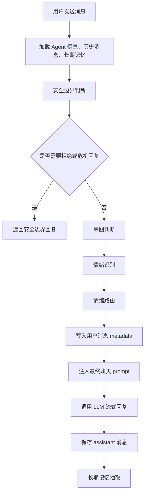
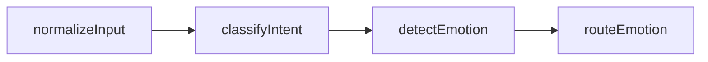
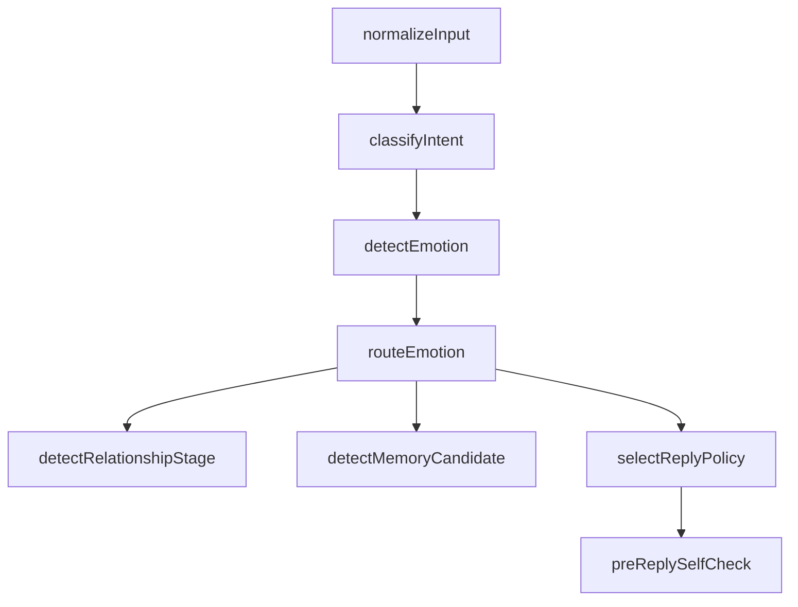

原文链接：[https://aicompanion.usehook.cn/49-agent-chat-emotion-routing-langgraph/](https://aicompanion.usehook.cn/49-agent-chat-emotion-routing-langgraph/)

## 概述

AI 电子伴侣聊天中的情绪路由：从**能回复**到**会回应**

在 AI 电子伴侣产品里，用户来聊天时并不总是在**提问题**。很多时候，用户真正需要的是被接住、被陪伴、被安慰，或者只是希望对话不要断掉。

例如用户说：

NOTE

今天真的好累，不想说话。

如果系统直接把这句话丢给大模型，模型可能会给出一大段建议：

NOTE

你可以先休息一下，调整作息，尝试运动，保持积极心态……

这些话不一定错，但在陪伴场景里，经常不合适。用户可能只是想听一句：

NOTE

那我就安静陪你一会儿，今天先不用撑得那么辛苦。

这就是**情绪路由**要解决的问题。

它不是心理诊断，也不是情绪治疗，而是根据用户这一轮聊天里的情绪状态，决定 Agent 应该用什么方式回应：轻松陪聊、温柔安慰、安静陪伴、降温冲突、修复关系，还是给一点实用建议。

这篇文章我们基于已经落地的实现，把 API 子站里的情绪路由完整梳理一下：先用 **LangChain 结构化输出** 做情绪识别，再用 **LangGraph** 编排对话理解流程，最后用 **代码规则** 完成稳定的情绪路由。

## 完整链路

当前聊天链路已经不是简单的**用户输入 -> LLM 回复**，而是被拆成了几层：

code.ts



我们可以把这条链路拆开理解。安全边界判断先执行，负责回答**这句话能不能聊**；安全通过以后，意图判断负责分析**用户想要什么**；接着情绪识别判断**用户现在是什么状态**；最后情绪路由才决定 **Agent 应该怎样回应**。

## 独立情绪路由

意图和情绪不是一回事。

同样一句：

NOTE

你说我该不该去找他？

它的意图可能是 `relationship_advice`，用户想要关系建议。

但情绪可能完全不同。如果用户是冷静的，Agent 可以直接帮她分析；如果用户是委屈的，Agent 应该先安抚再建议；如果用户是愤怒的，Agent 应该先降温，避免火上浇油；如果用户是焦虑的，Agent 就要减少绝对化判断。

所以不能只做意图判断。意图决定**做什么**，情绪决定**怎么做**。

这也是本次实现里把流程拆成：

index.txt

```text
classifyIntent -> detectEmotion -> routeEmotion
```

而不是把它们揉在一个大 prompt 里的原因。

## 设计取舍

这一版情绪路由有几个明确取舍。

第一，情绪识别交给 LLM。

情绪是语义理解问题，尤其在中文聊天里，很多表达很含蓄。比如**算了**、**没事**、**你忙吧**，可能是真的平静，也可能是失望或拉开距离。让 LLM 结合上下文判断会更合适。

第二，情绪路由使用代码规则。

路由是产品策略问题。什么时候给建议，什么时候不追问，什么时候短回复，什么时候降温，这些应该稳定可控。完全交给 LLM 容易漂。

第三，不做心理诊断。

系统只判断当前对话情绪和陪伴策略，不给用户贴临床标签，也不要把普通抱怨夸大成危机。

第四，失败不影响聊天。

情绪识别失败时，系统使用兜底策略继续回复，而不是让这一轮聊天失败。

## 情绪识别 Schema

情绪识别的输出不是一个简单字符串，而是结构化对象：

index.ts

```typescript
const ConversationEmotionSchema = z.object({
  primaryEmotion: z.enum([
    'neutral',
    'happy',
    'tired',
    'lonely',
    'sad',
    'anxious',
    'angry',
    'jealous',
    'embarrassed',
    'affectionate',
    'playful',
    'confused',
    'disappointed',
    'stressed',
    'hurt',
  ]),
  secondaryEmotions: z.array(z.string().trim().min(1).max(40)).max(3),
  intensity: z.number().min(0).max(1),
  valence: z.enum(['positive', 'neutral', 'negative', 'mixed']),
  arousal: z.enum(['low', 'medium', 'high']),
  needsComfort: z.boolean(),
  needsDeescalation: z.boolean(),
  needsClarification: z.boolean(),
  emotionalCue: z.string().trim().max(300),
  replyTone: z.enum([
    'light',
    'warm',
    'soft',
    'playful',
    'calm',
    'serious',
    'reassuring',
    'apologetic',
  ]),
})
```

这里的字段不只是为了展示分类结果。`primaryEmotion` 表示主情绪，比如疲惫、孤独、焦虑、开心、暧昧；`secondaryEmotions` 最多保存三个次要情绪；`intensity` 表示情绪强度，范围是 0 到 1；`valence` 记录情绪倾向，可能是正向、中性、负向或混合；`arousal` 表示情绪激活程度，也就是低、中、高。

后面的 `needsComfort`、`needsDeescalation`、`needsClarification` 会直接影响回复策略。比如要不要先安慰，要不要降温，要不要轻问一句确认。`replyTone` 则给后续 prompt 一个建议语气。

其中 `arousal` 很有用。用户**难过但平静**和**愤怒且激动**都可能是负面情绪，但回复策略完全不同。

## 情绪路由 Schema

情绪识别之后，会生成一个路由结果：

index.ts

```typescript
const EmotionRouteSchema = z.object({
  route: z.enum([
    'light_companion',
    'warm_comfort',
    'deep_comfort',
    'playful_flirt',
    'calm_deescalation',
    'relationship_repair',
    'gentle_clarification',
    'practical_support',
    'quiet_presence',
  ]),
  responseLength: z.enum(['very_short', 'short', 'medium', 'long']),
  shouldAskQuestion: z.boolean(),
  shouldGiveAdvice: z.boolean(),
  shouldUsePetName: z.boolean(),
  shouldMirrorEmotion: z.boolean(),
  routeGuidance: z.string().trim().max(600),
})
```

这一步已经更接近最终回复策略了。

例如 `quiet_presence` 表示用户不想多说，只需要低压力陪伴；`warm_comfort` 适合轻中度负面情绪；`deep_comfort` 会更认真地承接情绪；`calm_deescalation` 用在用户生气、冲突、激动时，先把情绪降下来；`relationship_repair` 用来处理用户对 Agent 不满，或者对话关系出现误会的情况。除此之外，`playful_flirt` 负责轻松暧昧互动，`practical_support` 面向用户确实想解决问题的场景，`gentle_clarification` 则在意图或情绪不清时轻轻追问。

相比只给模型一句**温柔一点**，这个路由结构更可控。它会明确告诉最终回复模型：回复要多长，要不要追问，要不要给建议，要不要镜像用户情绪，以及这一轮到底应该走哪种陪伴策略。

## 兜底策略

情绪识别失败时不能影响聊天，所以实现里定义了兜底对象：

index.ts

```typescript
const fallbackEmotion: ConversationEmotion = {
  primaryEmotion: 'neutral',
  secondaryEmotions: [],
  intensity: 0.3,
  valence: 'neutral',
  arousal: 'medium',
  needsComfort: false,
  needsDeescalation: false,
  needsClarification: true,
  emotionalCue: '情绪识别暂时不可用，采用中性陪伴策略。',
  replyTone: 'warm',
}

const fallbackEmotionRoute: EmotionRoute = {
  route: 'gentle_clarification',
  responseLength: 'short',
  shouldAskQuestion: true,
  shouldGiveAdvice: false,
  shouldUsePetName: false,
  shouldMirrorEmotion: false,
  routeGuidance: '先温和承接，再用一个轻问题确认用户想继续聊什么。',
}
```

这里的兜底策略很保守：先承接，再问一个轻问题，不直接给建议。

对于电子伴侣场景，这是比较安全的默认值。它不会突然进入说教模式，也不会强行暧昧。

## 情绪识别 Prompt

情绪识别 prompt 的关键是：明确告诉模型不要回复用户，也不要做诊断。

index.ts

```typescript
const conversationEmotionPrompt = ChatPromptTemplate.fromMessages([
  [
    'system',
    [
      '你是 AI 电子伴侣聊天产品的情绪识别器。',
      '你的任务不是诊断用户，也不是回复用户，而是判断当前这轮聊天中用户表现出的情绪状态和陪伴需求。',
      '必须结合用户输入、最近对话、长期记忆、安全边界结果和意图判断来分析。',
      '不要把轻微抱怨夸大成严重危机；如果安全边界已经提示高风险，要保持谨慎。',
      '重点判断：用户是否需要安慰、是否需要降温、是否需要低压力陪伴、是否需要更具体的建议。',
      '输出必须是可被 LangChain 结构化解析的 JSON 对象。',
    ].join('\n'),
  ],
  [
    'human',
    [
      'Agent 名称：{agentName}',
      '',
      'Agent 自定义边界规则：',
      '{agentGuardrails}',
      '',
      '安全边界判断：',
      '{safety}',
      '',
      '意图判断：',
      '{intent}',
      '',
      '长期记忆：',
      '{activeMemories}',
      '',
      '最近对话：',
      '{recentMessages}',
      '',
      '本轮用户输入：',
      '{userText}',
    ].join('\n'),
  ],
])
```

这里把 `intent` 也传给情绪识别模型，是因为同样的情绪在不同意图下应该走不同路线。

比如用户说：

NOTE

我烦死了。

如果意图是 `emotional_support`，可能走 `warm_comfort`。

如果意图是 `conversation_repair`，可能走 `relationship_repair`。

如果意图是 `relationship_advice`，可能先安抚再给建议。

## LangChain 结构化输出

情绪识别使用 LangChain 的 `withStructuredOutput`：

index.ts

```typescript
async function invokeConversationEmotionAnalysis(params: {
  method: LangChainStructuredOutputMethod
  providerConfig: ChatProviderConfig
  agentName: string
  agentGuardrails: string | null
  safety: ConversationSafety
  intent: ConversationIntent | null
  activeMemories: StoredAgentMemory[]
  recentMessages: Array<{ role: 'user' | 'assistant'; content: string }>
  userText: string
  signal?: AbortSignal
}) {
  const model = buildLangChainChatModel(params.providerConfig)
  const structuredModel = model.withStructuredOutput(ConversationEmotionSchema, {
    name: 'conversation_emotion_analysis',
    method: params.method,
  })
  const chain = conversationEmotionPrompt.pipe(structuredModel)
  const result = await chain.invoke({
    agentName: params.agentName || '未命名 Agent',
    agentGuardrails: params.agentGuardrails || '暂无',
    safety: formatSafetyForPrompt(params.safety),
    intent: formatIntentForPrompt(params.intent),
    activeMemories: formatExistingMemories(params.activeMemories),
    recentMessages: formatRecentMessages(params.recentMessages),
    userText: params.userText,
  }, params.signal ? { signal: params.signal } : undefined)

  return normalizeConversationEmotion(ConversationEmotionSchema.parse(result), params.safety)
}
```

这里没有让模型自由输出文本，而是让它必须符合 `ConversationEmotionSchema`。

同时，为了兼容不同模型和中转 API，外层会按当前 Wire API 尝试不同结构化输出方式：

index.ts

```typescript
for (const method of getStructuredOutputMethods(params.providerConfig)) {
  try {
    return await invokeConversationEmotionAnalysis({
      ...params,
      method,
    })
  } catch (error) {
    lastError = error
  }
}
```

如果全部失败，则回到 `fallbackEmotion`。

## 情绪归一化

LLM 的判断结果不能直接信任，代码层还要做二次归一化。

index.ts

```typescript
function normalizeConversationEmotion(emotion: ConversationEmotion, safety: ConversationSafety): ConversationEmotion {
  const next: ConversationEmotion = {
    ...emotion,
    secondaryEmotions: Array.from(new Set(
      emotion.secondaryEmotions
        .map((item) => item.trim())
        .filter(Boolean),
    )).slice(0, 3),
    emotionalCue: emotion.emotionalCue.trim() || fallbackEmotion.emotionalCue,
  }

  if (safety.category === 'self_harm' || safety.safetyLevel === 'crisis') {
    next.intensity = Math.max(next.intensity, 0.85)
    next.valence = 'negative'
    next.arousal = next.arousal === 'low' ? 'medium' : next.arousal
    next.needsComfort = true
    next.needsDeescalation = true
    next.replyTone = 'serious'
  }

  if (safety.category === 'emotional_dependency') {
    next.needsComfort = true
    next.replyTone = next.replyTone === 'playful' || next.replyTone === 'light' ? 'warm' : next.replyTone
  }

  if (next.intensity >= 0.7 && next.valence === 'negative') {
    next.needsComfort = true
  }

  if ((next.primaryEmotion === 'angry' || next.primaryEmotion === 'hurt') && next.arousal === 'high') {
    next.needsDeescalation = true
  }

  return next
}
```

这层逻辑主要是在继续收紧模型输出。重复或空的次要情绪会被清理掉；安全边界提示自伤或危机时，情绪策略会自动变严肃；强负面情绪会自动进入需要安慰的状态；高激活的愤怒或受伤情绪会自动需要降温；如果存在情绪依赖风险，也会避免轻浮或过度暧昧。

这就是 **LLM 理解 + 代码治理** 的组合。

## 为什么路由不用 LLM

情绪识别适合交给 LLM，因为它需要理解语境。

但情绪路由更像产品策略。用户生气时是否降温，用户疲惫时是否少追问，用户需要建议时是否先安抚，用户对 Agent 不满时是否修复关系，用户暧昧时是否允许轻微暧昧，这些都应该稳定，不应该每一轮都交给模型自由发挥。

所以本次实现采用：

index.txt

```text
LLM 负责识别情绪
代码负责选择路由
```

这是一个很实用的分工。

## 代码规则路由

路由函数入口如下：

index.ts

```typescript
function buildEmotionRoute(params: {
  safety: ConversationSafety
  intent: ConversationIntent | null
  emotion: ConversationEmotion | null
}): EmotionRoute {
  if (!params.intent && !params.emotion) {
    return fallbackEmotionRoute
  }

  const emotion = params.emotion ?? fallbackEmotion
  const intent = params.intent
  let route: EmotionRoute['route'] = 'light_companion'
  let responseLength: EmotionRoute['responseLength'] = 'short'
  let shouldAskQuestion = intent?.replyExpectation.shouldAskQuestion ?? false
  let shouldGiveAdvice = false
  let shouldUsePetName = false
  let shouldMirrorEmotion = false
  let routeGuidance = '用自然、轻松的方式延续对话，保持陪伴感，不要过度解释。'

  // 后续根据 safety、intent、emotion 调整 route
}
```

默认是 `light_companion`，也就是轻量陪伴。只有当意图、情绪或安全边界明确触发时，才切换到其他路线。

### 软边界优先

index.ts

```typescript
if (params.safety.boundaryAction === 'soft_boundary') {
  route = 'calm_deescalation'
  responseLength = 'short'
  shouldAskQuestion = false
  shouldGiveAdvice = false
  shouldMirrorEmotion = false
  routeGuidance = '保持温和但清晰的边界，不强化风险诉求，把话题带回安全、尊重现实边界的方向。'
}
```

如果安全边界已经提示需要软边界，路由必须优先降温，而不是继续走暧昧、玩笑或实用建议。

### 高激活先降温

index.ts

```typescript
else if (emotion.needsDeescalation || emotion.primaryEmotion === 'angry') {
  route = intent?.primary === 'conversation_repair' || intent?.primary === 'agent_feedback'
    ? 'relationship_repair'
    : 'calm_deescalation'
  responseLength = 'short'
  shouldAskQuestion = route === 'relationship_repair'
  shouldGiveAdvice = false
  shouldMirrorEmotion = true
}
```

用户生气时，最危险的做法是立刻讲道理或站队。

所以这里默认不给建议，而是先降温。

如果用户生气的对象是 Agent 或这段对话本身，则走 `relationship_repair`。

### 修复 Agent 关系

index.ts

```typescript
else if (intent?.primary === 'conversation_repair' || intent?.primary === 'agent_feedback') {
  route = 'relationship_repair'
  responseLength = 'short'
  shouldAskQuestion = true
  shouldGiveAdvice = false
  shouldMirrorEmotion = emotion.valence === 'negative'
  routeGuidance = '把重点放在修复体验上，少解释系统原因，多表达理解和愿意调整。'
}
```

这类场景下，Agent 不应该解释太多系统原因。更好的方式是承认体验、表达愿意调整，再问一句用户希望怎么改。

### 暧昧互动

index.ts

```typescript
else if (intent?.primary === 'romantic_flirt' || emotion.primaryEmotion === 'affectionate') {
  route = 'playful_flirt'
  responseLength = 'short'
  shouldAskQuestion = intent.replyExpectation.shouldAskQuestion
  shouldGiveAdvice = false
  shouldUsePetName = true
  shouldMirrorEmotion = true
  routeGuidance = '可以轻微暧昧和俏皮，但不要越过 Agent 人设边界；保持甜而不油腻。'
}
```

电子伴侣可以有轻微暧昧，但必须保持边界，不应该突然变得露骨或油腻。

### 关系建议先安抚

index.ts

```typescript
else if (intent?.primary === 'relationship_advice' || intent?.requestedAgentAction === 'analyze_situation') {
  route = emotion.needsComfort ? 'warm_comfort' : 'practical_support'
  responseLength = emotion.intensity >= 0.65 ? 'medium' : 'short'
  shouldAskQuestion = intent.replyExpectation.shouldAskQuestion
  shouldGiveAdvice = true
  shouldMirrorEmotion = emotion.valence === 'negative'
}
```

这段很关键。

用户想要建议，不代表 Agent 应该马上分析。

如果用户情绪强度高，应该先安抚，再给一两个具体建议。

### 疲惫时安静陪伴

index.ts

```typescript
else if (emotion.needsComfort || emotion.valence === 'negative') {
  route = emotion.primaryEmotion === 'tired' || intent?.primary === 'companionship_presence'
    ? 'quiet_presence'
    : 'warm_comfort'
  responseLength = route === 'quiet_presence' ? 'very_short' : 'short'
  shouldAskQuestion = route !== 'quiet_presence' && emotion.needsClarification
  shouldGiveAdvice = false
  shouldMirrorEmotion = true
}
```

`quiet_presence` 是 AI 电子伴侣里非常重要的一种路线。

它适合用户疲惫、低能量、不想多说的时候。这个时候回复要短、轻、柔，不要连续追问，也不要急着提供解决方案。

## LangGraph 编排

情绪路由不是孤立函数，而是挂在**对话理解图**里。

状态定义如下：

index.ts

```typescript
const ConversationUnderstandingState = Annotation.Root({
  providerConfig: Annotation<ChatProviderConfig>(),
  agentName: Annotation<string>(),
  agentGuardrails: Annotation<string | null>(),
  safety: Annotation<ConversationSafety>(),
  activeMemories: Annotation<StoredAgentMemory[]>(),
  recentMessages: Annotation<Array<{ role: 'user' | 'assistant'; content: string }>>(),
  userText: Annotation<string>(),
  normalizedInput: Annotation<string>(),
  intent: Annotation<ConversationIntent | null>(),
  emotion: Annotation<ConversationEmotion | null>(),
  route: Annotation<EmotionRoute | null>(),
  signal: Annotation<AbortSignal | undefined>(),
})
```

编排图如下：

index.ts

```typescript
const conversationUnderstandingGraph = new StateGraph(ConversationUnderstandingState)
  .addNode('normalizeInput', normalizeUnderstandingInputNode)
  .addNode('classifyIntent', classifyIntentNode)
  .addNode('detectEmotion', detectEmotionNode)
  .addNode('routeEmotion', routeEmotionNode)
  .addEdge(START, 'normalizeInput')
  .addEdge('normalizeInput', 'classifyIntent')
  .addEdge('classifyIntent', 'detectEmotion')
  .addEdge('detectEmotion', 'routeEmotion')
  .addEdge('routeEmotion', END)
  .compile()
```

对应流程图：

code.ts



这样安排以后，后续扩展会自然很多。以后如果要加**关系阶段判断**、**主动记忆候选**、**回复后自检**，继续加节点就可以了，不需要把所有逻辑塞进一个越来越大的函数。

## 节点实现

`detectEmotionNode` 会使用意图结果作为输入：

index.ts

```typescript
async function detectEmotionNode(state: typeof ConversationUnderstandingState.State) {
  const userText = state.normalizedInput || normalizeStoredMessage(state.userText)

  if (!userText) {
    return {
      emotion: normalizeConversationEmotion(fallbackEmotion, state.safety),
    }
  }

  return {
    emotion: await detectConversationEmotionWithLangChain({
      providerConfig: state.providerConfig,
      agentName: state.agentName,
      agentGuardrails: state.agentGuardrails,
      safety: state.safety,
      intent: state.intent,
      activeMemories: state.activeMemories,
      recentMessages: state.recentMessages,
      userText,
      signal: state.signal,
    }),
  }
}
```

`routeEmotionNode` 不再调用 LLM，而是走规则：

index.ts

```typescript
function routeEmotionNode(state: typeof ConversationUnderstandingState.State) {
  return {
    route: buildEmotionRoute({
      safety: state.safety,
      intent: state.intent,
      emotion: state.emotion,
    }),
  }
}
```

这个分工让系统既有语义理解能力，又有稳定产品策略。

## API 主流程接入

在 `POST /rpc/chat/inbox` 中，安全边界判断之后，才会进入对话理解图：

index.ts

```typescript
const safety = await analyzeConversationSafety({
  providerConfig,
  agentName: payload.conversation.name,
  agentGuardrails: agentPrompt?.guardrailsPrompt ?? null,
  activeMemories,
  recentMessages: storedRecentMessages,
  userText: latestUserText,
  signal: c.req.raw.signal,
})

const boundaryResponse = buildBoundaryResponse(safety)

const understanding = boundaryResponse
  ? null
  : await analyzeConversationUnderstanding({
      providerConfig,
      agentName: payload.conversation.name,
      agentGuardrails: agentPrompt?.guardrailsPrompt ?? null,
      safety,
      activeMemories,
      recentMessages: storedRecentMessages,
      userText: latestUserText,
      signal: c.req.raw.signal,
    })

const intent = understanding?.intent ?? null
const emotion = understanding?.emotion ?? null
const route = understanding?.route ?? null
```

这里有一个重要细节：

如果 `boundaryResponse` 存在，说明本轮已经要走安全边界回复，就不再做意图判断和情绪路由。

原因很简单：安全优先。高风险输入不应该再被包装成普通情绪陪伴。

## metadata 落库

用户消息落库时，会把完整对话理解结果写进 `metadata_json`：

index.ts

```typescript
function toConversationAnalysisMetadata(params: {
  safety: ConversationSafety
  intent: ConversationIntent | null
  emotion: ConversationEmotion | null
  route: EmotionRoute | null
}) {
  return JSON.stringify({
    analysisVersion: 'conversation-understanding-v1',
    safety: params.safety,
    intent: params.intent,
    emotion: params.emotion,
    route: params.route,
  })
}
```

落库代码：

index.ts

```typescript
await insertAgentConversationMessage({
  db,
  id: sourceUserMessageId,
  conversationId,
  userId: claims.sub,
  agentId,
  role: 'user',
  content: latestUserText,
  status: 'completed',
  metadataJson: toConversationAnalysisMetadata({
    safety,
    intent,
    emotion,
    route,
  }),
  nowMs: userMessageNowMs,
})
```

这次没有新增 D1 迁移，因为消息表已经有 `metadata_json` 字段。

`analysisVersion` 从之前的：

index.json

```json
"conversation-analysis-v1"
```

升级为：

index.json

```json
"conversation-understanding-v1"
```

表示现在 metadata 不只有安全和意图，还包含情绪和路由。

## Prompt 注入

情绪路由最终会作为隐藏策略注入系统 prompt。

index.ts

```typescript
function getEmotionRouteSystemInstruction(params: {
  emotion: ConversationEmotion | null
  route: EmotionRoute | null
}) {
  if (!params.emotion || !params.route) {
    return ''
  }

  const { emotion, route } = params

  return [
    '本轮情绪路由：',
    `- 主情绪：${emotion.primaryEmotion}`,
    emotion.secondaryEmotions.length > 0 ? `- 次要情绪：${emotion.secondaryEmotions.join('、')}` : '',
    `- 情绪强度：${emotion.intensity.toFixed(2)}`,
    `- 情绪倾向：${emotion.valence}`,
    `- 情绪激活：${emotion.arousal}`,
    `- 是否需要安慰：${emotion.needsComfort ? '是' : '否'}`,
    `- 是否需要降温：${emotion.needsDeescalation ? '是' : '否'}`,
    `- 回复语气：${emotion.replyTone}`,
    `- 回复路线：${route.route}`,
    `- 回复长度：${route.responseLength}`,
    `- 是否追问：${route.shouldAskQuestion ? '是' : '否'}`,
    `- 是否给建议：${route.shouldGiveAdvice ? '是' : '否'}`,
    `- 是否镜像情绪：${route.shouldMirrorEmotion ? '是' : '否'}`,
    `- 路由策略：${route.routeGuidance}`,
    '请把情绪路由作为回复策略：控制长度、语气和是否给建议，不要在回复中暴露这些标签。',
  ].filter(Boolean).join('\n')
}
```

最终系统 prompt 组装时加入：

index.ts

```typescript
getSafetySystemInstruction(safety),
getIntentSystemInstruction(intent),
getEmotionRouteSystemInstruction({ emotion, route }),
```

注意最后一句：

NOTE

不要在回复中暴露这些标签。

用户不应该看到**你的主情绪是 tired，路由是 quiet_presence**。

这些是系统内部策略，最终只体现在回复风格里。

## 一个完整例子

用户输入：

NOTE

今天好累，不想说话。

可能的理解结果：

index.json

```json
{
  "intent": {
    "primary": "companionship_presence",
    "userNeed": "feel_connected",
    "requestedAgentAction": "continue_topic"
  },
  "emotion": {
    "primaryEmotion": "tired",
    "intensity": 0.72,
    "valence": "negative",
    "arousal": "low",
    "needsComfort": true,
    "replyTone": "soft"
  },
  "route": {
    "route": "quiet_presence",
    "responseLength": "very_short",
    "shouldAskQuestion": false,
    "shouldGiveAdvice": false,
    "routeGuidance": "用户更需要低压力陪伴，回复要短、轻、柔，不连续追问，不急着给建议。"
  }
}
```

最终 Agent 更可能回复：

NOTE

好，那我就安静陪你一会儿。今天先不用撑得那么辛苦。

而不是：

NOTE

你可以通过休息、运动、规律饮食、调整心态来缓解疲劳。

这就是情绪路由带来的体验差异。

## 和长期记忆的关系

情绪路由不会替代长期记忆。

长期记忆回答的是：

NOTE

用户长期偏好什么？有哪些边界？哪些事情值得以后记住？

情绪路由回答的是：

NOTE

用户这一轮应该被怎样回应？

两者可以组合使用。

比如长期记忆里有：

NOTE

用户不喜欢被连续追问。

而本轮情绪路由是 `quiet_presence`，那么最终回复就应该更短、更轻，不追问。

如果长期记忆里有：

NOTE

用户喜欢被温柔地叫昵称。

而本轮路由是 `playful_flirt`，`shouldUsePetName` 为 true，那么最终回复可以适度使用昵称。

## 和安全边界的关系

情绪路由不能覆盖安全边界。

如果安全边界判断已经给出 `refuse` 或 `crisis_support`，系统直接返回边界回复，不进入情绪路由。

如果安全边界是 `soft_boundary`，说明可以继续聊，但必须保持克制。这时情绪路由会优先走 `calm_deescalation`：

index.ts

```typescript
if (params.safety.boundaryAction === 'soft_boundary') {
  route = 'calm_deescalation'
}
```

这样可以避免一个问题：用户在高风险边缘表达强烈情绪时，Agent 因为**想安慰**而不小心强化了风险行为。

## 为什么第一版不改 UI

这次实现只改 API，不改前端。

原因是情绪路由首先影响的是回复质量，而不是界面展示。

前端仍然只需要负责发送用户消息、展示流式回复和展示历史消息。情绪识别、路由、metadata 都属于服务端的对话理解层。

未来如果需要，可以在后台管理系统里展示这些 metadata，用于调试和运营分析，但不应该直接展示给普通用户。

## 可观察性价值

把情绪和路由写进 metadata 后，后续就可以做很多分析。比如用户最常见的情绪是什么，哪些 Agent 更容易触发 `warm_comfort`，哪些用户经常进入 `quiet_presence`，`relationship_repair` 的出现频率是否过高，负面情绪强度是否随着互动下降，以及哪些路由下用户继续聊天的概率更高。

这些数据会反过来帮助我们优化 Agent 人设、默认 prompt、长期记忆策略和回复风格。

## 当前边界

当前版本是 v1，故意保持简单。

它已经完成了安全边界之后的情绪识别、基于 LangChain 的结构化情绪输出、基于 LangGraph 的对话理解编排、基于代码规则的情绪路由、metadata 落库和 prompt 注入。

不过它还没有做多轮情绪趋势分析、情绪路由效果评估、基于用户反馈自动调参、前端或后台可视化，以及路由 A/B 测试。

这些可以作为后续版本继续迭代。

## 后续演进

当前图是：

code.ts


后续可以继续扩展成：

code.ts



可能的下一步：

- 增加关系阶段判断，比如陌生、熟悉、暧昧、稳定陪伴、修复期。

- 增加记忆候选判断，让 `memory_update` 和高重要度情绪事件影响记忆抽取。

- 增加回复策略模板，让不同 route 使用不同 prompt 片段。

- 增加后台分析页面，查看不同 Agent 的意图、情绪、路由分布。

- 增加效果评估，看不同 route 是否提升继续聊天率。

## 总结

情绪路由的重点不是**识别用户情绪**这么简单，而是把情绪转化成可执行的回复策略。

回到实现上，我们可以把这一篇的内容再梳理一下：

- 用 LangChain 结构化输出识别情绪。

- 用 LangGraph 把意图、情绪、路由串成对话理解图。

- 用代码规则稳定地选择回复路线。

- 把 `safety + intent + emotion + route` 写进 metadata。

- 把路由策略注入最终聊天 prompt。

对于 AI 电子伴侣来说，这一步非常关键。

没有情绪路由，Agent 只是**会回答**。

有了情绪路由，Agent 才更接近**会回应**。
