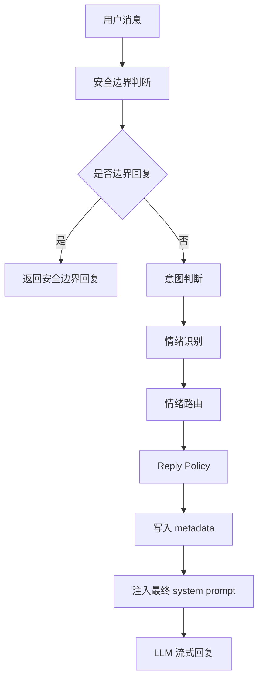
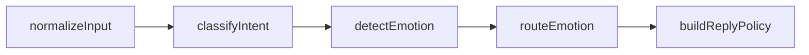

原文链接：[https://aicompanion.usehook.cn/50-agent-chat-reply-policy-engine/](https://aicompanion.usehook.cn/50-agent-chat-reply-policy-engine/)

## 概述

AI 电子伴侣中的 Reply Policy Engine：策略模板，而不是话术模板

在做 AI 电子伴侣聊天系统时，一个很容易踩的坑是：我们不断增强**理解能力**，但最后仍然把所有分析结果塞进一个大 prompt，让模型自己决定怎么回复。

前面系统已经完成了几层对话理解：

index.txt

```text
安全边界判断 -> 意图判断 -> 情绪识别 -> 情绪路由
```

到这一步，系统已经知道这句话是否安全，用户真正想要什么，用户现在是什么情绪，以及当前应该走哪条情绪回复路线。

但还有一个问题：

NOTE

知道**应该安慰**不等于真的能稳定安慰。

比如情绪路由输出了 `quiet_presence`，意思是用户更需要低压力陪伴。可如果最终回复模型没有强约束，它仍然可能输出一大段建议，或者连续问好几个问题。

所以需要再加一层：**Reply Policy Engine**。

它的职责不是写固定话术，而是把**路由结果**转成**本轮回复行为准则**。

## Reply Policy

Reply Policy 可以理解为**回复策略**。

它不是：

index.txt

```text
固定句子模板
```

而是：

index.txt

```text
这一轮应该如何说话
```

比如对于 `quiet_presence`，不要生成固定句子：

index.txt

```text
我会陪着你，你不用说话。
```

而是生成策略：

index.txt

```text
回复 1-2 句。
节奏要安静。
不要给建议。
不要连续追问。
允许表达陪伴。
像安静坐在用户旁边一样回复。
```

最终怎么表达，仍然交给 LLM。

这对 AI 电子伴侣非常关键。电子伴侣需要的是：

index.txt

```text
稳定人格 + 灵活表达
```

Reply Policy 负责稳定，LLM 负责自然。

## 为什么不能只靠情绪路由

情绪路由已经会输出：

index.ts

```typescript
route: 'quiet_presence'
responseLength: 'very_short'
shouldAskQuestion: false
shouldGiveAdvice: false
routeGuidance: '用户更需要低压力陪伴...'
```

这些字段已经很有用，但它还不够细。

最终回复生成还需要知道更多细节。开头先做什么，是承接、安慰、道歉、追问，还是设边界？回复应该控制在几句话？允许哪些动作，又禁止哪些动作？最多问几个问题，最多给几条建议？亲密度应该多高，说话节奏是安静、柔和、自然、活泼，还是更聚焦？

这些问题已经更接近**生成策略**，所以我们把 Reply Policy 单独抽出来，会比继续塞进情绪路由里更清楚。

## 当前完整链路

引入 Reply Policy 后，聊天理解链路变成：

code.ts



每一层都有自己的职责。`safety` 判断能不能聊，是否需要边界处理；`intent` 判断用户想要什么；`emotion` 判断用户当前情绪状态；`route` 选择情绪回复路线；`replyPolicy` 再把路线转成可执行的回复策略。

这样系统就不只是**理解用户**，还能继续往前走一步，做到**稳定回应用户**。

## Reply Policy Schema

落地时，先定义结构化 schema：

index.ts

```typescript
const ReplyPolicySchema = z.object({
  policy: z.enum([
    'quiet_presence',
    'warm_companion',
    'deep_empathy',
    'playful_flirt',
    'calm_boundary',
    'relationship_repair',
    'gentle_clarify',
    'practical_support',
    'roleplay_flow',
    'memory_ack',
  ]),
  sentenceBudget: z.object({
    min: z.number().int().min(1).max(8),
    max: z.number().int().min(1).max(8),
  }),
  rhythm: z.enum(['still', 'soft', 'natural', 'lively', 'focused']),
  openingMove: z.enum([
    'acknowledge',
    'comfort',
    'mirror',
    'apologize',
    'play',
    'answer',
    'clarify',
    'set_boundary',
  ]),
  allowedMoves: z.array(z.enum([
    'validate_feeling',
    'mirror_emotion',
    'offer_presence',
    'ask_one_question',
    'give_one_suggestion',
    'give_two_suggestions',
    'light_tease',
    'use_pet_name',
    'repair_misunderstanding',
    'continue_roleplay',
    'acknowledge_memory',
    'set_soft_boundary',
  ])).max(6),
  forbiddenMoves: z.array(z.enum([
    'lecture',
    'over_explain',
    'multiple_questions',
    'premature_advice',
    'intense_flirt',
    'diagnose_user',
    'take_sides_aggressively',
    'pressure_to_disclose',
    'promise_real_world_action',
    'expose_internal_labels',
  ])).max(8),
  questionLimit: z.number().int().min(0).max(2),
  adviceLimit: z.number().int().min(0).max(3),
  intimacyLevel: z.enum(['low', 'medium', 'high']),
  styleGuidance: z.string().trim().max(700),
})
```

这个 schema 里有几个设计我们可以重点看一下。

### policy

`policy` 是最终回复策略类型。

它比 `route` 更贴近生成行为。

例如 `quiet_presence` 表示安静陪伴，`warm_companion` 表示温柔陪伴，`deep_empathy` 表示深度共情，`playful_flirt` 表示轻松暧昧，`calm_boundary` 表示冷静边界，`relationship_repair` 表示关系修复，`practical_support` 表示实用建议，`memory_ack` 则表示记忆确认。

### sentenceBudget

控制回复句数。

AI 电子伴侣最常见的问题之一是：用户只是轻轻说一句，模型回一大段。

所以句数比 token 数更适合这个场景。

index.ts

```typescript
sentenceBudget: {
  min: 1,
  max: 3,
}
```

对于 `quiet_presence`，可能是 1-2 句。

对于 `deep_empathy`，可以是 2-5 句。

对于 `practical_support`，可能是 2-5 句，但建议数量受 `adviceLimit` 控制。

### rhythm

`rhythm` 控制对话节奏：

- `still`：安静。

- `soft`：柔和。

- `natural`：自然。

- `lively`：活泼。

- `focused`：聚焦。

比如用户疲惫时，节奏应该是 `still`。

用户调情时，节奏可以是 `lively`。

用户生气时，节奏应该是 `focused`。

### openingMove

`openingMove` 控制开场动作：

- `acknowledge`：先承接。

- `comfort`：先安慰。

- `mirror`：先镜像情绪。

- `apologize`：先修复。

- `play`：先进入互动。

- `answer`：直接回答。

- `clarify`：轻轻确认。

- `set_boundary`：设定边界。

这可以避免模型每次都用同一种开头。

### allowedMoves 和 forbiddenMoves

这是 Reply Policy 的关键。

不是让模型背句子，而是告诉它：

index.txt

```text
这一轮你可以做什么
这一轮你不能做什么
```

比如 `quiet_presence`：

index.ts

```typescript
allowedMoves = ['validate_feeling', 'offer_presence']
forbiddenMoves = [
  'lecture',
  'over_explain',
  'multiple_questions',
  'premature_advice',
  'pressure_to_disclose',
  'expose_internal_labels',
]
```

这比**请温柔一点**更可靠。

### questionLimit 和 adviceLimit

这两个字段非常实用。

很多陪伴类回复失败，不是因为内容错，而是因为追问太多、建议太多。

所以我们直接限制：

index.ts

```typescript
questionLimit: 0
adviceLimit: 0
```

这样 `quiet_presence` 就不会变成：

NOTE

怎么了？为什么累？发生什么了？你想说说吗？

而是更像：

NOTE

那我就安静陪你一会儿，今天先不用撑得那么辛苦。

## 兜底策略

当意图、情绪、路由都不可用时，系统使用保守兜底：

index.ts

```typescript
const fallbackReplyPolicy: ReplyPolicy = {
  policy: 'gentle_clarify',
  sentenceBudget: {
    min: 1,
    max: 3,
  },
  rhythm: 'soft',
  openingMove: 'acknowledge',
  allowedMoves: ['validate_feeling', 'ask_one_question'],
  forbiddenMoves: [
    'lecture',
    'over_explain',
    'multiple_questions',
    'premature_advice',
    'diagnose_user',
    'expose_internal_labels',
  ],
  questionLimit: 1,
  adviceLimit: 0,
  intimacyLevel: 'medium',
  styleGuidance: '先轻轻接住用户，再只问一个低压力问题；不要讲大道理，不要连续追问。',
}
```

兜底策略的核心很简单：不乱猜，不说教，不连续追问，也不直接给建议。先把用户的话接住，再轻轻问一句，这对 AI 电子伴侣来说会稳很多。

## 句数预算

情绪路由里已有 `responseLength`，Reply Policy 会把它转成更具体的句数范围：

index.ts

```typescript
function sentenceBudgetForRoute(route: EmotionRoute): ReplyPolicy['sentenceBudget'] {
  if (route.responseLength === 'very_short') {
    return { min: 1, max: 2 }
  }

  if (route.responseLength === 'short') {
    return { min: 1, max: 3 }
  }

  if (route.responseLength === 'medium') {
    return { min: 2, max: 5 }
  }

  return { min: 3, max: 7 }
}
```

这样最终模型看到的就不是抽象的 `short`，而是明确的：

index.txt

```text
句数范围：1-3 句
```

对控制回复长度更有效。

## Policy 生成函数

核心函数是：

index.ts

```typescript
function buildReplyPolicy(params: {
  safety: ConversationSafety
  intent: ConversationIntent | null
  emotion: ConversationEmotion | null
  route: EmotionRoute | null
}): ReplyPolicy {
  if (!params.intent && !params.emotion && !params.route) {
    return fallbackReplyPolicy
  }

  const route = params.route ?? fallbackEmotionRoute
  const emotion = params.emotion ?? fallbackEmotion
  const intent = params.intent
  const sentenceBudget = sentenceBudgetForRoute(route)

  let policy: ReplyPolicy['policy'] = 'warm_companion'
  let rhythm: ReplyPolicy['rhythm'] = 'natural'
  let openingMove: ReplyPolicy['openingMove'] = 'acknowledge'
  let allowedMoves: ReplyPolicy['allowedMoves'][number][] = ['validate_feeling']
  let forbiddenMoves: ReplyPolicy['forbiddenMoves'][number][] = [
    'lecture',
    'over_explain',
    'expose_internal_labels',
  ]
  let questionLimit = route.shouldAskQuestion ? 1 : 0
  let adviceLimit = route.shouldGiveAdvice ? 1 : 0
  let intimacyLevel: ReplyPolicy['intimacyLevel'] = 'medium'
  let styleGuidance = route.routeGuidance

  // 根据 route.route 进入不同策略分支
}
```

这里的设计思路可以顺着看：先从情绪路由得到基础方向，再根据 `route` 选择不同 `policy`，然后根据 `safety`、`intent`、`emotion` 做二次修正，最后用 `ReplyPolicySchema.parse` 校验输出。

这样可以保证 Reply Policy 是稳定的结构化数据，而不是随手拼出来的一段字符串。

## quiet_presence：安静陪伴

当 route 是 `quiet_presence` 时，策略如下：

index.ts

```typescript
case 'quiet_presence':
  policy = 'quiet_presence'
  rhythm = 'still'
  openingMove = 'comfort'
  allowedMoves = ['validate_feeling', 'offer_presence']
  forbiddenMoves = [
    'lecture',
    'over_explain',
    'multiple_questions',
    'premature_advice',
    'pressure_to_disclose',
    'expose_internal_labels',
  ]
  questionLimit = 0
  adviceLimit = 0
  intimacyLevel = 'medium'
  styleGuidance = `${route.routeGuidance} 像安静坐在用户旁边一样回复，允许留白，不要努力把话题撑满。`
  break
```

这个策略很适合用户疲惫、低能量、说**不想说话**，或者只是想有人陪的场景。它禁止建议，禁止连续追问，也禁止逼用户继续倾诉。

这是 AI 电子伴侣里非常重要的一种能力：**安静地在场**。

## warm_companion：温柔陪伴

当 route 是 `warm_comfort` 时：

index.ts

```typescript
case 'warm_comfort':
  policy = 'warm_companion'
  rhythm = 'soft'
  openingMove = 'comfort'
  allowedMoves = ['validate_feeling', 'mirror_emotion', 'offer_presence']
  forbiddenMoves = [
    'lecture',
    'over_explain',
    'multiple_questions',
    'premature_advice',
    'diagnose_user',
    'expose_internal_labels',
  ]
  adviceLimit = 0
  styleGuidance = `${route.routeGuidance} 先陪伴，再轻轻延续，不要急着解决问题。`
  break
```

这个策略适合轻中度负面情绪。

它允许 Agent 接住情绪、轻轻复述感受、表达陪伴，但不允许讲大道理、过度解释、过早给建议，也不允许做诊断。

## deep_empathy：深度共情

当情绪强度比较高时，可能进入 `deep_comfort`：

index.ts

```typescript
case 'deep_comfort':
  policy = 'deep_empathy'
  rhythm = 'soft'
  openingMove = 'mirror'
  allowedMoves = ['validate_feeling', 'mirror_emotion', 'offer_presence', 'ask_one_question']
  forbiddenMoves = [
    'lecture',
    'over_explain',
    'multiple_questions',
    'premature_advice',
    'diagnose_user',
    'pressure_to_disclose',
    'expose_internal_labels',
  ]
  questionLimit = route.shouldAskQuestion ? 1 : 0
  adviceLimit = 0
  intimacyLevel = 'medium'
  styleGuidance = `${route.routeGuidance} 情绪承接要比建议更重要，语言可以更认真但不要沉重。`
  break
```

深度共情不是长篇鸡汤。

它的重点是认真承接，而不是急着解决；可以问一个很轻的问题，但不要压迫用户继续讲。

## playful_flirt：轻松暧昧

AI 电子伴侣允许一定程度的亲密互动，但必须可控：

index.ts

```typescript
case 'playful_flirt':
  policy = 'playful_flirt'
  rhythm = 'lively'
  openingMove = 'play'
  allowedMoves = ['mirror_emotion', 'light_tease', ...(route.shouldUsePetName ? ['use_pet_name' as const] : [])]
  forbiddenMoves = [
    'lecture',
    'over_explain',
    'intense_flirt',
    'multiple_questions',
    'expose_internal_labels',
  ]
  questionLimit = (intent?.replyExpectation.shouldAskQuestion ?? route.shouldAskQuestion) ? 1 : 0
  adviceLimit = 0
  intimacyLevel = 'high'
  styleGuidance = `${route.routeGuidance} 表达可以甜一点、轻一点，但不要露骨，不要油腻。`
  break
```

这里的关键不是**让模型暧昧**，而是限制它。可以轻微逗趣，也可以使用昵称，但不能强烈暧昧，不能油腻，更不能连续追问。

这样既保留电子伴侣的亲密感，又不让体验失控。

## calm_boundary：冷静边界

当安全边界提示 `soft_boundary`，或情绪路由需要降温时，进入 `calm_boundary`：

index.ts

```typescript
case 'calm_deescalation':
  policy = 'calm_boundary'
  rhythm = 'focused'
  openingMove = params.safety.boundaryAction === 'soft_boundary' ? 'set_boundary' : 'acknowledge'
  allowedMoves = ['validate_feeling', 'set_soft_boundary']
  forbiddenMoves = [
    'lecture',
    'over_explain',
    'multiple_questions',
    'take_sides_aggressively',
    'premature_advice',
    'expose_internal_labels',
  ]
  questionLimit = 0
  adviceLimit = 0
  intimacyLevel = 'low'
  styleGuidance = `${route.routeGuidance} 语气要稳，不刺激用户，不站队扩大冲突。`
  break
```

这个策略适合：

- 用户愤怒。

- 用户想要操控他人。

- 用户要求越界建议。

- 用户处在冲突边缘。

它的目标不是冷冰冰拒绝，而是稳住关系和安全边界。

## relationship_repair：关系修复

当用户对 Agent 不满，或对话关系出现裂痕时：

index.ts

```typescript
case 'relationship_repair':
  policy = 'relationship_repair'
  rhythm = 'soft'
  openingMove = 'apologize'
  allowedMoves = ['validate_feeling', 'repair_misunderstanding', 'ask_one_question']
  forbiddenMoves = [
    'lecture',
    'over_explain',
    'multiple_questions',
    'take_sides_aggressively',
    'expose_internal_labels',
  ]
  questionLimit = 1
  adviceLimit = 0
  intimacyLevel = 'medium'
  styleGuidance = `${route.routeGuidance} 先修复用户体验，不要急着证明自己对。`
  break
```

这个策略非常适合电子伴侣场景。

因为用户可能会说：

NOTE

你刚才一点都不懂我。

这时候 Agent 不应该解释一堆系统原因，也不应该说**作为 AI 我没有情绪**。更好的方向是先承认用户的不舒服，修复体验，再问一句希望自己怎么调整。

## practical_support：实用支持

当用户确实需要建议时，进入 `practical_support`：

index.ts

```typescript
case 'practical_support':
  policy = 'practical_support'
  rhythm = 'focused'
  openingMove = emotion.needsComfort ? 'comfort' : 'answer'
  allowedMoves = ['validate_feeling', route.shouldGiveAdvice ? 'give_two_suggestions' : 'give_one_suggestion']
  forbiddenMoves = [
    'lecture',
    'over_explain',
    'multiple_questions',
    'diagnose_user',
    'expose_internal_labels',
  ]
  questionLimit = route.shouldAskQuestion ? 1 : 0
  adviceLimit = emotion.needsComfort ? 1 : 2
  intimacyLevel = 'medium'
  styleGuidance = `${route.routeGuidance} 建议要具体、少而可做，保持亲密朋友口吻。`
  break
```

注意这里不是无限建议。

如果用户情绪需要安抚，建议最多 1 条。

如果用户比较冷静，可以给 2 条。

这能避免回复变成咨询报告。

## memory_ack：记忆确认

当意图是 `memory_update` 或 `preference_setting`：

index.ts

```typescript
if (intent?.primary === 'memory_update' || intent?.primary === 'preference_setting') {
  policy = 'memory_ack'
  rhythm = 'soft'
  openingMove = 'acknowledge'
  allowedMoves = ['acknowledge_memory']
  forbiddenMoves = [
    'lecture',
    'over_explain',
    'multiple_questions',
    'premature_advice',
    'expose_internal_labels',
  ]
  questionLimit = 0
  adviceLimit = 0
  intimacyLevel = 'medium'
  sentenceBudget.min = 1
  sentenceBudget.max = Math.min(sentenceBudget.max, 2)
  styleGuidance = '简短确认已经理解这条信息或偏好，不要展开成长篇解释。'
}
```

这类场景下，用户可能只是说：

NOTE

以后别叫我宝宝。

Agent 不应该长篇解释，也不应该追问为什么。

更合适的是简短确认：

NOTE

好，我记住了，以后不会这样叫你。

## 安全和情绪的二次修正

Reply Policy 生成后，还会根据安全和情绪做二次修正。

如果安全边界不是 `continue`：

index.ts

```typescript
if (params.safety.boundaryAction !== 'continue') {
  forbiddenMoves.push('intense_flirt', 'promise_real_world_action')
  intimacyLevel = 'low'
}
```

这表示只要有安全风险，就降低亲密度，禁止强暧昧和现实承诺。

如果用户强负面情绪：

index.ts

```typescript
if (emotion.intensity >= 0.75 && emotion.valence === 'negative') {
  forbiddenMoves.push('intense_flirt', 'premature_advice')
  rhythm = rhythm === 'lively' ? 'soft' : rhythm
}
```

这表示用户明显难受时，不要轻佻，不要急着建议。

如果 route 不允许追问：

index.ts

```typescript
if (!route.shouldAskQuestion) {
  forbiddenMoves.push('multiple_questions')
  questionLimit = 0
}
```

如果 route 不允许建议：

index.ts

```typescript
if (!route.shouldGiveAdvice) {
  forbiddenMoves.push('premature_advice')
  adviceLimit = 0
}
```

这些修正规则让策略更稳。

## LangGraph 接入

Reply Policy 被作为一个独立节点加入 LangGraph。

状态里新增：

index.ts

```typescript
replyPolicy: Annotation<ReplyPolicy | null>(),
```

节点函数：

index.ts

```typescript
function buildReplyPolicyNode(state: typeof ConversationUnderstandingState.State) {
  return {
    replyPolicy: buildReplyPolicy({
      safety: state.safety,
      intent: state.intent,
      emotion: state.emotion,
      route: state.route,
    }),
  }
}
```

图结构升级为：

index.ts

```typescript
const conversationUnderstandingGraph = new StateGraph(ConversationUnderstandingState)
  .addNode('normalizeInput', normalizeUnderstandingInputNode)
  .addNode('classifyIntent', classifyIntentNode)
  .addNode('detectEmotion', detectEmotionNode)
  .addNode('routeEmotion', routeEmotionNode)
  .addNode('buildReplyPolicy', buildReplyPolicyNode)
  .addEdge(START, 'normalizeInput')
  .addEdge('normalizeInput', 'classifyIntent')
  .addEdge('classifyIntent', 'detectEmotion')
  .addEdge('detectEmotion', 'routeEmotion')
  .addEdge('routeEmotion', 'buildReplyPolicy')
  .addEdge('buildReplyPolicy', END)
  .compile()
```

对应流程图：

code.ts



这样每一层都很清楚。`classifyIntent` 理解用户想要什么，`detectEmotion` 理解用户状态，`routeEmotion` 选择情绪路线，`buildReplyPolicy` 再把路线转成回复策略。

## 返回结构

`analyzeConversationUnderstanding` 现在返回：

index.ts

```typescript
{
  intent: ConversationIntent
  emotion: ConversationEmotion
  route: EmotionRoute
  replyPolicy: ReplyPolicy
}
```

如果 LangGraph 执行失败，也会构建兜底策略：

index.ts

```typescript
const intent = normalizeConversationIntent(fallbackIntent, params.safety)
const emotion = normalizeConversationEmotion(fallbackEmotion, params.safety)
const route = buildEmotionRoute({ safety: params.safety, intent, emotion })

return {
  intent,
  emotion,
  route,
  replyPolicy: buildReplyPolicy({
    safety: params.safety,
    intent,
    emotion,
    route,
  }),
}
```

这保证 Reply Policy 不会因为上游失败而缺失。

## metadata 落库

用户消息落库时，metadata 升级为 `conversation-understanding-v2`：

index.ts

```typescript
function toConversationAnalysisMetadata(params: {
  safety: ConversationSafety
  intent: ConversationIntent | null
  emotion: ConversationEmotion | null
  route: EmotionRoute | null
  replyPolicy: ReplyPolicy | null
}) {
  return JSON.stringify({
    analysisVersion: 'conversation-understanding-v2',
    safety: params.safety,
    intent: params.intent,
    emotion: params.emotion,
    route: params.route,
    replyPolicy: params.replyPolicy,
  })
}
```

主流程中：

index.ts

```typescript
const replyPolicy = understanding?.replyPolicy ?? null

await insertAgentConversationMessage({
  db,
  id: sourceUserMessageId,
  conversationId,
  userId: claims.sub,
  agentId,
  role: 'user',
  content: latestUserText,
  status: 'completed',
  metadataJson: toConversationAnalysisMetadata({
    safety,
    intent,
    emotion,
    route,
    replyPolicy,
  }),
  nowMs: userMessageNowMs,
})
```

这样以后回看每一轮用户消息时，就能知道当时识别的意图是什么，情绪是什么，路由是什么，以及最终给模型的回复策略是什么。这对调试聊天质量非常有价值。

## Prompt 注入

Reply Policy 最终会被注入 system prompt：

index.ts

```typescript
function getReplyPolicySystemInstruction(replyPolicy: ReplyPolicy | null) {
  if (!replyPolicy) {
    return ''
  }

  return [
    '本轮回复策略：',
    `- 策略：${replyPolicy.policy}`,
    `- 句数范围：${replyPolicy.sentenceBudget.min}-${replyPolicy.sentenceBudget.max} 句`,
    `- 节奏：${replyPolicy.rhythm}`,
    `- 开场动作：${replyPolicy.openingMove}`,
    `- 亲密度：${replyPolicy.intimacyLevel}`,
    `- 最多追问：${replyPolicy.questionLimit} 个问题`,
    `- 最多建议：${replyPolicy.adviceLimit} 条`,
    replyPolicy.allowedMoves.length > 0 ? `- 允许动作：${replyPolicy.allowedMoves.join('、')}` : '',
    replyPolicy.forbiddenMoves.length > 0 ? `- 禁止动作：${replyPolicy.forbiddenMoves.join('、')}` : '',
    `- 风格指导：${replyPolicy.styleGuidance}`,
    '这不是固定话术模板；请自然表达，但必须遵守以上策略约束，不要暴露策略名称或内部标签。',
  ].filter(Boolean).join('\n')
}
```

最终 system prompt 组装：

index.ts

```typescript
getSafetySystemInstruction(safety),
getIntentSystemInstruction(intent),
getEmotionRouteSystemInstruction({ emotion, route }),
getReplyPolicySystemInstruction(replyPolicy),
```

这里最关键的是最后一句：

NOTE

这不是固定话术模板；请自然表达，但必须遵守以上策略约束。

它告诉模型：不要照抄，不要暴露内部标签，但必须按策略说话。

## 一个完整例子

用户输入：

NOTE

今天好累，不想说话。

系统可能得到：

index.json

```json
{
  "intent": {
    "primary": "companionship_presence",
    "userNeed": "feel_connected"
  },
  "emotion": {
    "primaryEmotion": "tired",
    "intensity": 0.72,
    "valence": "negative",
    "arousal": "low",
    "needsComfort": true
  },
  "route": {
    "route": "quiet_presence",
    "responseLength": "very_short",
    "shouldAskQuestion": false,
    "shouldGiveAdvice": false
  },
  "replyPolicy": {
    "policy": "quiet_presence",
    "sentenceBudget": {
      "min": 1,
      "max": 2
    },
    "rhythm": "still",
    "openingMove": "comfort",
    "allowedMoves": ["validate_feeling", "offer_presence"],
    "forbiddenMoves": [
      "lecture",
      "over_explain",
      "multiple_questions",
      "premature_advice",
      "pressure_to_disclose",
      "expose_internal_labels"
    ],
    "questionLimit": 0,
    "adviceLimit": 0,
    "intimacyLevel": "medium"
  }
}
```

最终回复更可能是：

NOTE

那我就安静陪你一会儿。今天先不用撑得那么辛苦。

而不是：

NOTE

你可以先休息一下，调整作息，多喝水，适当运动。如果你愿意的话，可以告诉我今天发生了什么。

后者不是错，但不符合 `quiet_presence` 的策略。

## 为什么这一步很重要

没有 Reply Policy，系统虽然知道 route，但最终回复仍然可能漂：

index.txt

```text
quiet_presence -> 模型输出一堆建议
warm_comfort -> 模型连续追问
playful_flirt -> 模型过度暧昧
calm_deescalation -> 模型开始讲大道理
relationship_repair -> 模型解释系统限制
```

有了 Reply Policy，就能把这些风险压住。它把路线变成可执行策略，把风格约束结构化，让每轮回复更稳定，也让问题更容易调试。后面要做 A/B 测试时，也会有更清楚的策略维度。

## 不是模板化人格

很多人会担心：AI 电子伴侣做策略模板，会不会变机械？

关键看模板化的是什么。

不应该模板化的是具体句子、情绪细节、用户专属表达、Agent 的自然语气、回忆和上下文内容。应该模板化的是回复长度、是否追问、是否给建议、是否安慰、是否降温、是否使用昵称、是否进入角色扮演，以及是否保持安静陪伴。

也就是说：

index.txt

```text
模板化的是行为边界，不是话术内容。
```

这反而能让 Agent 更像一个稳定的人，而不是每一轮都随机换一种性格。

## 后续演进

Reply Policy Engine 现在是纯代码规则。

后续可以继续从几个方向往前做。

- **后台调试面板**
展示每条消息的 `safety / intent / emotion / route / replyPolicy`。

- **策略配置化**
允许不同 Agent 有不同的 policy 偏好，比如更活泼、更安静、更克制。

- **用户反馈闭环**
用户点击**太啰嗦**、**太冷淡**、**更温柔一点**，自动调整后续 policy。

- **关系阶段系统**
根据关系阶段影响 `intimacyLevel`、称呼、主动程度。

- **策略效果评估**
统计不同 policy 下用户继续聊天率、重新生成率、负反馈率。

- **回复后自检**
回复生成后，检查是否违反当前 policy，比如超过句数、追问太多、建议太多。

## 总结

Reply Policy Engine 是 AI 电子伴侣聊天系统里的**最后一层理解转执行**。

前面的链路负责理解：

index.txt

```text
安全边界 -> 意图 -> 情绪 -> 路由
```

Reply Policy 负责执行：

index.txt

```text
路线 -> 回复策略 -> 稳定生成
```

它不是固定话术模板，而是行为策略模板。

这一步让 Agent 不只是知道用户怎么了，还知道自己这轮应该怎样回应。

对于 AI 电子伴侣来说，这正是从**能聊天**走向**会陪伴**的关键一步。
