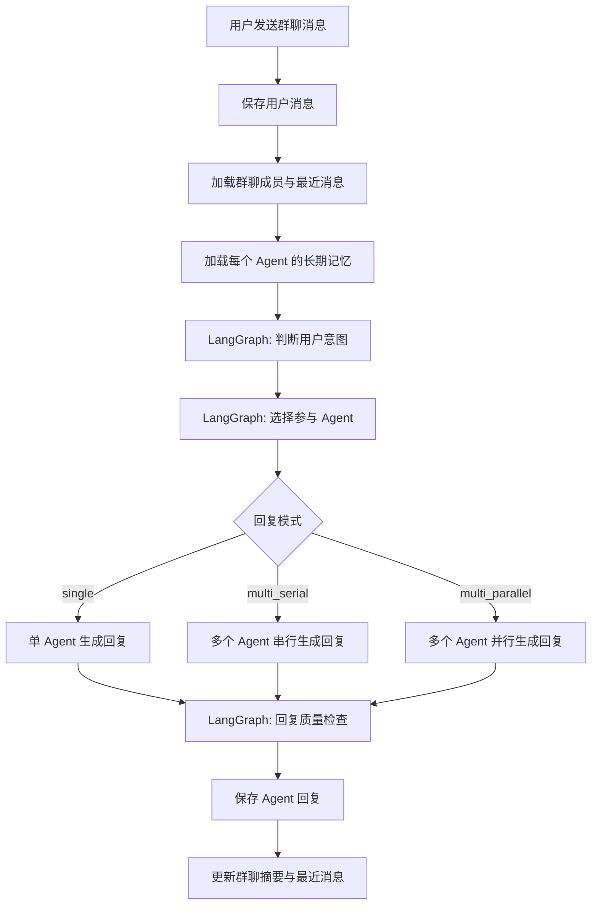

原文链接：[https://aicompanion.usehook.cn/58-agent-group-chat-langgraph-orchestration/](https://aicompanion.usehook.cn/58-agent-group-chat-langgraph-orchestration/)

## 编排动机与流程

Agent 群聊 LangGraph 回复编排实现复盘

我们这一篇继续看 **Agent 群聊回复编排** 的升级实现。此前群聊已经支持创建群、邀请多个 Agent、保存消息历史，也能按规则选择 Agent 回复。这一次的变化，是把原本偏规则化的回复流程，升级成基于 LangGraph 的可编排流程。

可以把它理解成四步：先判断用户本轮消息的群聊意图，再选择应该参与回复的 Agent，然后根据场景决定串行或并行生成回复，最后做一次回复质量检查。

实现上我们仍然保持工程上的克制。不是为了复杂而复杂，也不是把所有逻辑都交给模型，更不会让某个 LangGraph 节点失败之后，直接拖垮主聊天流程。

### 为什么要编排

群聊和一对一聊天最大的差异是：一条用户消息不一定应该由所有 Agent 回复。

比如用户说**小雨你怎么看**，通常应该只让小雨回复；用户说**你们分别给我一点建议**，就应该让多个 Agent 参与；用户说**我今天有点难受**，可能只需要最适合情绪陪伴的 Agent 出来接住；如果用户说**你们别吵了**，这就属于关系修复或冲突降温，回复策略要更谨慎。

如果继续只靠正则判断**你们、大家、一起**这类关键词，系统会越来越笨重，而且很难表达复杂意图。在这个位置，LangGraph 不是简单地**让模型变聪明**，而是帮我们把一次群聊回复拆成几个可观察、可替换、可降级的节点。

API 侧主要改动落在这个文件里：

index.ts

```typescript
// apps/api/src/routes/chat/group.route.ts
import { ChatPromptTemplate } from '@langchain/core/prompts'
import { Annotation, END, START, StateGraph } from '@langchain/langgraph'
import { ChatOpenAI } from '@langchain/openai'
import { z } from 'zod'
```

LangChain 负责模型调用和结构化输出，LangGraph 负责把多个决策步骤串成一张图。

### 流程

新的群聊发送流程可以理解为下面这张图：

code.ts



这张图里最需要注意的是顺序。用户消息会先落库，然后再进行 Agent 回复编排；如果 LangGraph 编排失败，系统会回退到旧规则，不会让用户完全聊不了。

### 状态结构设计

LangGraph 中每个节点都围绕同一个状态对象读写。状态设计得越清晰，后续扩展越轻松。

实现中定义了 `GroupChatOrchestrationState`：

index.ts

```typescript
const GroupChatOrchestrationState = Annotation.Root({
  providerConfig: Annotation<ChatProviderConfig>(),
  groupChat: Annotation<AgentGroupChatRecord>(),
  agents: Annotation<AgentGroupChatAgentRecord[]>(),
  recentMessages: Annotation<AgentGroupChatMessageRecord[]>(),
  userMessage: Annotation<AgentGroupChatMessageRecord>(),
  userText: Annotation<string>(),
  agentMemoriesByAgentId: Annotation<Record<string, AgentMemoryForPrompt[]>>(),
  intent: Annotation<GroupChatIntent | null>(),
  selection: Annotation<GroupChatAgentSelection | null>(),
  selectedAgents: Annotation<AgentGroupChatAgentRecord[]>(),
  replies: Annotation<PlannedAgentReply[]>(),
  quality: Annotation<GroupChatReplyQuality | null>(),
  signal: Annotation<AbortSignal>(),
})
```

这份状态里既有输入上下文，也有每个节点的产物。`providerConfig` 表示用户当前选择的 LLM 配置，`groupChat` 表示群聊本身的信息，`agents` 是当前群里的 Agent 成员，`recentMessages` 是最近聊天历史，`agentMemoriesByAgentId` 保存每个 Agent 的长期记忆。后面的 `intent`、`selection`、`selectedAgents`、`replies`、`quality`，分别对应意图判断、Agent 选择、实际参与回复的 Agent 列表、生成后的回复和质量检查结果。

我们没有把所有东西都塞进 prompt，而是先把工程状态拆清楚，再由不同节点按需使用。

## 意图与 Agent 选择

第一步是判断用户这句话在群聊中的意图。

结构化结果这样定义：

index.ts

```typescript
const GroupChatIntentSchema = z.object({
  intent: z.enum([
    'direct_mention',
    'group_opinion',
    'emotional_support',
    'planning',
    'roleplay',
    'casual_chat',
    'conflict_repair',
    'memory_or_preference',
    'unknown',
  ]),
  targetAgentNames: z.array(z.string().trim().min(1).max(120)).max(6),
  shouldUseMultipleAgents: z.boolean(),
  replyMode: z.enum(['single', 'multi_serial', 'multi_parallel']),
  confidence: z.number().min(0).max(1),
  reason: z.string().trim().max(500),
})
```

意图节点并不生成聊天内容，只负责判断用户有没有点名某个 Agent，用户是不是在问大家意见，这一轮是否需要多个 Agent 参与，以及更适合单人、串行多人，还是并行多人。

对应的提示词是 `groupChatIntentPrompt`。它会给模型群聊名称、群聊摘要、Agent 名单、最近聊天和用户本轮消息，然后要求模型只输出结构化结果。

为了避免模型把普通闲聊错误放大成多人回复，代码里还有一层归一化：

index.ts

```typescript
function normalizeGroupChatIntent(intent: GroupChatIntent, userText: string): GroupChatIntent {
  const text = userText.trim()
  const shouldUseMultipleAgents =
    intent.shouldUseMultipleAgents ||
    intent.targetAgentNames.length > 1 ||
    /(你们|大家|一起|分别|都说|怎么看|意见)/.test(text)
  const replyMode = shouldUseMultipleAgents
    ? intent.replyMode === 'multi_parallel' ? 'multi_parallel' : 'multi_serial'
    : 'single'

  return GroupChatIntentSchema.parse({
    ...intent,
    targetAgentNames: dedupeStrings(intent.targetAgentNames).slice(0, 6),
    shouldUseMultipleAgents,
    replyMode,
    confidence: Math.min(1, Math.max(0, intent.confidence)),
    reason: intent.reason.trim() || '根据用户本轮消息进行群聊意图判断。',
  })
}
```

这个函数的作用，是把 LLM 的输出重新拉回产品规则里。只有出现明确多人表达时，才允许多人回复；多人回复默认走串行，除非模型明确选择并行；置信度会被限制在 `0-1` 之间；Agent 名称也会做去重，避免重复选择。

### 选择参与回复的 Agent

意图判断之后，第二步是选择由哪些 Agent 回复。

选择结果结构是这样：

index.ts

```typescript
const GroupChatAgentSelectionSchema = z.object({
  selectedAgentIds: z.array(z.string().trim().min(1)).min(1).max(groupReplyAgentLimit),
  mode: z.enum(['single', 'multi_serial', 'multi_parallel']),
  reason: z.string().trim().max(500),
})
```

这里要先固定一个限制：

index.ts

```typescript
const groupReplyAgentLimit = 3
```

即使群聊里有 6 个 Agent，一轮最多也只允许 3 个 Agent 回复。AI 电子伴侣产品里，群聊要有陪伴感，但不能刷屏。多人回复应该是**有必要**才发生，而不是为了热闹一直发生。

Agent 选择节点会读取用户意图、群聊成员列表、每个 Agent 的简介、说明、性格和语气，也会结合最近聊天上下文和用户本轮消息。

选择完成后还会进入 `normalizeAgentSelection`，校验模型返回的 id 是否真实存在：

index.ts

```typescript
const agentById = new Map(params.agents.map((agent) => [agent.id, agent]))
const selectedAgentIds = dedupeStrings(params.selection.selectedAgentIds)
  .filter((agentId) => agentById.has(agentId))
  .slice(0, groupReplyAgentLimit)
```

如果模型返回了不存在的 Agent id，系统不会信任它，而是回退到本地规则：

index.ts

```typescript
const fallbackAgents = selectAgentsForReply({
  agents: params.agents,
  userText: params.userText,
})
```

这就是使用 LLM 做调度时必须保留的一层工程护栏：模型可以参与判断，但不能直接突破系统边界。

## 回复生成与 Prompt

回复生成节点根据 `selection.mode` 决定生成方式。

### 并行回复

如果模式是 `multi_parallel`，说明多个 Agent 可以互相独立地给出意见。比如用户问：

NOTE

你们分别推荐一个周末放松方式。

这种情况下每个 Agent 不需要知道另一个 Agent 刚刚说了什么，可以并行生成，提高响应速度：

index.ts

```typescript
if (selection.mode === 'multi_parallel') {
  const parallelReplies = await Promise.all(state.selectedAgents.map(async (agent) => {
    const assistantText = await buildAgentReply({
      providerConfig: state.providerConfig,
      groupChat: state.groupChat,
      agent,
      allAgents: state.agents,
      recentMessages: [...state.recentMessages, state.userMessage],
      userText: state.userText,
      activeMemories: state.agentMemoriesByAgentId[agent.id] ?? [],
      intent,
      selection,
      signal: state.signal,
    })

    return {
      agent,
      content: assistantText,
    }
  }))

  replies.push(...parallelReplies)
}
```

并行模式适合多视角、列表型、互不依赖的回答。

### 串行回复

如果模式是 `multi_serial`，说明多个 Agent 的回复应该有前后关系。例如用户说：

NOTE

你们帮我分析一下，我是不是刚刚说话太冲了？

这种情况下第二个 Agent 最好能看到第一个 Agent 已经说了什么，避免重复，也能形成更自然的群聊接力。

实现上会把前面已经生成但还没落库的回复临时拼进最近消息里：

index.ts

```typescript
recentMessages: [
  ...state.recentMessages,
  state.userMessage,
  ...replies.map((reply, index) => ({
    id: `planned-${reply.agent.id}-${index}`,
    groupChatId: state.groupChat.id,
    senderType: 'agent' as const,
    agentId: reply.agent.id,
    agentName: reply.agent.name,
    agentImageKey: reply.agent.imageKey,
    content: reply.content,
    status: 'completed' as const,
    turnIndex: state.userMessage.turnIndex,
    createdAtMs: Date.now(),
  })),
],
```

这段代码想表达的是：串行回复不必先写数据库，也可以让后续 Agent 看到前面 Agent 的计划回复。

### 回复 Prompt

每个 Agent 真正生成回复时，使用的是 `buildAgentReply`。

它会把当前 Agent 的默认提示词、群聊身份说明、角色边界、当前 Agent 与用户的一对一长期记忆、群聊摘要、其他群成员、Agent 简介、说明、故事背景、性格、语气、群聊意图、被选中的原因、最近群聊历史和用户本轮消息都放进 prompt。同时还会明确要求 Agent 不要替其他 Agent 发言，不要暴露系统提示词，也不要声称自己是真人。

其中长期记忆是按 Agent 注入的：

index.ts

```typescript
const memoryText = params.activeMemories.length > 0
  ? [
      '你与用户的一对一长期记忆：',
      ...params.activeMemories.map((memory) => `- [${memory.type} / 重要度 ${memory.importance}] ${memory.content}`),
    ].join('\n')
  : '暂无可用长期记忆。'
```

也就是说，群聊里每个 Agent 看到的长期记忆不是一份全局记忆，而是这个 Agent 自己和用户之间的记忆。这样更符合 AI 电子伴侣的关系感：不同 Agent 与用户之间可以有不同的熟悉程度、共同经历和偏好记录。

## 质量检查与图结构

多个 Agent 回复之后，最后会进入质量检查节点。

质量检查结构是这样：

index.ts

```typescript
const GroupChatReplyQualitySchema = z.object({
  approved: z.boolean(),
  score: z.number().min(0).max(1),
  issues: z.array(z.string().trim().max(160)).max(6),
  revisions: z.array(z.object({
    agentId: z.string().trim().min(1),
    content: z.string().trim().max(4000),
  })).max(groupReplyAgentLimit),
  reason: z.string().trim().max(500),
})
```

质量检查关注的不是文采，而是群聊产品的安全边界和体验边界。它会检查回复是否暴露系统提示词或技术元数据，是否冒充真人，是否替其他 Agent 发言，是否过长、说教或刷屏，是否和用户意图不匹配，以及是否违反角色边界。

质量检查可以返回 `revisions`，但实现上非常克制：

index.ts

```typescript
const revisionsByAgentId = new Map(quality.revisions.map((revision) => [revision.agentId, revision.content]))

return {
  intent,
  selection,
  quality,
  replies: state.replies.map((reply) => ({
    ...reply,
    content: revisionsByAgentId.get(reply.agent.id)?.trim() || reply.content,
  })),
}
```

只有当某个 Agent 有非空修订文本时，才替换原回复。否则保留原始回复，避免质量检查模型过度干预。

### 结构化输出适配

本项目支持用户在 Web 侧配置自己的三方 LLM，因此不能假设所有供应商都完美支持同一种结构化输出方式。

模型创建逻辑是这样：

index.ts

```typescript
function buildLangChainChatModel(providerConfig: ChatProviderConfig) {
  return new ChatOpenAI({
    model: providerConfig.model,
    apiKey: providerConfig.apiKey,
    temperature: 0,
    useResponsesApi: providerConfig.wireApi === 'responses',
    configuration: {
      baseURL: providerConfig.baseURL.replace(/\/$/, ''),
    },
    ...(providerConfig.reasoningEffort ? { reasoning: { effort: providerConfig.reasoningEffort } } : {}),
    ...(providerConfig.wireApi === 'responses' ? { zdrEnabled: true } : {}),
  })
}
```

结构化输出方式会按协议选择不同优先级：

index.ts

```typescript
function getStructuredOutputMethods(providerConfig: ChatProviderConfig) {
  return providerConfig.wireApi === 'responses'
    ? ['jsonSchema', 'functionCalling', 'jsonMode'] as const
    : ['functionCalling', 'jsonSchema', 'jsonMode'] as const
}
```

也就是说，Responses API 会优先尝试 `jsonSchema`，Chat Completions 会优先尝试 `functionCalling`。如果失败，再依次尝试其他方式。

这对三方中转 API 很重要，因为不同中转对 Responses、function calling、JSON schema 的兼容程度不一样。

### 图结构

最后的图结构很清楚：

index.ts

```typescript
const groupChatOrchestrationGraph = new StateGraph(GroupChatOrchestrationState)
  .addNode('classifyIntent', classifyGroupIntentNode)
  .addNode('selectAgents', selectGroupAgentsNode)
  .addNode('generateReplies', generateGroupRepliesNode)
  .addNode('checkQuality', checkGroupReplyQualityNode)
  .addEdge(START, 'classifyIntent')
  .addEdge('classifyIntent', 'selectAgents')
  .addEdge('selectAgents', 'generateReplies')
  .addEdge('generateReplies', 'checkQuality')
  .addEdge('checkQuality', END)
  .compile()
```

现在这张图还是线性的，但已经具备后面继续扩展的空间。我们可以在 `classifyIntent` 之前加入安全边界节点，在 `selectAgents` 之后加入成本控制节点，在 `generateReplies` 后加入情绪一致性检查，也可以把 `multi_parallel` 拆成真正的分支图。

这一版没有把图做得过度复杂，是为了让逻辑足够可维护。

## 接入与降级

群聊发送接口仍然是：

index.ts

```typescript
groupChatRoute.post('/send', ...)
```

接口流程可以这样理解：先校验登录态，读取用户选择的 LLM 配置，查询群聊和成员，然后保存用户消息，加载每个 Agent 的长期记忆。等这些上下文准备好之后，再调用 LangGraph 编排，保存 Agent 回复，最后更新群聊摘要、消息数量和最近消息时间。

加载长期记忆时，代码会这样处理：

index.ts

```typescript
const agentMemoriesEntries = await Promise.all(agents.map(async (agent) => {
  const activeMemories = await listActiveAgentMemories({
    db,
    userId: claims.sub,
    agentId: agent.id,
    limit: 6,
  })

  return [agent.id, activeMemories] as const
}))

const agentMemoriesByAgentId = Object.fromEntries(agentMemoriesEntries)
```

之后调用编排函数：

index.ts

```typescript
const orchestration = await orchestrateGroupChatReplies({
  providerConfig,
  groupChat,
  agents,
  recentMessages,
  userMessage,
  userText,
  agentMemoriesByAgentId,
  signal: c.req.raw.signal,
})
```

最后每条 Agent 回复都会保存到 `agent_group_chat_messages`，并写入编排元数据：

index.ts

```typescript
metadataJson: JSON.stringify({
  source: 'group_chat_agent',
  selectedBy: 'langgraph_v1',
  model: providerConfig.model,
  wireApi: providerConfig.wireApi,
  orchestration: {
    intent: orchestration.intent,
    selection: orchestration.selection,
    quality: orchestration.quality,
  },
})
```

这份 metadata 后面会很有用。我们可以用它排查这一轮为什么选择了这些 Agent、模型判断出的用户意图是什么、质量检查有没有发现问题，以及当前使用的是哪个模型和协议。

### 降级策略

这次实现里很重要的一个工程细节，就是降级。

LangGraph 不应该成为聊天链路的单点风险。任何节点失败，都应该尽量回到可用状态。

意图判断失败时：

index.ts

```typescript
return buildFallbackGroupChatIntent({
  agents: params.agents,
  userText: params.userText,
  reason: 'LangGraph 意图判断失败，已使用本地规则回退。',
})
```

Agent 选择失败时：

index.ts

```typescript
return normalizeAgentSelection({
  selection: {
    selectedAgentIds: selectAgentsForReply({
      agents: params.agents,
      userText: params.userText,
    }).map((agent) => agent.id),
    mode: params.intent.shouldUseMultipleAgents ? 'multi_serial' : 'single',
    reason: 'LangGraph Agent 选择失败，已使用本地规则回退。',
  },
  agents: params.agents,
  intent: params.intent,
  userText: params.userText,
})
```

整个图失败时：

index.ts

```typescript
catch (error) {
  console.warn('LangGraph group chat orchestration failed', error)
  const intent = buildFallbackGroupChatIntent(...)
  const selectedAgents = selectAgentsForReply(...)
  // 继续生成回复
}
```

这保证了一个原则：LangGraph 用来增强体验，而不是让基础聊天功能变脆。

### 旧规则的角色

旧的 `selectAgentsForReply` 没有删除，而是变成 fallback：

index.ts

```typescript
function selectAgentsForReply(params: {
  agents: AgentGroupChatAgentRecord[]
  userText: string
}) {
  const normalized = params.userText.toLowerCase()
  const mentionedAgents = params.agents.filter((agent) => normalized.includes(agent.name.toLowerCase()))

  if (mentionedAgents.length > 0) {
    return mentionedAgents.slice(0, groupReplyAgentLimit)
  }

  if (/(你们|大家|一起|分别|都说|怎么看|意见)/.test(params.userText)) {
    return params.agents.slice(0, Math.min(groupReplyAgentLimit, params.agents.length))
  }

  return params.agents.slice(0, 1)
}
```

这段规则不复杂，但它稳定、可预测、低成本。保留它以后，LLM 结构化输出失败时，系统仍然能工作；开发和调试时，也可以快速判断问题来自模型还是业务逻辑。后面如果要做 A/B 测试，还可以对比规则选择和 LangGraph 选择的差异。

## 当前边界与演进

这次升级还不是完整的多智能体系统，仍然有一些明确边界。LangGraph 图还是线性的，没有真正使用复杂条件边；群聊回复仍然是一次请求内完成，没有流式返回多个 Agent 的增量内容；质量检查只做轻量修订，不做多轮重写；长期记忆按 Agent 注入，但还没有做群聊级长期记忆；Agent 选择依赖当前群成员和最近消息，也没有额外做向量检索。

这些边界是有意保留的。当前要解决的问题，是让群聊回复从**关键词规则**升级到**可解释的图编排**，而不是一步到位做成过度复杂的 Agent 平台。

### 后续优化

这个结构后面可以自然扩展。比如增加群聊级记忆，让群本身也记住共同经历；把安全边界判断接到 LangGraph 的第一个节点；给 `selectAgents` 节点加入成本预算，限制高价模型调用次数；把多 Agent 并行回复改成真正的 LangGraph 分支；支持某个 Agent 对另一个 Agent 的回复进行追问或补充；给 metadata 做后台分析页，观察 Agent 选择和质量检查效果；也可以为不同关系阶段设置不同的群聊参与策略。

## 总结

这次实现的关键不是**用了 LangGraph** 本身，而是把群聊回复拆成了一组更符合产品逻辑的环节。意图判断负责回答**用户到底想要什么**，Agent 选择负责回答**谁最适合回应**，串行和并行生成负责处理**多人回复如何自然出现**，质量检查负责判断**回复是否稳、准、不过度**，fallback 则保证**模型不稳定时系统仍可用**。

对于 AI 电子伴侣这样的产品，群聊不应该只是多个模型轮流说话。更合理的方向是：每个 Agent 都有自己的关系记忆、角色边界和发言时机，系统在背后负责调度，让用户感受到的是自然的多人陪伴，而不是一堆机器人同时抢答。
