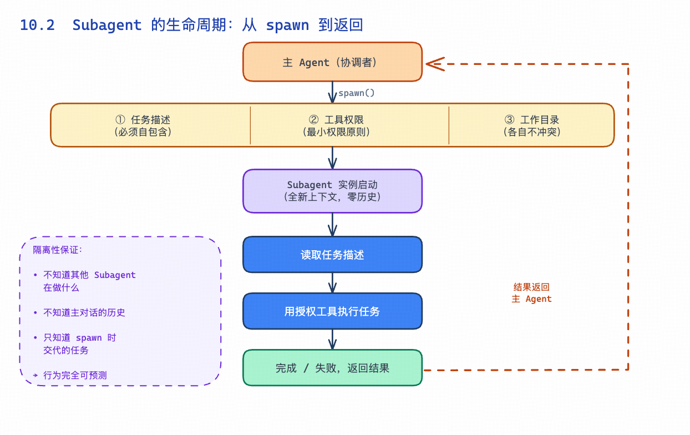
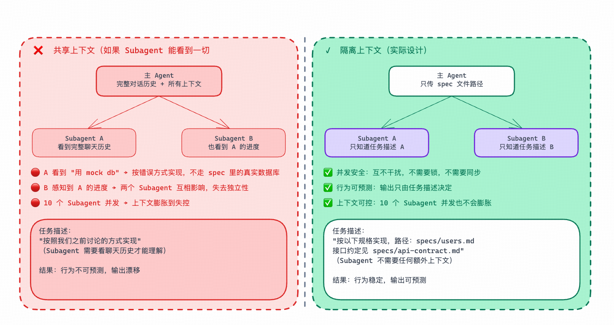
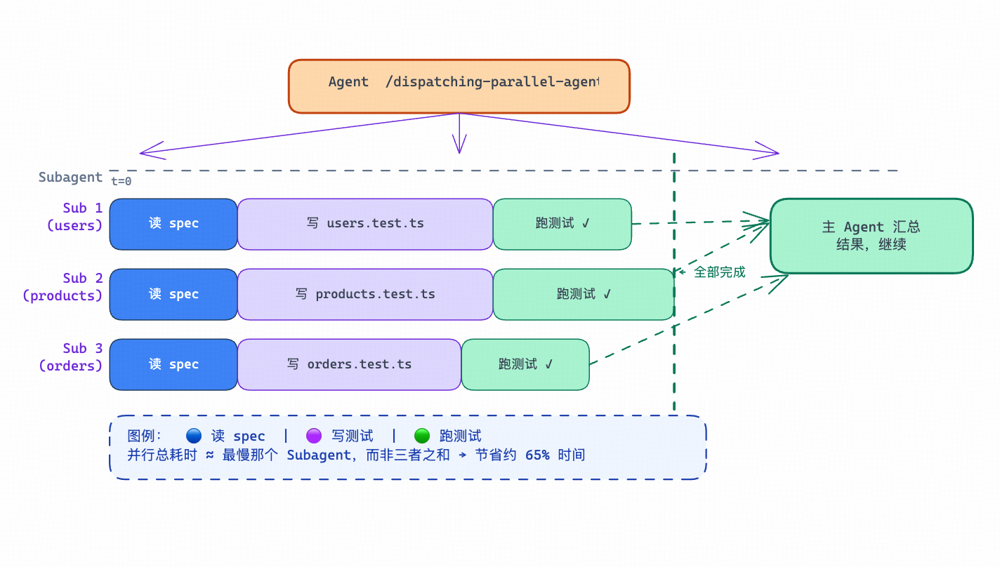

原文链接：[https://xiaobot.net/post/003dd0e8-aa71-4903-86af-55869d8988d2](https://xiaobot.net/post/003dd0e8-aa71-4903-86af-55869d8988d2)

#

> 第二部分：Skills 深度解析

上一章讲完了 Hooks——一种让部分工作"自动发生"的机制。但有些任务，即便用了 Skill 和 Hook，单个 Agent 会话跑起来还是很慢。

比如你要同时为三个独立模块写测试。用一个 Agent 顺序跑：写完 A 模块测试，再写 B，再写 C。三件互不依赖的事，一件一件排队，总时间是三者之和。

Subagent 是打破这个上限的机制——它让主 Agent 把任务"分包出去"，派出多个子 Agent 同时处理，然后汇总结果继续。

---

## 10.1　Agent vs Subagent：主线程与子任务

你和 Claude Code 的对话，本身就是一个 Agent 会话——有完整的上下文、工具访问权限、当前工作目录。当这个 Agent 遇到可以并行处理的任务时，它可以派生出多个 Subagent。每个 Subagent 是一个独立的 Claude 实例，接一个子任务，执行完成后把结果返回给主 Agent。

打个比方：主 Agent 是项目经理，Subagent 是被分配了具体任务的开发者。项目经理不自己写每一行代码，而是把任务分发出去，等结果汇总。

有一点要搞清楚：

主 Agent

Subagent

上下文

完整对话历史

只知道被交代的那个任务

状态

有状态，负责协调

无状态，执行后结束

数量

单个

一次可以多个并发

职责

理解全局、分配任务、汇总结果

聚焦一个子任务，做到最好

Subagent 没有主 Agent 的对话历史，不知道你们之前聊了什么，不知道其他 Subagent 在做什么。它只知道 spawn 时传给它的任务描述——那份描述就是它的全部世界。

---

## 10.2　Subagent 的生命周期



从派生到结束，一个 Subagent 的完整生命周期是这样的：

```
主 Agent
↓ spawn(任务描述, 工具权限, 工作目录)
Subagent 实例启动（全新上下文，零历史）
↓ 读取任务描述
↓ 用授权工具执行任务（读文件、写代码、跑测试……）
↓ 完成或失败
↓ 返回结果给主 Agent
主 Agent
↓ 收到结果，继续主流程
```

Spawn 时必须指定三件事：

**任务描述**：Subagent 能看到的全部信息。这份描述必须是自包含的——Subagent 没有任何办法"问主 Agent 一个问题"，也没法回头看聊天记录。任务描述写不清楚，Subagent 只能猜。

**工具权限**：允许 Subagent 使用哪些工具。可以只开放文件读写，也可以开放 Bash、MCP 工具等。最小权限原则——只开放任务需要的工具，其余全部收回。

**工作目录**：Subagent 文件操作的基准路径。多个 Subagent 同时跑时，确保各自的工作目录不冲突。

---

## 10.3　哪些 Skills 会调度 Subagent

理解了 Subagent 的原理，再看这些 Skill 就清楚多了：

**/subagent-driven-development**：SDD 流程里最重要的执行 Skill。读取 tasks.md 里的 Task 列表，分析依赖关系，为可以并行的 Task 各派一个 Subagent，有依赖的 Task 串联等待。这是 SDD 把"串联规划 + 并联执行"落地的核心机制。

**/dispatching-parallel-agents**：通用的并发调度 Skill。当你手头有多个互不依赖的任务，用这个 Skill 直接派出多个 Subagent 同时处理，不需要走完整的 SDD 流程。

**/brainstorming 的 visual companion 模式**：brainstorming 主流程在和你对话时，后台会派出一个 Subagent 生成浏览器端的可视化 mockup——主流程不等 mockup 完成，两件事并行推进。

这三个 Skill 的共同逻辑是：**主 Agent 做协调，Subagent 做执行。** 主 Agent 理解全局、分配任务、汇总结果；Subagent 聚焦一个子任务，不分心，不绕弯。

---

## 10.4　隔离性：为什么 Subagent 不共享上下文



每个 Subagent 启动时，上下文是空的。

这不是技术限制，是设计决策。

想想如果 Subagent 共享主 Agent 的上下文会发生什么：

- Subagent A 写 users 模块，看到了主对话里提到的"临时用一个简单的 mock db"——它可能跟着用 mock，而不是按 spec 里的真实数据库实现

- Subagent B 看到了 Subagent A 的进度消息——两个 Subagent 开始互相影响，失去了独立性

- 10 个 Subagent 并发时，上下文大小会膨胀到失控

隔离性带来两个核心好处：

**并发安全。** 多个 Subagent 同时跑，互不干扰。每个 Subagent 在自己的"沙箱"里操作，不需要锁，不需要同步，不会产生竞争条件。

**行为可预测。** Subagent 的输出只由任务描述决定，不受聊天历史影响。你能预测它会做什么——因为你控制了它能看到的全部信息。

隔离性也带来了一个要求：**给 Subagent 的任务描述必须自包含。**

不能写"按照我们之前讨论的方式实现"，要写"按照以下规格文件实现，规格文件路径是 specs/users.md，接口约定见 specs/api-contract.md"。

这也是为什么 SDD 流程要先写 spec 再执行：spec 文件就是 Subagent 的完整上下文。写好了规格，Subagent 才能真正独立工作。反过来说，规格写得模糊，Subagent 的输出就开始各自漂移。

---

## 10.5　案例：三个 Subagent 同时写测试

场景：一个 API 项目，要同时为用户、商品、订单三个模块写单元测试。三个模块互相独立，完全可以并行。



用 /dispatching-parallel-agents：

```
你：/dispatching-parallel-agents
任务：
1. 为 src/users/ 模块写单元测试，规格见 specs/users-spec.md
2. 为 src/products/ 模块写单元测试，规格见 specs/products-spec.md
3. 为 src/orders/ 模块写单元测试，规格见 specs/orders-spec.md
```

主 Agent 读到请求，判断三个任务互相独立，同时派出三个 Subagent：

```
// 主 Agent 的调度逻辑（伪码）
const tasks = [
{ id: 1, desc: '为 users 模块写测试', specPath: 'specs/users-spec.md' },
{ id: 2, desc: '为 products 模块写测试', specPath: 'specs/products-spec.md' },
{ id: 3, desc: '为 orders 模块写测试', specPath: 'specs/orders-spec.md' },
]
// 三个任务无依赖，全部并发
const results = await Promise.all(
tasks.map(task => spawnSubagent({
description: `${task.desc}，规格见 ${task.specPath}`,
// ↑ 任务描述完全自包含，Subagent 不需要问任何人
tools: ['Read', 'Write', 'Bash(npm test)'],
workDir: process.cwd(),
}))
)
// 所有 Subagent 完成后，主 Agent 汇总结果
console.log('测试覆盖率：', results.map(r => r.coverage))
```

实际效果：

```
Subagent 1                  Subagent 2                  Subagent 3
└─ 读 users-spec.md         └─ 读 products-spec.md      └─ 读 orders-spec.md
└─ 写 users.test.ts         └─ 写 products.test.ts      └─ 写 orders.test.ts
└─ 运行测试，确认通过         └─ 运行测试，确认通过         └─ 运行测试，确认通过
└─ 返回结果 ─────────────────────────────────────────────────────→ 主 Agent 汇总
```

三个任务并行，总耗时约等于最慢那个任务的耗时，而不是三者之和。实际跑下来，通常能节省 60%–70% 的时间。

---

## 小结

至此，第二部分的五个核心概念都讲完了：

概念

一句话

**Skill**

把一个可复用的工作流固化成一个命令

**MCP**

给 AI 提供外部能力（数据库、API、工具）

**Skill 组合**

串联 + 并联，把多个 Skill 串成流水线

**Hooks**

事件驱动，让部分动作在特定时机自动发生

**Subagent**

让主 Agent 分包任务，多个子 Agent 并发执行

这五个概念不是孤立的——它们共同构成了 SDD 工具链的基础设施。Skill 定义了"做什么"，MCP 扩展了"能做什么"，Skill 组合决定了"怎么排列"，Hooks 管理了"什么时候触发"，Subagent 解决了"怎么并发跑"。

理解了这一层，SDD 的全流程实操才有了真正的基础。

第三部分，我们把这套工具链放进真实的开发流程里——从需求澄清到代码审查，从规格提案到验证归档，每个环节怎么落地，坑在哪里，走过一遍你就明白了。
