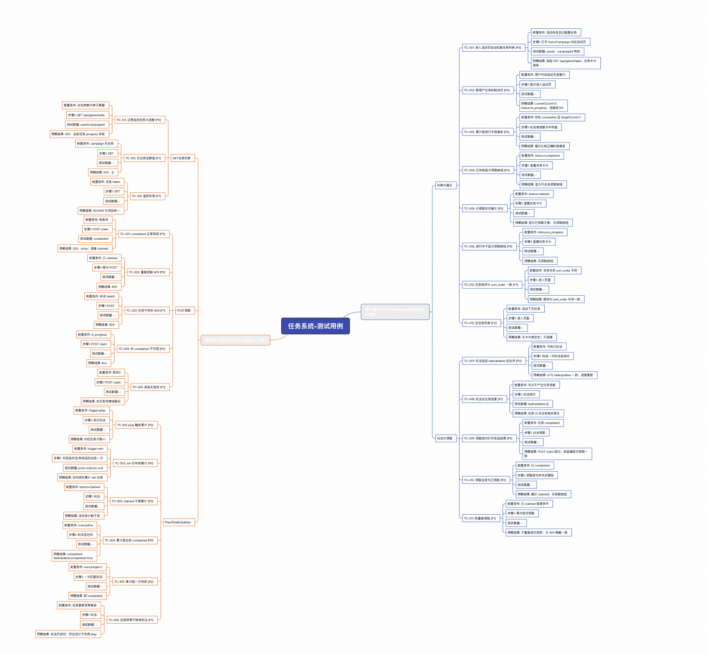

原文链接：[https://xiaobot.net/post/c1490265-8bbf-4edf-953c-280fbd7e4070](https://xiaobot.net/post/c1490265-8bbf-4edf-953c-280fbd7e4070)

前面如果把规格、实施计划都摆齐了，下一关通常是：**谁来把这些东西翻译成可执行的测试用例**。手写当然行，但重复度高、还容易写成「看起来很多、跑起来很虚」的清单。

Fly哥这章只聊一件事：仓库里的 **/tdd-test-spec-skill**（.cursor/skills/tdd-test-spec-skill）——它不是一句 prompt，而是一条带版本检测、输入路由、规则约束、输出结构、再落盘 XMind 的固定流水线。 完整的skill 链接： [https://github.com/wzf1997/play-sdd/tree/main/.cursor/skills/tdd-test-spec-skill](https://github.com/wzf1997/play-sdd/tree/main/.cursor/skills/tdd-test-spec-skill)

---

### 17.1 为什么「问 AI 写几个用例」经常翻车

很多人第一次用 AI 写用例，路径是这样的：把 PRD 一贴，问「给我十条用例」。AI 会交卷，而且常常交得「像那么回事」——但一落地执行，问题全来了：步骤写得像散文，边界没封住，反向场景缺一半，优先级清一色 P1。

不是模型突然变笨了。**没有结构化输入、没有输出契约、没有模式路由**，它只能按「写满为止」的默认习惯工作。你得到的是“像测试用例的东西”，不是“能进回归集的东西”。

和传统「复制 PRD → 手搓表格」相比，Skill 的差别在于：它先决定**信谁**（输入源优先级），再决定**怎么排版**（客户端 / 接口 / A·B 三种骨架），最后用 **generation_rules.md 之类规则**把低价值、不可验证、凭空扩展的内容挡在门外。

说白了：**AI 不缺生成速度，缺的是你把规格变成约束。**

---

### 17.2 Skill 实际怎么跑：从版本检测到 XMind

tdd-test-spec-skill 的主干流程，仓库里写得很直白，你可以把它当成固定 checklist：

```plaintext
0. 版本检测
→ 1. 输入源路由（与 SDD 主链路对齐）
优先：openspec/specs/…/spec.md、docs/superpowers/plans（Superpowers Implementation Plan）
拉通：Figma 设计稿（MCP 取稿，与 spec/plan 对界面与交互）
补充：飞书 PRD / Wiki、用户粘贴
→ 2. 输入解析（按 input_sources 规则提取可测点）
→ 3. 内容获取
→ 4. 用例生成（按 rules/mode_selection.md 定模式）
→ 5. 输出 Markdown
→ 6. 生成 XMind
```

**第一步「路由」决定天花板。** 你已经是 SDD 工作流：默认先吃 **spec.md + Superpowers plan**（本地路径即可），需要核对视觉与控件时再走 **Figma MCP** 与设计稿打通；**PRD / 飞书文档**放在补充位，和规格冲突时仍以 openspec/specs 为准。造数场景下再用 **造数 MCP**（Community_AI_Data_Tool）。默认测试环境 **T1**，账号侧默认用造数工具拿数据——这和「只生成文档、不管能不能跑」的玩法不是一回事。

**第二步到第四步**才是多数团队真正省时间的部分：按 input_sources.md 把材料拆成可测点，再交给 mode_selection.md 选对文档骨架——否则客户端表格和接口判定表混在一锅粥里，review 的人会疯。

---

### 17.3 输入源：谁优先，冲突了听谁的

Skill 支持的输入组合很多，但优先级心里要有数：

| 来源 | 角色 |
|------|------|
| **OpenSpec spec.md** | 契约级输入，Requirement / Scenario / WHEN / THEN 本身就像用例骨架，翻译路径最短。 |
| **Superpowers Implementation Plan** | 偏实施：Goal 像顶层验收，File Map 像分区边界，Task/Step 像功能点清单；边界往往要靠规则补。 |
| **飞书 / PRD / 粘贴** | 质量完全跟随文档是否写清字段、错误码、流程；模糊文档就只能产出模糊用例。 |

**多种输入可以合并**；若描述打架，以现行 **openspec/specs** 为准——PRD 可能是历史版本，spec 才是「此刻约定」。

我个人会更激进一点：**能写 spec 就别只喂 PRD**。不是道德优越感，是省钱——后面少改一遍用例，比前面省半小时粘贴时间划算得多。

---

### 17.4 模式路由：三种骨架，别用错容器

真正写过长测试 spec 的人都知道：**错把接口逻辑塞进 UI 表格式**，或者反过来，后期维护成本会指数级上升。Skill 用 mode_selection.md 做模式选择，经验法则是信号检测：

- **exp_key / variant 一类词冒头** → 走 **A·B 实验**（ab_experiment_rules.md），把组间差异和「实验外通用行为是否被误伤」钉死。
- **多个条件共同决定某个接口字段** → 走 **服务端接口**（server_interface_rules.md），核心武器是**判定表**：先穷举组合，再落用例，直觉漏网的那类 corner case 会少很多。
- **其余默认** → **客户端 / 功能测试**：按模块分节，用例独立成表，逐步可执行。

一份需求里多层同时出现也常见：各层分别判定，**同一份 Markdown 里分模块写**，比硬揉成一种结构要干净。

---

### 17.5 输出长什么样：两种版式，接口那张表有纪律

Skill 对「测试用例字段」有统一约定：ID、标题、描述、前置、步骤、预期、端、优先级（P0/P1/P2）——先统一字段，后面无论是人跑还是接工具，都少扯皮。

**客户端**偏叙述型结构：概述（范围、环境）→ 分模块 → 每条用例一张表 → 最后统计。

**服务端接口**则强调**一张横向大表**撑住同一接口：Mock 字段各占一列，设计方法列标注等价类 / 判定表 / 错误推测，枚举值该拆行就拆行，异常兜底单独成行——对比「每个场景单独一个小竖表」，review 时一眼能对比差异点。

把核心判断逻辑先写成伪代码，对团队很有用。Skill 建议用简短可执行的伪代码表达意图，例如：

```js
// 任务进度更新：由任务类型、当前进度、玩法结果共同决定下一状态
async function nextTaskStatus({ taskType, progress, playResult }) {
if (playResult === 'error') return { status: 'unchanged', reason: 'server_error' };
if (taskType === 'single' && progress.goalMet) return { status: 'completed' };
if (taskType === 'cumulative' && progress.current >= progress.target) {
return { status: 'completed' };
}
return { status: 'in_progress' };
}
```

先让它站得住，再拆判定表——这比憋「灵感型用例」稳。

---

### 17.6 三条硬约束：让生成结果「真的能进回归」

generation_rules.md 里几条看起来苛刻，其实是替团队挡债：

- **埋点严格剔除**：验证成本高、重复维护的心智负担大，混进功能回归集只会稀释注意力。
- **正向必须带反向**：规格只写成功路径，规则也会逼你把失败、重复、状态不允许一类路径补出来。
- **写操作必须验证状态**：「调接口返回 200」不够——领取之后查询状态是否落库、刷新 UI 是否一致，才是集成层面该盯的东西。

另外还有一层和产品纪律对齐：**只覆盖规格与计划里写得出来的行为**——文档没写的，不凭空「帮你完善产品」。这和 SDD「规格是源头」是同一句坏话的不同侧面：**少写胡写的用例，比多写凑数的用例更重要。**

---

### 17.7 落地例子：任务系统那次的分层

拿项目里真实走过的一条路径来说：输入 docs/superpowers/plans 下的任务系统 Plan，输出 任务系统-测试spec.md，大约二十多条，分两层。

- **File Map** 已经告诉你测哪些面：Web 组件、BFF 代理、service 进度逻辑——测试范围不用重新猜。
- **客户端侧**从 Task/Step 抽「用户可见行为」：进活动页拉列表、进度展示、领取按钮出现条件、未登录/超时/服务错误等。注意过滤掉「在某某 hook 里封装 fetch」这种实现细节——黑盒用例只盯外显行为。
- **服务端侧**把「任务类型 × 进度 × 玩法结果」拉开判定表，再映射到接口用例——这比「先拍脑袋列 TC 编号」要慢一小步，但后面补漏的时间会十倍还回来。

Markdown 定稿后，Skill 会调用仓库脚本把结构落到思维导图：

```bash
python3 .cursor/skills/tdd-test-spec-skill/scripts/generate_xmind.py \
--output "./任务系统-测试用例.xmind" \
--title "任务系统-测试用例" \
--cases '<JSON>'
```

默认落在当前工作目录：***-测试spec.md + *-TDD测试用例.xmind** 一对交付。XMind 用来做用例 review 很合适——树一展开，哪里薄一眼能看见。

这个是我生成的测试用例思维导图



---

到这里，**测试用例这一层已经落地**——有结构、有优先级、能和规格对上号。再往下就不是「写什么」，而是**怎么跑起来**：下一章我们聊**如何执行测试用例**，把同一批意图拆到 **单元测试**（函数与模块）、**E2E 测试**（端到端链路）里，让 spec 里写过的东西在 CI 和回归里真的发生。
