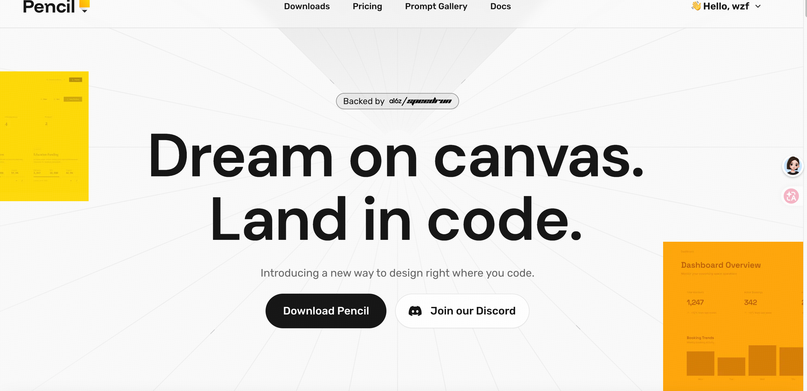

原文链接：[https://xiaobot.net/post/3e8f2b6a-a76f-4ab6-9436-ff6d450bf1b2](https://xiaobot.net/post/3e8f2b6a-a76f-4ab6-9436-ff6d450bf1b2)

## 2.1 从氛围编程到规范驱动

AI 编程的第一个阶段，基本上是这样的：打开对话框，用几句话描述想要什么，AI 吐出一段代码，复制粘贴，跑一下，看看对不对。这种方式有个名字——Vibe Coding（氛围编程）。够快，够爽，适合做原型。

但氛围编程有个根本问题：AI 不知道你脑子里的全貌，它只能猜。猜得越多，偏差越大。

在企业级场景里，这种偏差会被放大。上下文漂移——AI 在处理第三个功能时，早把第一个功能的业务边界忘了。代码质量不稳定，每次对话都像重新开始。人和 AI 之间、AI 和工具之间没有统一协议，各说各话。

SDD 解决的正是这个问题。核心逻辑只有一句：用规范约束模型，用上下文喂给模型，用工作流复用经验。AI 的准确率不是靠模型更聪明，而是靠系统更确定。高准确率 AI 编程的本质，是确定性，不是智能。

## 2.2 规格是唯一真相来源

SDD 的核心就一句话：先写规格，再生成代码。规格是唯一真相来源。

规格文档是一个 Markdown 文件，描述三件事：接口契约（这个端点接收什么、返回什么）、行为约束（边界条件、错误处理、事务要求）、数据模型（字段、类型、关系）。

代码可以重写，注释可以过时，但规格文档必须和当前系统保持一致。如果规格变了，代码要跟着变。如果代码变了但规格没变，这是一个 bug，不是"灵活调整"。

听起来严苛，但这种严苛省了很多力气。

## 2.3 SDD vs TDD vs BDD

这三种方法经常被混为一谈，先说 TDD 和 BDD 各自在做什么，再说 SDD 解决的是哪一层问题。

**TDD（Test-Driven Development，测试驱动开发）**

先写测试，再写代码。核心是三步循环：红（写一个必然失败的测试）→ 绿（写最简单的代码让测试通过）→ 重构（清理代码，保持测试通过）。反复循环，每次只构建一小块经过验证的代码。

TDD 的测试是技术性的，用编程语言写，检查的是"代码做了什么"，不是"代码怎么做的"。适合有复杂内部逻辑的类、老系统加新功能、需要重构但怕改坏的场景。

TDD 也有坑。一次写太多测试、测试里堆满 mock、断言细到实现细节——这些是设计出了问题，不是 TDD 本身的问题。GUI 密集型的功能也不适合 TDD，因为关注点不在代码行为。

**BDD（Behavior-Driven Development，行为驱动开发）**

用接近自然语言的方式描述用户行为场景（Given / When / Then），让产品、开发、测试能在同一份描述上对齐。关注的是用户故事，不是代码单元。

BDD 理论上好，落地很难。需要多方持续参与，一旦某一方脱节，Given-When-Then 就变成了只有测试人员在维护的文档。

**SDD（Spec-Driven Development，规格驱动开发）**

先写规格，规格描述接口契约和架构约束，AI 按规格生成代码，生成后对照规格逐条审查。关注的是系统设计的精确性。

SDD 把视角再往前移了一层。TDD 问的是"代码行为对不对"，BDD 问的是"功能符不符合用户预期"，SDD 问的是"系统在代码生成之前，到底应该是什么样的"。

三者不互斥。SDD 项目里可以有 TDD——规格文档定义了验收标准，TDD 在实现层面保证代码行为。BDD 的场景描述也可以作为规格文档的补充，尤其是需要和产品对齐的部分。

顺带一提，“SDD"这个词在不同地方定义不同。testRigor 用它指代"用纯英语写可执行规格”，关注测试层面。本书的 SDD 更上层：规格是系统设计的单一真相来源，驱动的是整个 AI 协作开发流程。两者方向一致，出发点不同。

## 2.4 工具链全景

关于本套SDD小册子开发主要会用到下面这三类工具：

### 3.1 SuperPowers Skills

SuperPowers 是一套 Claude Skills，通过 / 命令触发。每个 Skill 背后是一段预写的系统提示，告诉 Claude 在这个阶段应该做什么、产出什么格式的内容、存到哪里。

它要解决的问题很具体：AI 辅助开发里，"做什么"和"怎么做"往往混在一起，导致每次开发都要重新解释流程。SuperPowers 把流程固化到命令里，触发即执行。

核心命令：

- /brainstorming：需求脑暴。输入你的想法，它会提澄清问题、给出 2-3 种方案、帮你对齐，最后生成设计文档存到 docs/superpowers/specs/。

- /writing-plans：实施计划。读取 proposal 和 specs，生成带文件列表、验证步骤和依赖关系的 Task 列表。

- /subagent-driven-development：执行实施。读取实施计划，调度多个 AI 子代理并行执行 Task，每个 Task 包含实现、规格审查、代码质量审查三个环节。

- /requesting-code-review 和 /receiving-code-review：成对使用。前者生成结构化审查报告，后者评估报告里每条建议是否有效，决定是否实施。

- /finishing-a-development-branch：收尾。运行测试，提供本地合并、PR、保留分支、丢弃四个选项。

- /capture-knowledge：知识沉淀。从当前对话里提取踩坑经验，写入飞书多维表格。

### 3.2 OpenSpec CLI

OpenSpec 管理的是规格文件的生命周期，有几个关键概念：

- **change**：一次功能变更的容器。每个 change 是一个目录，里面有 [proposal.md](http://proposal.md)、[design.md](http://design.md)、[tasks.md](http://tasks.md) 和一组 [spec.md](http://spec.md) 文件。

- **specs**：接口级别的规格文件，描述一个模块的输入输出、行为约束、数据模型。和代码是 1:1 的对应关系，一个模块一个 spec。

- **archive**：变更完成后，delta specs 同步到主 specs 目录，change 目录移到 archive。这样主 specs 目录始终是当前系统状态的完整描述。

/opsx:propose 触发后，OpenSpec 会根据你的需求描述生成整套文档。[proposal.md](http://proposal.md) 是"为什么做、做什么、有什么影响"；[design.md](http://design.md) 是架构决策；[spec.md](http://spec.md) 是接口契约；[tasks.md](http://tasks.md) 是执行检查项。文档生成完之后，你和 AI 都知道这件事的边界在哪里。

### 3.3 Pencil MCP

Pencil 是一个设计工具，通过 MCP（Model Context Protocol）与 Claude 集成。在 .pen 文件里，Claude 可以直接创建和修改设计稿——插入组件、更新布局、生成配色方案。

pencil 在线地址： [https://www.pencil.dev/](https://www.pencil.dev/)



**为什么要在开发流程里放 UI 设计？**

UI 设计稿是另一种规格。它规定了组件的视觉层级、交互状态、token 系统（颜色、字体、间距）。在编码阶段才讨论这些，很容易在实现过程中不断变动，最后样式代码和逻辑代码搅在一起，维护成本很高。

在这个项目里，.pen 文件里定义了皮肤 token：

```
--color-bg: #0F0E17;
--color-primary: #6C63FF;
--color-accent: #FF8906;
--color-text: #FFFFFE;
```

这几个变量后来直接映射到 tokens.css，前端实现时没有任何关于"颜色用什么"的讨论。

现在不管是工业界还是学术界，其实都有很多工具在走同一个核心路子。比如 Kiro，就是个轻量的 VS Code 插件，它严格按照「需求→设计→任务」的流程来做，特别适合一次性的开发任务；还有 GitHub 出的 Spec-kit，它提了个很有意思的「宪章」概念，就是先把架构原则定清楚，给团队一套现成的模板化协作框架；学术界也有成熟的方案，就是 CodePlan，它把大规模改代码这件事，直接建模成了一个规划问题 ——AI 先生成带依赖关系的计划图，每改一步都用构建和测试去验证，要是验证不通过，就把结果反馈给 AI，让它重新规划。

其实这些方案，底层逻辑都是一样的：就是要让 AI 真正理解你完整的开发意图，而不是只会给你补个代码片段。但是用上 SDD 之后，有几个变化会比较直接地感受到。

- **角色变了。** 开发者更多的时间花在写规格、审规格、和 AI 对齐意图上。代码是结果，规格是核心工作。不是不写代码了，是写代码这件事前移到了规格阶段。

- **测试前移了。** 规格里包含验收标准，AI 在实现时自动生成并运行测试。不是开发完了再补测试，而是规格定了，测试逻辑就定了。

- **文档不再是负担。** 规格本身就是文档，和代码同步演进。新人上手看规格，不用反推代码逻辑。

**只不过我是站在咱们一线开发工程师的角度，去琢磨 SDD 的实践，到底应该包含哪些核心内容。这也是我写这本小册子的意义，希望能够帮助到大家！！**
