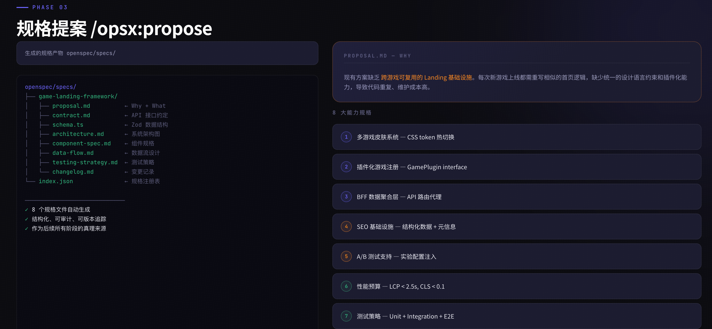
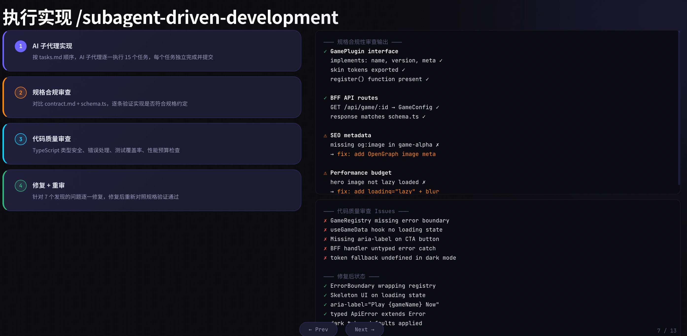
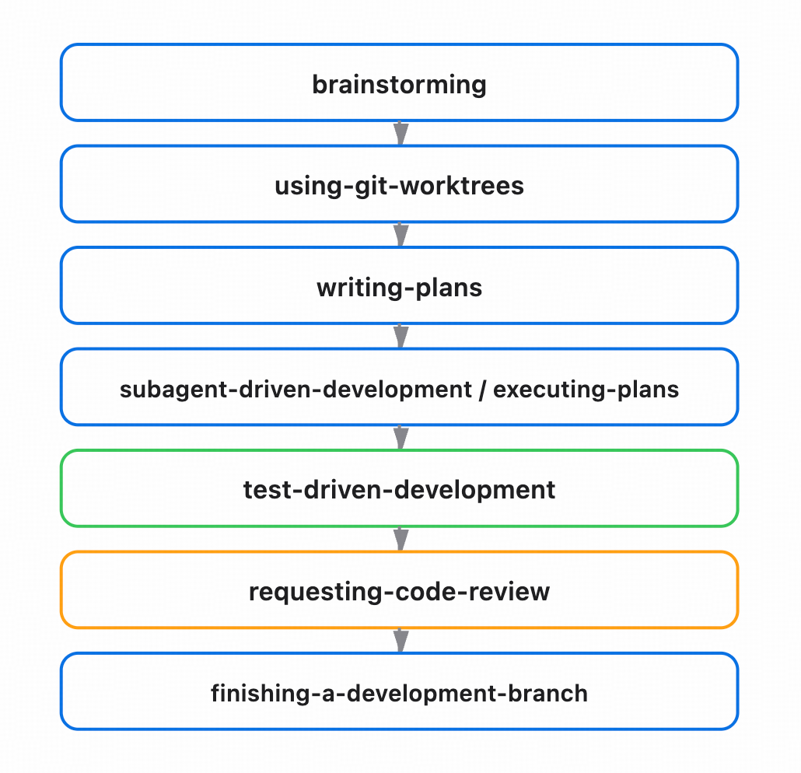
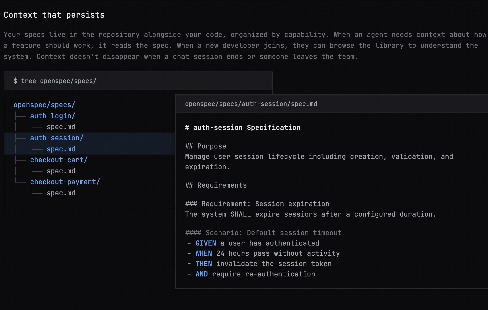
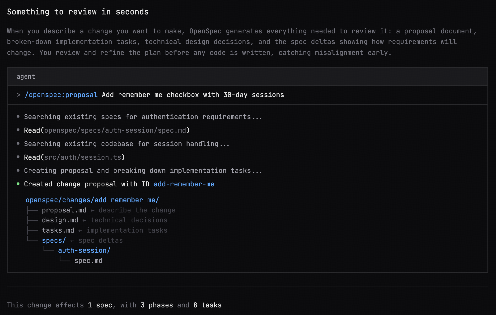
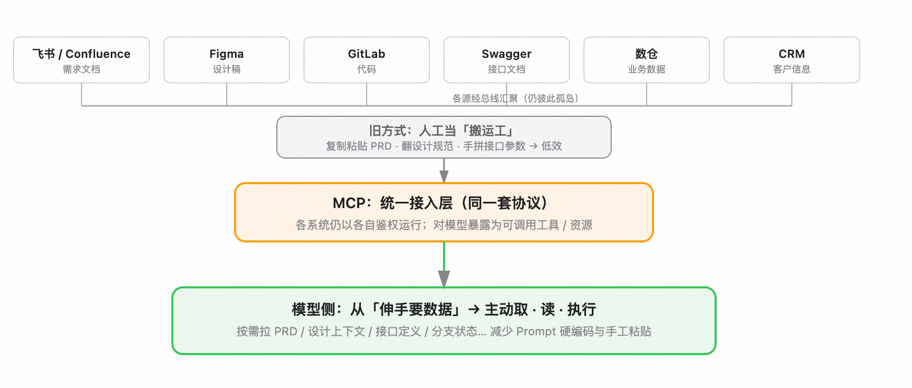
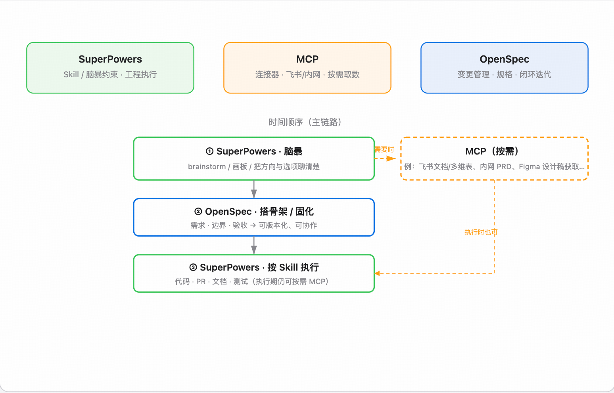

原文链接：[https://xiaobot.net/post/45c8b5ce-08b8-4390-abd3-43a7f16af481](https://xiaobot.net/post/45c8b5ce-08b8-4390-abd3-43a7f16af481)

## 3.1 SuperPowers Skills

Superpowers 是一套面向编程智能体的完整软件开发工作流，建立在可组合的「技能（skills）」之上，配合一组初始说明，确保智能体会按流程使用它们。

工作原理从你启动编程智能体的那一刻就开始了。一旦它判断你在「做东西」，不会立刻埋头写代码，而是先退一步，问清楚你真正想达成什么。

从对话里把规格（spec）梳理出来后，会分段展示给你，每段都短到你能真的读完、消化。

你认可设计之后，智能体会整理出一份实现计划。

接下来，你说「开干」之后，会启动子智能体驱动开发（subagent-driven-development）：按工程任务逐个派智能体执行，检查并评审产出，再继续推进。Claude 连续自主工作一两个小时、且不偏离你们定好的计划，并不少见。

还有更多细节，但以上就是核心。因为技能会自动触发，你不需要额外操作，编程智能体自然就具备 Superpowers。

它要解决的问题很具体：**AI 编程里，"做什么"和"怎么做"往往混在一起，导致每次开发都要重新解释流程。SuperPowers 把流程固化到命令里，触发即执行。**

**基本工作流**

- brainstorming：在写代码前激活。通过提问把粗糙想法打磨清楚，探索备选方案，分块展示设计供你确认，并保存设计文档。

- using-git-worktrees：设计获批后激活。在新分支上创建隔离工作区，跑项目初始化，确认测试基线干净。

- writing-plans：有已批准的设计时激活。把工作拆成小块任务（每项约 2–5 分钟）。每项任务包含确切文件路径、完整代码思路、验证步骤。

- subagent-driven-development 或 executing-plans：有计划后激活。每个工程任务派全新子智能体，并做两阶段评审（先符合规格，再代码质量）；或分批执行并带人工检查点。

- test-driven-development：实现阶段激活。强制执行红-绿-重构：先写失败测试、看红、写最少代码、看绿、提交。在测试之前写的代码要删掉。

- requesting-code-review：任务之间激活。对照计划评审，按严重程度报告问题；严重问题阻塞继续。

- finishing-a-development-branch：任务完成时激活。验证测试，给出合并/PR/保留/丢弃等选项，清理 worktree。

## 3.2 OpenSpec CLI

OpenSpec 是一款轻量级、规范驱动（spec-driven）的开源开发框架，定位为 AI 编码时代的通用规划层，解决 AI 编码代理上下文丢失、需求对齐难、代码评审只看实现不看业务意图的核心痛点。

传统代码评审只能看到代码改动，看不到需求意图。OpenSpec 每次变更都会生成 spec delta（规范增量），捕获每次业务需求的变化，而非仅展示代码差异。评审者不需要深挖代码细节，就能理解变更的业务本质。举个例子：新增「记住我」登录功能时，可以直接在规范里看到会话过期规则的需求变化，而不是一堆 ts 或者js的改动。

规范文件与代码同仓存放，按业务能力模块化组织，解决 AI 聊天会话结束、团队人员变动导致的上下文丢失问题。AI 代理可以随时读取规范，理解功能设计要求；新成员可以通过规范库快速上手系统设计和业务规则；规范随代码迭代持续更新，成为伴随项目生命周期的「活文档」，而不是一次性的需求文档。

OpenSpec 不搞瀑布式开发，拒绝冗长的前置规划。花少量时间完成最小可行规划，即可启动编码；需求变更时，同步更新规范，继续推进。绝大多数工具只适配全新项目，OpenSpec 专门解决成熟代码库的开发痛点，不需要一次性生成全量规范，可以按需创建、逐步完善。

核心设计是「变更」的生命周期管理，有几个关键概念：

- **change**：一次功能变更的容器。每个 change 是一个目录，里面有 [proposal.md](http://proposal.md)、[design.md](http://design.md)、[tasks.md](http://tasks.md) 和一组 [spec.md](http://spec.md) 文件。

- **specs**：接口级别的规格文件，描述一个模块的输入输出、行为约束、数据模型。和代码 1:1 对应，一个模块一个 spec。

- **archive**：变更完成后，delta specs 同步到主 specs 目录，change 目录移到 archive。主 specs 目录始终是当前系统状态的完整描述。

/opsx:propose 触发后，OpenSpec 会根据你的需求描述生成整套文档。[proposal.md](http://proposal.md) 是「为什么做、做什么、有什么影响」；[design.md](http://design.md) 是架构决策；[spec.md](http://spec.md) 是接口契约；[tasks.md](http://tasks.md) 是执行检查项。文档生成完之后，你和 AI 都知道这件事的边界在哪里。

## 3.3 MCP：企业内网的真正王牌

MCP（Model Context Protocol）刚出来的时候，大家一窝蜂地冲向公域：接入搜索引擎、各种 SaaS、公开 API，热热闹闹了大半年。结果声音渐渐小了，甚至有人开始说「MCP 没用了」。

我不认同这个判断。MCP 的真正价值，从来就不在公域，而在企业内网。它真正能让大模型读懂、用好公司内部那些私有数据和业务系统。

企业研发的信息像碎片一样散落在各个角落：需求文档在飞书或 Confluence，设计稿在 Figma，代码在 GitLab，接口文档在 Swagger，业务数据在数仓，客户信息在 CRM……这些系统彼此孤岛，鉴权方式五花八门。以前开发者要手动复制粘贴 PRD、翻设计规范、拼接口参数，效率极低。MCP 做的事很简单，却很关键：把所有系统统一接入，让大模型用同一套协议去调用。模型不再是"伸手要数据"，而是可以自己去取、去读、去执行。

### 为什么不直接调用接口？

这是企业落地 MCP 时最常被问到的问题。直接调接口当然能跑通，但有个根本性缺陷：传统接口是为人和程序设计的，不是为大模型设计的。

想象一下，你让大模型调用一个内网订单查询接口。你得在 Prompt 里手把手写清楚：

- 需要带内网鉴权 Token

- user_id 必须是数字

- page_size 不能超过 100

- order_status 返回值 0 代表未支付、1 代表已支付

一个接口还好，企业内网动辄几十、上百甚至上千个接口，每个都要这样维护。一旦接口字段改动，Prompt 就得同步修改，否则模型就会传错参数、误解返回值。

MCP 的解法不同：它把接口的调用规则、参数说明、依赖关系、返回值语义全部打包成结构化元数据，由服务端主动提供给模型。接口更新后，只需要重启 MCP 服务，下次模型调用时就能自动拿到最新规则，不需要改 Prompt。单个接口看不出太大差别，但放到企业几千个接口的规模，差距就很明显了。

更重要的是，MCP 支持跨系统连续调用。比如让大模型完成这样一个任务：

> 根据 PRD，读取 Figma 设计稿，生成前端代码，并提交到 GitLab 指定分支。

直接调接口的方式，需要你对接 4 套系统、写一份超长的 Prompt 来描述执行顺序；MCP 则是把 4 个系统的服务统一接入网关，模型自己规划调用顺序、处理依赖、容错重试，全程无需人工干预。

### 安全与权限

企业场景下，安全不能将就。直接给大模型一个 API Key 走调用，要么权限开得太大（数据泄露风险极高），要么拆得太细（维护成本爆炸）。更麻烦的是：模型到底调用了什么、拿了哪些数据、做了哪些操作，几乎没有追溯手段。

MCP 在协议层内置了企业级权限控制：

- 支持按部门、角色精细化配置工具访问权限

- 每次调用都有完整审计日志

- 服务端可配置脱敏规则（手机号、身份证号自动打码，不进入模型上下文）

- 高危操作（删除数据、批量导出、修改配置）可直接拦截

### 维护成本

企业系统永远在变：接口加字段、需求文档更新、设计稿改版……都是日常。直接调接口的方案，每一次变更都要同步修改 Prompt，维护成本随系统规模指数级上升，最后往往变成"demo 能跑，生产用不起"。

MCP 采用服务端注册 - 客户端自动发现的机制，底层更新后只需重启服务，模型自动获取最新元数据。维护成本几乎恒定。目前开源社区已经有很多现成适配组件，飞书、Confluence、Figma、GitLab、Swagger、MySQL 等主流系统基本都有覆盖，只需配好鉴权信息即可接入。

MCP 并没有落寞，它只是从公域的喧嚣，悄然回到了它真正该待的地方。

## 3.4 SuperPowers、OpenSpec 与 MCP：三者如何配合

三者各有侧重，不是相互替代。

SuperPowers 做执行约束。它以 skill 为核心，在开发过程中施加严格约束。当你和团队确定了方向后，SuperPowers 把方案精准落地。

OpenSpec 做变更管理。它完整记录每一个变更节点——设计、执行、检查、归档，形成闭环迭代。你可以犯错，但每一次错误都会被记录下来，成为下一次的参照。特别适合长期演进的复杂系统，帮你搭起可追溯的结构。

MCP 是连接器和执行底座。它负责把大模型与企业内网的所有私有系统（飞书、Confluence、Figma、GitLab、Swagger、数仓、CRM 等）统一打通。没有 MCP，SuperPowers 再强也只能在"空中"执行；OpenSpec 的规格文档再完善，模型也无法自动去拉最新 PRD、设计稿或接口定义。

三者真正的配合方式是这样的：

**OpenSpec 先搭骨架。** 用规格文档 + brainstorming 把需求、边界、架构、验收标准全部固化成结构化、可版本化的记录，成为团队共同语言。

**MCP 提供实时上下文和工具能力。** 通过 MCP 协议，模型可以自动读取最新 PRD、拉取 Figma 设计稿、查询 Swagger 接口定义、获取 GitLab 分支状态……所有私有数据和系统能力都以结构化元数据的方式主动推送给模型，不需要手动复制粘贴或在 Prompt 里硬编码规则。

**SuperPowers 负责精准执行。** 拿到 OpenSpec 的规格 + MCP 提供的实时上下文后，SuperPowers 启动对应的 skill 集，按约束生成代码、提交 PR、更新文档、跑测试……既有规范（OpenSpec），又有真实系统能力（MCP），执行起来既准又稳。

举个实际场景：你要实现「根据 PRD 生成前端页面并提交到 GitLab」。普通 AI 代理的做法是写超长 Prompt、手动提供所有上下文、反复修复参数错误。用这三件套：在需求脑暴环节基于superPowers的brainstorming skill，MCP 自动拉取最新 PRD 和 Figma 设计稿，

脑暴完成之后，使用openSpec 进行新建一个提案， 然后再让SuperPowers 直接执行生成计划、执行计划、提交分支、更新 spec 文档，最后在使用openSpec 进行归档，整个流程一气呵成，还带完整审计日志。

与 AI 代理内置 Plan 模式的区别也在这里：内置 Plan 只适用于单次聊天会话；OpenSpec 提供的是跨会话、可共享、可版本化的全生命周期规划空间；MCP 则让这个规划空间真正"落地"到企业内网系统里；SuperPowers 再把规划变成强约束执行。

一句话：**OpenSpec 管"记对"，MCP 管"拿对"，SuperPowers 管"做对"。三者配合，才让 AI 从"能聊天"真正变成"能干活"。**

## 3.5 什么时候不需要跑完整 SDD 流程

SDD 完整流程虽然强大，但也会消耗较多 Token。对于简单需求，完全没必要全套上。以下场景直接用 Plan 模式就够了：

- 在原有需求基础上做小修改

- 改动量很小（1～3 人日以内）

- 改完之后顺手让 AI 更新一下 spec 文档，方便后续沉淀

只有超过 3 人日、涉及跨模块或多人协作的需求，才值得跑完整的 SDD 流程。

还有一种常见情况：你是资深前端，对前端代码非常熟悉。这时候 SDD 那套流程对你来说可能确实有些多余。但如果你突然要写后端、写 Go、写 Java，怎么快速上手且不踩坑？这时 OpenSpec 的规格文档就是你的"指南针"。按着 spec 走，参考现有的代码规范，至少能保证写出来的代码结构清晰、不至于乱成一锅粥。
