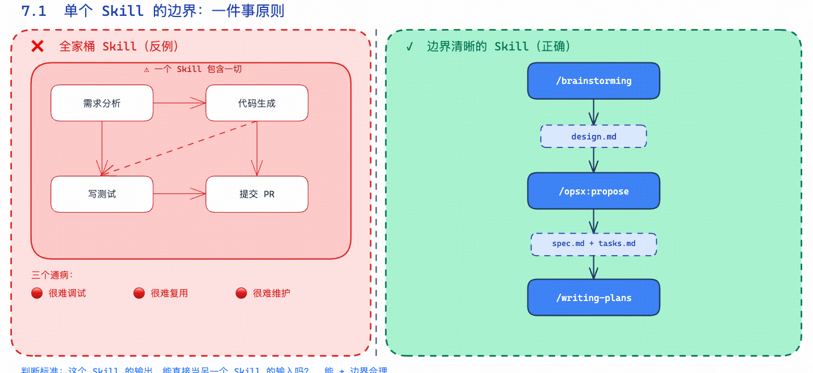
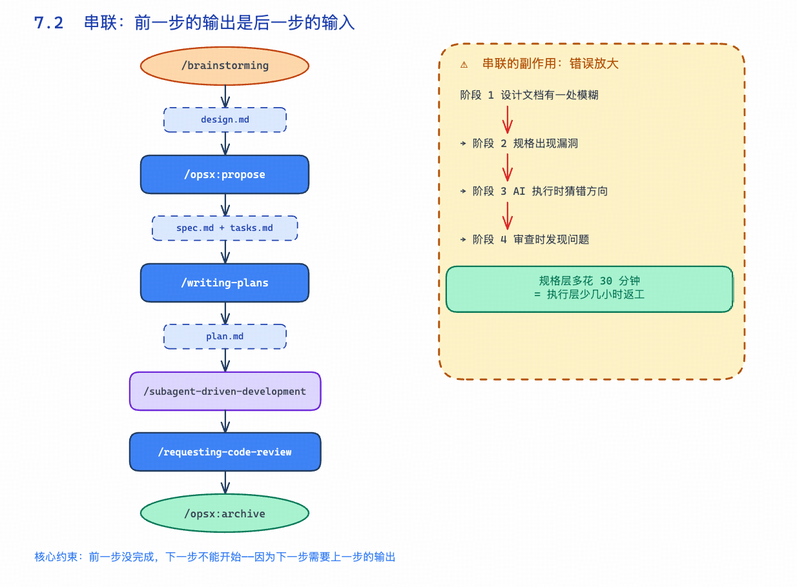
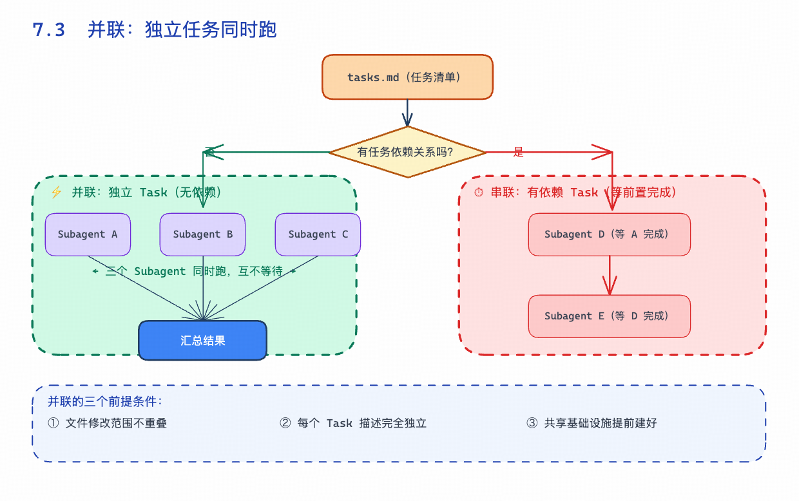
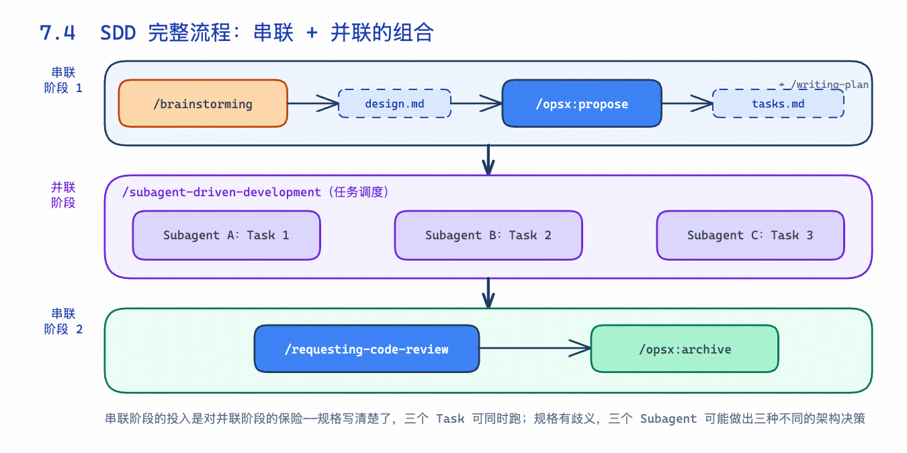
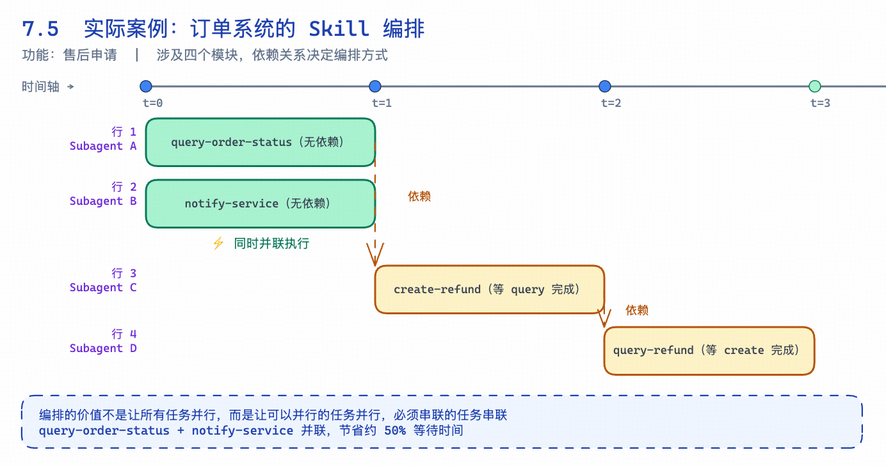
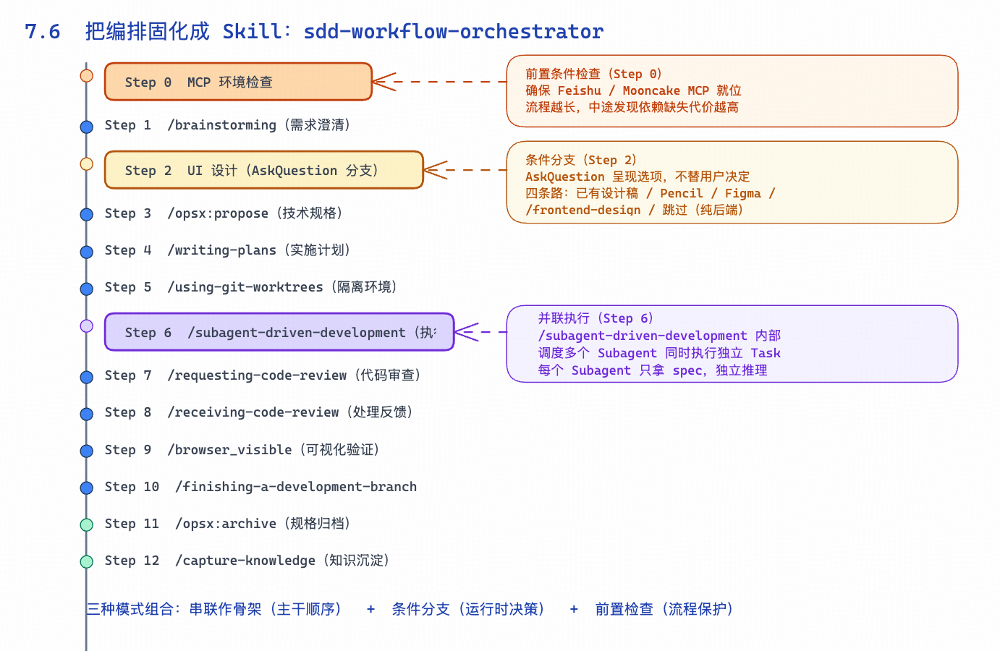

原文链接：[https://xiaobot.net/post/447a1e05-6606-4372-a218-b3c2e61df1a0](https://xiaobot.net/post/447a1e05-6606-4372-a218-b3c2e61df1a0)

#

> 第二部分：Skills 深度解析

第六章结尾我说了一句话：“Skill 不是写完就完了。” 但这里还有另一半没说——单个 Skill 能做的事，本来就有上限。

你写了 /git-status-report，写了 /daily-summary，跑起来都挺好用。然后某一天你想让 AI 帮你走一遍完整的功能开发流程——从需求澄清，到写规格，到拆任务，到执行代码，再到代码审查。一个 Skill 装不下这些，也不应该装。

真正好用的工具链，不是一个超级 Skill 包打天下，而是一套小而精的 Skill 相互咬合，串联成流水线。这章讲的就是这件事：怎么让多个 Skill 变成一套系统。

---

## 7.1　单个 Skill 的边界



先回答一个基础问题：一个 Skill 应该做多少事？

答案是：**一件事。**

这不是教条，是工程经验。Fly哥早期写过一个"全家桶 Skill"，里面塞了需求分析、代码生成、写测试、提交 PR——逻辑上没错，跑起来一塌糊涂。出了问题不知道是哪步出的，换个项目结构就跑不起来，改一处逻辑要小心翼翼怕动到其他部分。

过了一段时间，我把它拆开了。拆完之后反而好用得多。

判断一个 Skill 边界是否合理，有一个很实用的标准：**这个 Skill 的输出，能直接当另一个 Skill 的输入吗？**

能，边界合理。不能，要么是 Skill 做太多了，要么是输出格式没定义清楚。

/brainstorming 只做需求澄清，输出 design.md。/opsx:propose 读取 design.md，输出 spec.md + tasks.md。/writing-plans 读取 tasks.md，输出 plan.md。每一步的输出都是干净的文件，下一步直接拿来用，不需要任何人工中转。这才是正确的边界。

这类 Skill 有三个通病，你往"全家桶"方向走就会撞上：

- **很难调试**：出问题不知道是哪一步的锅

- **很难复用**：绑定了太多前提条件，换个场景就跑不起来

- **很难维护**：改一个步骤的逻辑，可能影响整条链路

边界清晰的 Skill，是能组合的 Skill。

---

## 7.2　串联：上一个的输出是下一个的输入



SDD 的标准流程，骨子里就是一条串联链：

```
/brainstorming
↓ 输出：design.md（设计决策 + 验收标准）
/opsx:propose
↓ 输出：proposal.md + spec.md + tasks.md
/writing-plans
↓ 输出：plan.md（任务拆分，每项 2-5 分钟）
/subagent-driven-development
↓ 输出：代码 + 测试
/requesting-code-review
↓ 输出：审查报告
/opsx:archive
↓ 输出：归档的规格和变更记录
```

串联的核心约束就一条：**前一步没完成，下一步不能开始**——不是因为慢，是因为下一步需要上一步的输出。

用 JS 伪码表达这个逻辑：

```
async function sddPipeline(requirement) {
const design = await runSkill('brainstorming', { input: requirement })
// design.md 写入磁盘，下一步 Skill 读取
const spec = await runSkill('opsx:propose', { context: design })
// proposal.md + spec.md + tasks.md 写入磁盘
const plan = await runSkill('writing-plans', { context: spec })
// plan.md 写入磁盘
const codeResult = await runSkill('subagent-driven-development', { plan })
const review = await runSkill('requesting-code-review', { context: codeResult })
await runSkill('opsx:archive', { spec, review })
}
```

串联有一个副作用你得提前知道：**错误会被放大**。设计文档有一处模糊 → 规格有漏洞 → AI 执行时猜 → 猜出来的代码审查时发现问题 → 返工。每往后一步，修复成本翻倍。

这也是为什么 SDD 把"规格"放在那么重要的位置——错误在规格层抓住，代价比在代码层抓住小得多。串联链越长，前置投入越值钱。

---

## 7.3　并联：独立任务同时跑



串联解决的是"有顺序依赖"的问题。但不是所有任务都有依赖关系。

问题来了：任务之间没有依赖，你为什么要一个接一个地等？

并联就是答案。适合并联的场景：

- 多个功能模块同时开发（用户模块、商品模块、订单模块，互不依赖）

- 多个文件需要修改，但改动之间没有交叉

- 同时生成代码和文档，两件事互不影响

/dispatching-parallel-agents 做的就是这件事——把任务清单里独立的 Task 拆出来，同时派给多个 Subagent，汇总结果后继续。

```
async function parallelExecution(tasks) {
const independent = tasks.filter(t => t.dependencies.length === 0)
const dependent = tasks.filter(t => t.dependencies.length > 0)
// 独立 Task 并发执行
const results = await Promise.all(
independent.map(task => spawnSubagent(task))
//           ↑ 每个 Subagent 拿到完整的 spec 上下文
//             独立推理，独立执行，互不干扰
)
// 有依赖的 Task 等并联结果出来再跑
for (const task of dependent) {
const depResults = task.dependencies.map(id => results[id])
await spawnSubagent(task, { context: depResults })
}
return results
}
```

但并联有几个前提条件，少一个都会翻车：

**任务之间不能有文件冲突。** 两个 Subagent 同时修改 config.ts，必然有一个被覆盖。并联前要确认文件修改范围不重叠。

**每个 Subagent 的任务描述必须完全独立。** “参考 Task 2 的输出来实现 Task 3”——这种说法在并联里是灾难。Task 2 还没跑完，Task 3 要参考什么？有依赖关系的任务必须改成串联。

**共享的基础设施要提前建好。** 如果 Task 1 和 Task 2 都要用 database.ts，这个文件必须在并联启动前就存在。否则两个 Subagent 可能各自创建一个版本，合并时冲突一堆。

---

## 7.4　SDD 流程：串联 + 并联的组合



把 SDD 完整流程画出来，能清楚看到哪里串联、哪里并联：

```
串联阶段（顺序执行，每步依赖上一步的输出）
─────────────────────────────────────────
/brainstorming → /opsx:propose → /writing-plans
↓
生成 tasks.md（任务清单）
并联阶段（独立 Task 并发执行）
─────────────────────────────────────────
/subagent-driven-development
├─ Subagent A：实现 Task 1（用户认证接口）
├─ Subagent B：实现 Task 2（订单查询接口）
└─ Subagent C：实现 Task 3（支付回调处理）
↓
三个 Subagent 同时跑，互不等待
串联阶段（汇总后继续顺序执行）
─────────────────────────────────────────
/requesting-code-review → /opsx:archive
```

理解这个结构，就能理解为什么 SDD 对规格质量那么执着。

并联阶段启动时，每个 Subagent 拿到的只有 spec 文件——没有额外的人工解释，没有"你帮我问一下另一个 Subagent 怎么处理的"。规格写清楚了，三个 Task 可以同时跑，一个小时出结果；规格有歧义，三个 Subagent 可能做出三种不同的架构决策，合并时冲突一堆，然后你要花更多时间手动 resolve conflict。

**串联阶段的投入，是对并联阶段的保险。** 在规格层多花半小时，在执行层少几个小时的返工。

---

## 7.5　一个实际案例：订单系统的 Skill 编排



假设你要给电商系统加"售后申请"功能，涉及四个模块：订单状态查询接口、售后申请接口、售后状态查询接口、消息通知（站内信 + 短信）。

从工程角度，依赖关系是：

```
const taskGraph = {
'query-order-status': { deps: [] },               // 无依赖，可以立刻开始
'create-refund':      { deps: ['query-order-status'] }, // 需要订单查询先就绪
'query-refund':       { deps: ['create-refund'] },      // 需要申请接口存在
'notify-service':     { deps: [] },               // 无依赖，可与订单查询并联
}
```

对应的 Skill 编排：

```
串联：/brainstorming → /opsx:propose
（明确 4 个模块的接口边界，写进 spec.md）
串联：/writing-plans
（生成 tasks.md，标注依赖关系）
并联：Subagent A 实现 query-order-status
Subagent B 实现 notify-service（与 A 无依赖，同时跑）
串联：Subagent C 实现 create-refund（等 A 完成）
串联：Subagent D 实现 query-refund（等 C 完成）
串联：/requesting-code-review → /opsx:archive
```

query-order-status 和 notify-service 并联，节省了约 50% 的等待时间。create-refund 和 query-refund 有依赖，老老实实串联。

**编排的价值不是让所有任务并行，而是让可以并行的任务并行，必须串联的任务串联。** 看起来是技巧，实际上是对任务依赖关系的精确分析。

---

## 7.6　把编排固化成 Skill



串联和并联解决的是"如何组合 Skill"。但还有更进一步的用法：**把组合逻辑本身也写成一个 Skill**，让整套流程变成可触发、可复用的单元。

这类 Skill 叫编排 Skill。它不做具体工作——不写代码、不分析需求、不生成规格。它只做一件事：按正确的顺序触发正确的 Skill，在关键节点等待用户输入，然后继续往下走。

sdd-workflow-orchestrator 是 SDD 工具链的元编排器，完整流程 13 步：

```
Step 0  MCP 环境检查
Step 1  /brainstorming（需求澄清）
Step 2  UI 设计（可选）
Step 3  /opsx:propose（技术规格）
Step 4  /writing-plans（实施计划）
Step 5  /using-git-worktrees（隔离环境）
Step 6  /subagent-driven-development（执行实现）
Step 7  /requesting-code-review（代码审查）
Step 8  /receiving-code-review（处理反馈）
Step 9  /browser_visible（可视化验证）
Step 10 /finishing-a-development-branch（合并策略）
Step 11 /opsx:archive（规格归档）
Step 12 /capture-knowledge（知识沉淀）
```

这 13 步里混合了三种编排模式。

**串联构成主干。** Step 1 到 Step 12 整体是串联结构，每步输出直接作为下步输入——需求澄清出来的 design.md 进入技术规格，技术规格出来的 spec.md + tasks.md 进入实施计划，实施计划产出的 plan.md 进入执行。前面几章讲的串联逻辑，在这里完整体现。

**条件分支处理运行时决策。** Step 2 是 UI 设计阶段，但用不用设计工具、用哪个，是运行时才能确定的——有人已有视觉稿，有人需要 Pencil MCP 做组件级设计，有人只要 /frontend-design 快速出效果，有的人使用 Figma Mcp 做组件设计，纯后端功能干脆跳过。这四条路无法提前静态分析，编排 Skill 的处理方式是 AskQuestion：

```
const answer = await askUserQuestion({
question: 'UI 设计阶段——你已有设计稿了吗？',
options: [
'已有设计，跳过',
'用 Pencil MCP',      // → 触发 Pencil MCP
"用 Figma MCP",     // → 触发 Figma MCP
'用 /frontend-design',  // → 触发 /frontend-design skill
'跳过（纯后端功能）'
]
})
```

串联和并联处理的是任务依赖问题，条件分支处理的是运行时决策问题。编排 Skill 的职责不是替用户做决定，而是在正确的时机提出正确的问题。

**前置条件检查保护流程完整性。** Step 0 排在所有业务步骤之前，专门检查 查询内部PRD 和 查询内部接口 两个 MCP 工具是否就位。流程越长，中途发现依赖缺失的代价越高——一个 Step 0 把这个风险前移到启动阶段。值得注意的是，Claude Code 和 Cursor 的 MCP 配置位置不同：Claude Code 通过命令行管理，Cursor 把配置写在 ~/.cursor/mcp.json 里。所以 Step 0 需要先用 AskQuestion 询问用户使用的 IDE，再走对应的检测路径。

---

三种模式组合，构成一个完整的编排 Skill：串联作为骨架保证顺序，条件分支在关键节点引入人的判断，前置条件检查确保流程不会半途而废。

就像函数可以调用函数，Skill 也可以调用 Skill。整个 SDD 工具链本质上是一棵 Skill 树：sdd-workflow-orchestrator 在最顶层负责全局编排，/subagent-driven-development 在中层（它内部还会 dispatch 多个子 Subagent 分别处理实现、spec 审查、代码质量审查），每一层只管自己那一块。

层层嵌套，层层职责分明。这才是真正可维护的工具链结构。

完整代码

> 备注：这里的飞书 和 mooncake 主要是我们内部内部需求开发的时候， 获取产品的PRD文档 和拿到后端接口文档的MCP。 这里大家根据自己公司的MCP去做修改。 可能是yapi，可能是钉钉文档

```
---
name: sdd-workflow-orchestrator
description: >
完整软件开发流程编排技能，覆盖从 MCP 环境检查到知识沉淀的 13 步开发工作流。
在每个阶段调用对应的专项 Skill，并在阶段间提供明确的衔接判断。
当用户提到「开始开发」「新功能」「开发流程」「SDD 流程」「下一步做什么」
「工作流编排」「按流程来」「跑一遍完整流程」时触发。
---
# SDD 流程编排
完整开发流程分 13 步，按阶段分为：环境 → 需求 → 设计 → 规划 → 实现 → 验收 → 归档。
## 工作流总览
| # | 命令 / 工具 | 作用 | 使用时机 |
|---|---|---|---|
| 0 | MCP 环境检查 | 检查 feishu/mooncake MCP 状态，按需安装 | **进入流程前** |
| 1 | `/brainstorming` | 需求脑暴：澄清问题 + 方案探讨 + 生成设计文档 | **第一步**，有想法时 |
| 2 | UI 设计 | Pencil MCP 或 `/frontend-design`，生成视觉参考 | 脑暴完成后，编码前 |
| 3 | `/opsx:propose` | 生成 proposal + design + spec × 8 + tasks | 需求明确后 |
| 4 | `/writing-plans` | 将 spec 转化为详细实施计划（`docs/superpowers/plans/`） | 有规格文档后 |
| 5 | `/using-git-worktrees` | 创建隔离 Git worktree，保护主工作区 | 开始实现前 |
| 6 | `/subagent-driven-development` | 调度 Subagent 执行 Task，含 spec review + code quality review | 执行实施计划时 |
| 7 | `/requesting-code-review` | 请求代码审查，生成结构化报告 | 主要功能完成后 |
| 8 | `/receiving-code-review` | 接收审查反馈，评估有效性，实施修复 | 拿到审查结果后 |
| 9 | `/browser_visible` | 打开有头浏览器进行可视化测试 | 集成验证阶段 |
| 10 | `/finishing-a-development-branch` | 验证测试 → 合并/PR/保留/丢弃（4 选 1） | 开发完成后 |
| 11 | `/opsx:archive` | 同步 specs → 归档变更目录 | 合并后 |
| 12 | `/capture-knowledge` | 提取踩坑写入飞书知识库 | **最后一步** |
## 快速决策：从哪里进入
```
进入任何步骤前              → Step 0 MCP 环境检查（必做）
有新想法但需求模糊？         → Step 1 /brainstorming
需求清晰，需要 UI 设计？     → Step 2 UI 设计（问用户选 Pencil 还是 /frontend-design）
需求清晰，需要技术规格？     → Step 3 /opsx:propose
已有 spec，需要实施计划？    → Step 4 /writing-plans
已有计划，准备编码？         → Step 5 /using-git-worktrees → Step 6 SDD
代码已写完，需要审查？       → Step 7 /requesting-code-review
审查完成，需要集成验证？     → Step 9 /browser_visible
功能完成，准备合并？         → Step 10 /finishing-a-development-branch
合并后需要归档？             → Step 11 /opsx:archive → Step 12 /capture-knowledge
```
## Step 0：MCP 环境检查（每次进入流程必做）
### 0-A：先问 IDE 类型
用 `AskQuestion` 工具询问：
```
问题：你当前使用的是哪个 AI 编程工具？
选项：
A. Claude Code（命令行终端）
B. Cursor（IDE）
```
---
### 0-B：根据 IDE 静默检测 MCP 状态
**若选 A（Claude Code）：**
```bash
claude mcp list 2>&1
```
在输出中查找 `feishu.*✓ Connected` 和 `mooncake.*✓ Connected`。
**若选 B（Cursor）：**
```bash
python3 -c "
import json, os
path = os.path.expanduser('~/.cursor/mcp.json')
if not os.path.exists(path): print('NOT_FOUND'); exit()
keys = list(json.load(open(path)).get('mcpServers', {}).keys())
print('feishu:', any('feishu' in k for k in keys))
print('mooncake:', any('mooncake' in k for k in keys))
"
```
---
### 0-C：根据检测结果决策
**feishu 和 mooncake 均已就绪 → 静默跳过，直接进入 Step 1，不再询问。**
若有缺失，用 `AskQuestion` 询问（仅此一次）：
```
问题：以下 MCP 未就绪，是否安装？
- front/feishu：[✅ 已就绪 / ❌ 未安装]
- front/mooncake：[✅ 已就绪 / ❌ 未安装]
选项：
A. 安装缺失的 MCP
B. 跳过，直接进入开发流程
```
**选 A + Claude Code：**
触发 `/mcp-install` skill → 用 `claude mcp add -s user --transport sse <alias> "<token URL>"` 全局安装。
**选 A + Cursor：**
触发 `/mcp-install` skill 拿到 token URL 后写入 `~/.cursor/mcp.json`，并提示重启 Cursor：
```bash
python3 -c "
import json, os
path = os.path.expanduser('~/.cursor/mcp.json')
cfg = json.load(open(path)) if os.path.exists(path) else {'mcpServers': {}}
cfg.setdefault('mcpServers', {})['front/feishu'] = {'url': '<token URL>'}
cfg['mcpServers']['front/mooncake'] = {'url': '<token URL>'}
json.dump(cfg, open(path, 'w'), indent=2)
print('写入成功，请重启 Cursor')
"
```
**选 B** → 直接进入 Step 1。
## 阶段衔接规则
**Step 1 → Step 2/3**
- `/brainstorming` 完成后产出设计文档
- 若有 UI 则先跑 Step 2（见下方 Step 2 规则），再跑 Step 3 (propose)
- 纯后端/CLI 功能可跳过 Step 2
**Step 2：UI 设计工具选择**
进入 Step 2 时，**用 `AskQuestion` 工具询问用户：**
```
问题：UI 设计阶段——你已有设计稿了吗？
选项：
A. 已有设计（跳过设计，直接进 Step 3）
B. 没有设计，用 Pencil MCP 生成（适合组件级、精细 UI）
C. 没有设计，用 /frontend-design skill 生成（适合页面级、快速出图）
D. 跳过设计阶段（纯后端/CLI 功能）
```
- 选 A → 进入 Step 3
- 选 B → 触发 Pencil MCP 工作流（`user-pencil` MCP），完成后进入 Step 3
- 选 C → 触发 `/frontend-design` skill，完成后进入 Step 3
- 选 D → 直接进入 Step 3
**Step 3 → Step 4**
- `/opsx:propose` 产出 `openspec/` 下的 spec 文件
- `/writing-plans` 消费这些 spec，输出 `docs/superpowers/plans/*.md`
**Step 4 → Step 5 → Step 6**
- **不要在 main/master 分支上直接实现**，必须先跑 Step 5 创建 worktree
- worktree 就位后立刻进入 Step 6 SDD 执行循环
**Step 6 → Step 7**
- SDD 全部 task 完成且 final code review 通过后，才进入 Step 7
- 若只是单个 task，可在 Step 6 内的 code quality review 完成后直接跳 Step 9
**Step 9 → Step 10**
- 浏览器验证通过 → Step 10 选择合并策略
- 发现 bug → 返回 Step 6 dispatch fix subagent
**Step 10 → Step 11 → Step 12**
- 合并到主分支后，按顺序跑 archive 和 capture-knowledge
- 这两步通常可以合并在同一个对话 turn 里完成
## 红线
- Step 5（worktree 隔离）不可跳过，直接在主分支开发
- Step 6 中 spec compliance review 必须在 code quality review 之前
- Step 8（接收代码审查）收到有效反馈后，不得跳过修复直接合并
- Step 12（知识沉淀）是强制最后一步，不得省略
## 详细步骤参考
各步骤的详细 prompt 模板、触发条件、注意事项见
[references/workflow-steps.md](references/workflow-steps.md)
```

```
references
# 各步骤详细说明
## Step 1: /brainstorming
**Skill:** `superpowers:brainstorming`
**触发：** 有新想法、需求模糊、不确定技术方案时
**产出：**
- 设计文档（问题定义 + 方案选型 + 决策记录）
- 可选：交互稿/线框图描述
**注意：**
- 必须在有具体想法时使用，不要跳过直接写代码
- 产出的文档是后续所有步骤的输入
---
## Step 2: Pencil MCP
**工具：** Pencil MCP（`.pen` 文件）
**触发：** 功能涉及 UI/页面设计，或需要视觉参考时
**操作：**
1. 用 `pencil.get_editor_state` 了解当前编辑器状态
2. 用 `pencil.batch_get` / `pencil.batch_design` 设计 UI
3. 用 `pencil.get_screenshot` 预览设计效果
**产出：**
- `.pen` 文件中的视觉设计稿
- 导出的 PNG 参考图（可选）
**跳过条件：** 纯后端/CLI/脚本类功能
---
## Step 3: /opsx:propose
**Skill:** `openspec:propose`
**触发：** 需求已经通过 brainstorming 澄清，需要生成技术规格
**产出（自动生成到 `openspec/` 目录）：**
- `proposal.md` - 功能提案
- `design.md` - 技术设计
- `spec-*.md` × N - 详细规格（每个子模块一份）
- `tasks.md` - 实施任务列表
**注意：**
- 生成后需人工 review spec，确认无歧义再进下一步
- spec 文件是 SDD 执行阶段每个 task 的权威来源
---
## Step 4: /writing-plans
**Skill:** `superpowers:writing-plans`
**触发：** `openspec/` 下已有 spec 文件，需要转化为可执行计划
**产出：**
- `docs/superpowers/plans/<feature-name>.md`
- 每个 task 包含：目标、文件范围、验收标准、依赖
**注意：**
- 计划文件是 SDD（Step 6）的直接输入
- 每个 task 应独立、可并行（依赖关系显式声明）
- task 粒度：1-3 小时内可完成的工作量
---
## Step 5: /using-git-worktrees
**Skill:** `superpowers:using-git-worktrees`
**触发：** 即将开始编码实现前
**操作：**
```bash
git worktree add ../feature-xxx feature/xxx
```
**产出：**
- 独立的 worktree 目录，不影响主工作区
- 新的 feature 分支
**红线：** 不得跳过此步骤直接在 main 分支开发
---
## Step 6: /subagent-driven-development（核心执行循环）
**Skill:** `superpowers:subagent-driven-development`
**触发：** worktree 就位 + 计划文件准备好后
### 执行循环（每个 task 重复）
```
1. 读取 task 完整文本（从计划文件一次性提取所有 task）
2. dispatch implementer subagent（见 implementer-prompt 模板）
3. 处理 subagent 状态：
- DONE → 进入 spec review
- DONE_WITH_CONCERNS → 读 concerns 后进入 spec review
- NEEDS_CONTEXT → 补充上下文后重新 dispatch
- BLOCKED → 评估后：补上下文 / 换更强模型 / 拆分 task / 上报人工
4. dispatch spec compliance reviewer（见 spec-reviewer-prompt 模板）
- ✅ 通过 → 进入 code quality review
- ❌ 有问题 → implementer 修复 → 重新 spec review
5. dispatch code quality reviewer（见 code-quality-reviewer-prompt 模板）
- ✅ 通过 → 标记 task 完成（TodoWrite）
- ❌ 有问题 → implementer 修复 → 重新 code quality review
6. 下一个 task...
```
### 模型选择
| 任务类型 | 模型 |
|---|---|
| 明确 spec，改 1-2 文件 | fast（最便宜） |
| 跨文件集成，有判断逻辑 | 标准模型 |
| 架构设计、需要广泛理解 | 最强模型 |
### Implementer Prompt 模板
```
description: "Implement Task N: [task name]"
prompt: |
你在实现 Task N: [task name]
## Task 描述
[完整 task 文本，不要让 subagent 自己去读文件]
## 上下文
[这个 task 在整体计划中的位置、依赖、架构背景]
## 工作目录
[worktree 路径]
## 开始前
有疑问先问，不要猜测。
## 完成后报告
- Status: DONE | DONE_WITH_CONCERNS | BLOCKED | NEEDS_CONTEXT
- 实现内容、测试结果、变更文件、self-review 发现
```
### Spec Reviewer Prompt 模板
```
description: "Review spec compliance for Task N"
prompt: |
验证实现是否符合规格（不多也不少）。
## 规格要求
[完整 task 需求]
## Implementer 报告
[实现报告]
## 你的任务
读实际代码，不信报告。检查：
- 缺失的需求
- 多余的实现
- 需求理解偏差
报告：✅ Spec compliant 或 ❌ Issues: [具体问题 + file:line]
```
### Code Quality Reviewer Prompt 模板
```
使用 superpowers:requesting-code-review 中的 code-reviewer.md 模板
WHAT_WAS_IMPLEMENTED: [implementer 报告]
PLAN_OR_REQUIREMENTS: Task N from [plan-file]
BASE_SHA: [task 开始前的 commit]
HEAD_SHA: [当前 commit]
DESCRIPTION: [task 摘要]
```
---
## Step 7: /requesting-code-review
**Skill:** `superpowers:requesting-code-review`
**触发：** 所有 task 的 SDD 循环完成后
**产出：**
- 结构化代码审查报告（Critical / Important / Minor 分级）
---
## Step 8: /receiving-code-review
**Skill:** `superpowers:receiving-code-review`
**触发：** 收到 Step 7 的审查报告后
**操作：**
1. 逐条评估反馈有效性（不盲目接受）
2. 对 Critical/Important 问题 dispatch fix subagent
3. 对 Minor 问题视情况处理或记录
**红线：** 有有效反馈时不得跳过修复直接合并
---
## Step 9: /browser_visible
**Skill:** `superpowers:browser_visible`
**触发：** 代码审查修复完成后，需要端到端验证时
**操作：**
- 打开有头浏览器，手动/自动验证主要 user journey
- 截图记录验证结果
**跳过条件：** 纯后端 API / CLI 工具，无前端界面
---
## Step 10: /finishing-a-development-branch
**Skill:** `superpowers:finishing-a-development-branch`
**触发：** 验证全部通过，准备结束 feature 分支
**4 种选择：**
1. **Merge** - 直接合并到主分支
2. **PR** - 创建 Pull Request 等待 review
3. **保留** - 暂存分支，稍后处理
4. **丢弃** - 功能放弃，清理分支
---
## Step 11: /opsx:archive
**Skill:** `openspec:archive`
**触发：** 分支合并/PR 创建后
**操作：**
- 将 `openspec/` 下的变更同步归档到变更目录
- 标记变更为 completed 状态
---
## Step 12: /capture-knowledge
**Skill:** `superpowers:capture-knowledge`
**触发：** 所有步骤完成后（**强制执行**）
**操作：**
- 提取本次开发中的踩坑记录
- 提取解决方案和经验教训
- 写入飞书多维表格知识库
**注意：** 即使流程顺利无踩坑，也应记录成功经验和关键决策
```

## 小结

模式

适用场景

核心约束

**单 Skill**

独立、边界清晰的单一任务

只做一件事，输出可被下一步直接消费

**串联**

有顺序依赖的任务链

前一步的输出是后一步的输入

**并联**

独立无依赖的并发任务

文件不重叠，任务描述完全独立

**条件分支**

运行时需由用户做选择的节点

用 AskQuestion 呈现选项，不替用户决定

**编排 Skill**

复杂流程的固化复用

Skill 调 Skill，前置条件检查，迭代打磨

Skill 能组合、能串联、能并联——理论上可以一路从需求跑到交付。但你很快会遇到下一个问题：怎么知道这套组合跑得对？怎么发现 Skill 在哪里开始跑偏？

下一章专门讲 Skill 的测试和迭代——从"能跑"到"放心跑"，这一步不能省。
