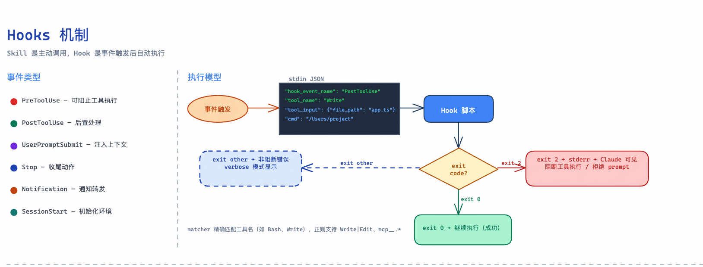
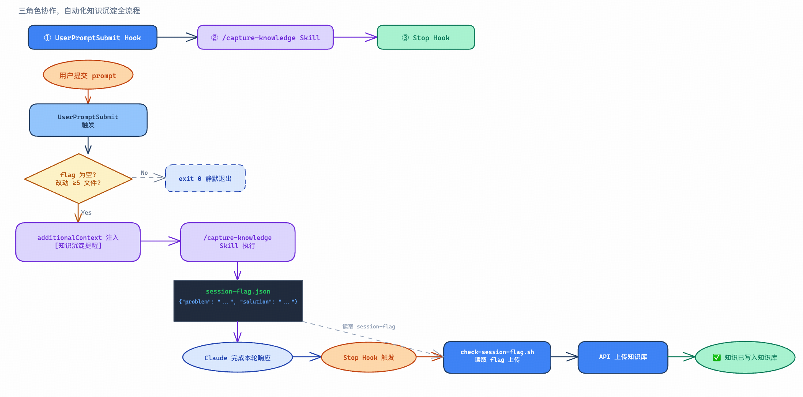
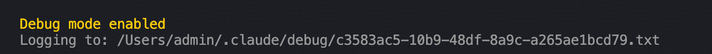
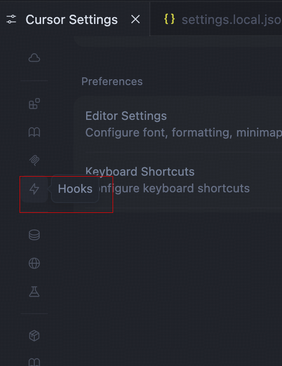
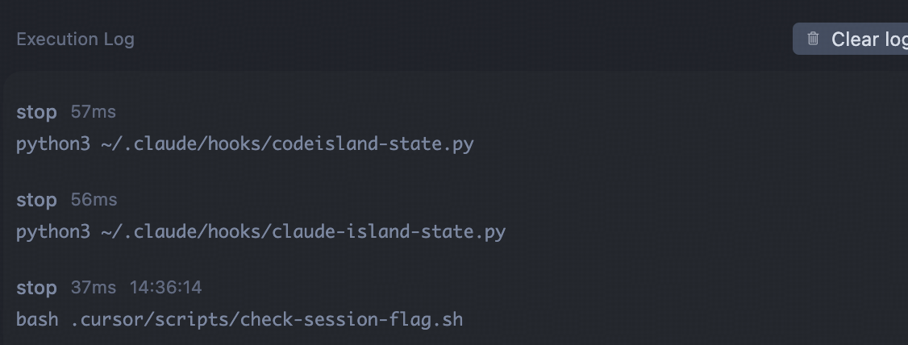

原文链接：[https://xiaobot.net/post/56abb8b7-b6a3-42e2-8749-fcc6bddada5c](https://xiaobot.net/post/56abb8b7-b6a3-42e2-8749-fcc6bddada5c)

> 第二部分：Skills 深度解析

上一章讲完了 Skill 的测试和迭代，你手里已经有了一批经过验证、行为稳定的 Skill。但用着用着，你会发现一个新问题：有些动作，你每次都要记得手动触发。

写完代码记得跑 lint，提交前记得检查规格，AI 写完文件记得格式化……这些事本身不麻烦，但每隔几天就会漏掉一次，然后事后补救。

这不是记性问题，是架构问题。“每次做完 X 记得做 Y”——这件事不应该靠人脑记，而应该写进系统。Hooks 就是来解决这件事的。

---

## 9.1　什么是 Hook

一句话：**Skill 是你主动调用时执行，Hook 是某件事发生时自动执行。**

你不需要记住"每次写完文件后跑格式化"——配置了 Hook，文件一写入，格式化自动跑。你不需要记住"提交前检查规格"——配置了 Hook，git commit 一执行，检查自动触发。

以前靠自己记，现在让 Hook 盯着。

从技术角度说，Hook 是事件监听器。Claude Code 在执行某些操作前后会发出事件，你可以在这些事件上挂载 shell 命令。命令可以很简单（跑个脚本），也可以很复杂（触发另一套 AI 推理流程）。

---

## 9.2　Hook 的生命周期全景

在看具体事件类型之前，先把底层机制搞清楚——不然你只会抄配置，遇到问题不知道从哪查。



### Hook 的工作原理

当一个 Hook 事件触发且 matcher 匹配时，Claude Code 会把关于该事件的 **JSON 上下文通过 stdin 传给你的 hook 脚本**。脚本读取 stdin，处理内容，通过退出码和输出告诉 Claude Code 下一步怎么做。

退出码决定行为：

- **退出 0**：成功。Claude Code 解析 stdout 里的 JSON 输出字段。对大多数事件，stdout 只在 verbose 模式（Ctrl+O）下显示，**不会**注入 Claude 上下文。

- **退出 2**：阻止。忽略 stdout，**stderr 文本作为错误消息反馈给 Claude**。效果取决于事件类型：PreToolUse 会阻止工具调用，UserPromptSubmit 会拒绝当前 prompt，以此类推。

- **其他退出码**：非阻止错误。stderr 在 verbose 模式下显示，执行继续。

### Hook 的数据输入协议

所有 Hook 接收数据的方式相同：通过 **stdin** 传入 JSON。脚本第一行通常是这样开头的：

```
INPUT=$(cat)
```

然后用 jq 取所需字段。不同事件传入的内容不同，但有一组公共字段是所有事件都包含的：

```
{
"hook_event_name": "PreToolUse",
"session_id": "abc123def456...",
"transcript_path": "/tmp/sessions/abc123.json",
"cwd": "/Users/you/project"
}
```

工具相关事件（PreToolUse、PostToolUse、PostToolUseFailure）额外包含工具信息：

```
{
"tool_name": "Bash",
"tool_use_id": "tu_abc123",
"tool_input": { "command": "git status" }
}
```

PostToolUse 还多一个 tool_response 字段，包含工具的执行结果。

取字段时有个坑：不同事件里某些字段可能不存在，直接 jq -r '.tool_input.command' 在字段缺失时会输出字符串 "null"，把它当成命令名去 grep 会搞出奇怪的结果。养成一个习惯，**取工具输入字段时加 // empty 做空值防护**：

```
COMMAND=$(echo "$INPUT" | jq -r '.tool_input.command // empty')
FILE=$(echo "$INPUT" | jq -r '.tool_input.file_path // ""')
```

stdout 也可以返回 JSON 来影响 Claude Code 的行为——比如 PreToolUse 里的 additionalContext（注入上下文）和 updatedInput（修改工具输入）。但大多数场景用不到这些，exit code + stderr 就够了。

Hook 分两大类：

- **会话级 Hook**：整个会话只触发一次（如 SessionStart、SessionEnd）

- **循环级 Hook**：在 Agent 执行循环内反复触发（如 PreToolUse、PostToolUse）

### 完整事件表

Claude Code 支持的事件远不止早期文档里的四类。下面是完整列表：

事件

触发时机

常见用途

SessionStart

会话开始或恢复时

初始化环境、打印欢迎信息

UserPromptSubmit

你提交 prompt、Claude 处理之前

输入校验、注入上下文

PreToolUse

工具调用执行之前，**可以阻止**

守卫检查、权限控制

PermissionRequest

出现权限确认对话框时

自动审批策略

PermissionDenied

自动模式下工具调用被拒绝时

返回 {retry: true} 让模型重试

PostToolUse

工具调用**成功**之后

格式化、后置检查

PostToolUseFailure

工具调用**失败**之后

错误上报、fallback 处理

Notification

Claude Code 发送通知时

转发到桌面通知、Slack

SubagentStart

Subagent 被派生时

监控 Subagent 启动

SubagentStop

Subagent 执行完毕时

收集 Subagent 结果

TaskCreated

任务通过 TaskCreate 创建时

任务追踪

TaskCompleted

任务被标记为完成时

完成统计、触发后续流程

Stop

Claude 完成当前轮次响应时

收尾、保存会话摘要

StopFailure

因 API 错误导致轮次结束时

错误告警（输出和退出码被忽略）

TeammateIdle

多 Agent 团队中某成员将进入空闲时

多 Agent 协调调度

InstructionsLoaded

[CLAUDE.md](http://CLAUDE.md) 或 rules 文件被加载时

审计规则加载情况

ConfigChange

会话期间配置文件变更时

动态响应配置更新

CwdChanged

工作目录变更时（如 Claude 执行了 cd）

联动 direnv 等环境工具

FileChanged

被监视的文件发生磁盘变化时

文件监听、触发热重载

WorktreeCreate

worktree 被创建时

替换默认 git worktree 行为

WorktreeRemove

worktree 被移除时（会话结束或 Subagent 完成时）

清理工作

PreCompact

上下文压缩之前

保存压缩前快照

PostCompact

上下文压缩完成之后

恢复状态、通知

Elicitation

MCP server 在工具调用期间请求用户输入时

自动响应 MCP 输入请求

ElicitationResult

用户响应 MCP elicitation 后、发回 server 之前

拦截或修改响应内容

SessionEnd

会话终止时

清理、归档会话产出

看起来很多，但日常开发中真正高频的就那几个：PreToolUse、PostToolUse、Stop、Notification。其他的是进阶场景——比如 CwdChanged 配合 direnv 自动切换环境变量，FileChanged 做外部文件监听，SubagentStart/Stop 在并发场景下监控子任务进度。

---

## 9.3　Hook 的配置格式

### 配置文件位置

Hook 不是独立的 hooks.json 文件，而是写在 settings.json 的 hooks 字段里。Claude Code 从三个位置读取，优先级从低到高：

文件路径

作用范围

适用场景

~/.claude/settings.json

全局（所有项目）

个人工作流偏好，比如通知、审计日志

.claude/settings.json

项目级（随代码提交）

团队共享的检查规则

.claude/settings.local.json

本地覆盖（不提交）

个人的临时调试钩子

### 完整配置格式

```
{
"hooks": {
"PostToolUse": [
{
"matcher": "Write",
"hooks": [
{
"type": "command",
"command": "bash .claude/hooks/format.sh",
"timeout": 30,
"statusMessage": "格式化中...",
"async": false,
"if": "Write(*.ts)"
}
]
}
]
}
}
```

type: "command" 的可用字段：

字段

说明

command

要执行的 shell 命令，必填

timeout

超时秒数，默认 600

statusMessage

执行时显示的 spinner 提示

async

true = 后台异步执行，不阻塞主流程

asyncRewake

true = 后台执行，且 exit 2 时唤醒 Claude

once

true = 执行一次后自动移除

if

条件过滤，语法同权限规则，如 "Bash(git *)"

if 字段是个性能优化点：它在 spawn 子进程之前先过滤，只有条件命中才真正执行 Hook，避免每次工具调用都启动进程。比如你只想在执行 git commit 时检查规格文件，if: "Bash(git commit*)" 就能精准触发，不会干扰其他 Bash 命令。

除了 command 类型，还有三种进阶用法：prompt（让 LLM 实例来评估）、agent（启动子代理验证）、http（发送 HTTP 请求到外部系统）。日常开发 command 足够，进阶场景比如"写完代码让 AI 自动语义审查"可以考虑 prompt 或 agent。

### 四个核心 Hook 事件

**PreToolUse：某个工具被调用之前触发**

用来做"前置守卫"——在 AI 真正执行操作前，先检查前提条件。**是唯一可以阻止工具执行的 Hook 类型。**

```
{
"hooks": {
"PreToolUse": [
{
"matcher": "Bash",
"hooks": [
{
"type": "command",
"command": "bash .claude/hooks/check-before-bash.sh",
"timeout": 5,
"statusMessage": "前置检查..."
}
]
}
]
}
}
```

**PostToolUse：某个工具调用成功之后触发**

用来做"后置处理"——AI 完成操作后，自动跑清理或检查工作。最常见的用法是自动格式化。

**Notification：Claude 发送通知时触发**

适合在 AI 需要你注意时发消息——任务完成后弹桌面通知，或者 AI 等待用户确认时提醒你回来看一眼。

**Stop：Claude 停止响应时触发**

适合在每次 AI 完成一轮工作后做收尾动作，比如自动保存会话摘要、记录本次工作产出、发完成通知。

### matcher 的过滤语义

matcher 不是通用的"匹配字符串"——它的含义随事件类型不同而变化。不同事件，matcher 过滤的是不同维度的内容：

事件

matcher 过滤的内容

示例值

PreToolUse / PostToolUse / PostToolUseFailure / PermissionRequest / PermissionDenied

工具名称

Bash、Edit|Write、mcp__.*

SessionStart

会话启动方式

startup、resume、clear、compact

SessionEnd

会话结束原因

clear、resume、logout、prompt_input_exit、bypass_permissions_disabled、other

Notification

通知类型

permission_prompt、idle_prompt、auth_success、elicitation_dialog

SubagentStart

Agent 类型

Bash、Explore、Plan，或自定义 Agent 名称

matcher 支持正则，所以可以写 Edit\|Write（同时匹配两个工具）、mcp__.*（匹配所有 MCP 工具调用）。不写 matcher 则默认匹配该事件的所有触发情况。

---

## 9.4　五个实用 Hook 场景

Hook 命令都通过 stdin 接收事件 JSON，复杂逻辑放脚本文件，配置里只写脚本调用。

### 场景一：写完文件自动格式化

这是最高频的 Hook 使用场景，没有之一。

AI 生成的代码格式不总是符合你的 ESLint 规则，以前你要么忍着，要么每次手动 prettier --write。配一个 PostToolUse Hook，彻底解决：

```
#!/bin/bash
# .claude/hooks/format-on-write.sh
INPUT=$(cat)
FILE=$(echo "$INPUT" | jq -r '.tool_input.file_path // ""' 2>/dev/null)
[ -n "$FILE" ] && [ -f "$FILE" ] && prettier --write "$FILE" 2>/dev/null || true
exit 0
```

```
{
"hooks": {
"PostToolUse": [
{
"matcher": "Write|Edit",
"hooks": [
{
"type": "command",
"command": "bash .claude/hooks/format-on-write.sh"
}
]
}
]
}
}
```

从 stdin JSON 里取 tool_input.file_path——这是 Write/Edit 工具传入的文件路径。|| true 保证格式化工具报错时不中断主流程。

### 场景二：提交前阻断并提示规格检查

SDD 流程里有一个容易滑掉的地方：改了代码，但没更新对应的规格文档。配一个 PreToolUse Hook，在 git commit 执行前拦截并告知 Claude：

```
#!/bin/bash
# .claude/hooks/check-spec-before-commit.sh
INPUT=$(cat)
COMMAND=$(echo "$INPUT" | jq -r '.tool_input.command // ""' 2>/dev/null)
if echo "$COMMAND" | grep -q 'git commit'; then
changed=$(git diff --cached --name-only 2>/dev/null | grep -v 'specs/')
if [ -n "$changed" ]; then
echo "[SDD Hook] 以下文件有改动，但尚未确认对应 spec 是否更新：" >&2
echo "$changed" >&2
exit 2  # 阻止 commit，stderr 内容反馈给 Claude
fi
fi
exit 0
```

```
{
"hooks": {
"PreToolUse": [
{
"matcher": "Bash",
"hooks": [
{
"type": "command",
"command": "bash .claude/hooks/check-spec-before-commit.sh"
}
]
}
]
}
}
```

exit 2 会阻止 commit 执行，并把 stderr 内容作为错误消息反馈给 Claude。Claude 看到之后会告知你，等你确认再继续。想只提醒不阻止？把 exit 2 改成 exit 0，但那样 stderr 只在 verbose 模式下显示，Claude 看不到。

### 场景三：任务完成后发桌面通知

AI 处理大任务时你可能去干别的事了，任务跑完了你不知道。配一个 Stop Hook：

```
#!/bin/bash
# .claude/hooks/notify-on-stop.sh
cat > /dev/null  # 消费 stdin，Stop 事件不需要解析内容
# macOS
if command -v osascript &>/dev/null; then
osascript -e 'display notification "Claude 任务完成，请查看结果" with title "Claude Code"' 2>/dev/null
exit 0
fi
# Linux
command -v notify-send &>/dev/null && \
notify-send "Claude Code" "任务完成" --icon=dialog-information
exit 0
```

```
{
"hooks": {
"Stop": [
{
"hooks": [
{
"type": "command",
"command": "bash .claude/hooks/notify-on-stop.sh",
"async": true
}
]
}
]
}
}
```

macOS 桌面通知，AI 跑完任务，桌面角落会弹出提醒——不用一直盯着终端。

### 场景四：操作审计日志

AI 在项目里翻来翻去，你想知道它到底动了哪些文件、跑了哪些命令。最低成本的方案：PostToolUse Hook 异步写日志文件。

```
#!/bin/bash
# .claude/hooks/audit-log.sh
INPUT=$(cat)
TIMESTAMP=$(date -u +"%Y-%m-%dT%H:%M:%SZ")
TOOL=$(echo "$INPUT" | jq -r '.tool_name // empty')
echo "$TIMESTAMP | $TOOL | $(echo "$INPUT" | jq -c '.tool_input // {}' 2>/dev/null)" >> ~/.claude/audit.jsonl
exit 0
```

```
{
"hooks": {
"PostToolUse": [
{
"hooks": [
{
"type": "command",
"command": "bash .claude/hooks/audit-log.sh",
"async": true,
"timeout": 5
}
]
}
]
}
}
```

async: true 让日志写入在后台跑，主流程不等它。记录完整工具调用后，可以用 jq 查：

```
# 看 Write 工具操作了哪些文件
cat ~/.claude/audit.jsonl | grep '"Write"' | jq -r '.tool_input.file_path // empty'
# 统计工具调用频次
cat ~/.claude/audit.jsonl | jq -r '.tool_name' | sort | uniq -c | sort -rn
```

### 场景五：文件写入后自动 Lint 检查

PostToolUse + Write 还有个高阶玩法：不只是格式化，而是跑完整 lint，把结果用 exit 2 反馈给 Claude，让它自己修。这等于给 Claude 加了一个**代码质量自检循环**。

```
#!/bin/bash
# .claude/hooks/lint-on-write.sh
INPUT=$(cat)
FILE=$(echo "$INPUT" | jq -r '.tool_input.file_path // empty')
[ -z "$FILE" ] || [ ! -f "$FILE" ] && exit 0
# TypeScript/JavaScript
if [[ "$FILE" =~ \.(ts|tsx|js|jsx)$ ]]; then
if command -v eslint &>/dev/null; then
RESULT=$(eslint "$FILE" 2>&1) || {
echo "$FILE 存在 lint 问题：" >&2
echo "$RESULT" >&2
exit 2
}
fi
fi
# Python
if [[ "$FILE" =~ \.py$ ]]; then
if command -v flake8 &>/dev/null; then
RESULT=$(flake8 --max-line-length=100 "$FILE" 2>&1) || {
echo "$FILE 存在代码风格问题：" >&2
echo "$RESULT" >&2
exit 2
}
fi
fi
exit 0
```

```
{
"hooks": {
"PostToolUse": [
{
"matcher": "Write",
"hooks": [
{
"type": "command",
"command": "bash .claude/hooks/lint-on-write.sh",
"timeout": 30,
"statusMessage": "Lint 检查..."
}
]
}
]
}
}
```

这里 exit 2 不是"阻止"操作（文件已经写完了），而是把 stderr 里的 lint 错误反馈给 Claude，它会主动回头改代码，改完再写一遍，再触发 Hook……直到 lint 通过。与 PreToolUse 的 exit 2 语义不同，这里是"事后反馈"，不是"事前拦截"。

---

## 9.5　Hook + Skill：自动化守卫的完整形态

单独的 Hook 只能运行 shell 命令。但如果你想在某个事件发生后触发一段 AI 推理呢？

比如：AI 每次完成一批文件写入后，自动对照检查改动的代码是否和对应的 spec 文件一致。这不是一个 shell 命令能搞定的，需要 AI 来推理。

这就是 Hook + Skill 的组合了。



先说清楚机制：**只有 UserPromptSubmit 和 SessionStart 的 stdout 会被注入 Claude 的上下文**，其他事件的 stdout 只在 verbose 模式显示，Claude 看不到。要给 Claude 发阻断反馈，用 exit 2 + stderr。

这条规则决定了 Hook 触发 Skill 的方式：通过 UserPromptSubmit hook，脚本的 JSON 输出可以注入 additionalContext，Claude 读到后去执行对应 Skill；或者通过 exit 2 + stderr，Claude 收到错误信息后主动调整行动。

说白了：**Hook 负责发信号，Skill 定义要做什么，Claude 来执行。**

### 一个完整的示例：自动触发知识沉淀

SDD 工作流里有一条知识沉淀链路：/capture-knowledge Skill 从当前会话提取踩坑与解决方案，写入本地 session-flag.json；每次 Claude 完成响应时，stop hook 读取这个文件，调用 API 把知识上传入库。

两个组件，职责清晰：

- **/capture-knowledge Skill** → 本地知识提取，写入 session-flag.json

- **stop hook** → 读取 session-flag.json，上传知识库

但手动触发 /capture-knowledge 这件事，你常常会忘。调试了两小时终于解决，关掉对话，知识就消失了。

解法是再加一个 Hook，在用户每次提交 prompt 时（UserPromptSubmit 事件）检查当前 session 是否已有知识入库，没有的话就注入一条提醒。UserPromptSubmit 是少数几个 stdout 会直接注入 Claude 上下文的事件之一——脚本的输出，Claude 真的能看到。

但每次提交 prompt 都注入会很吵。所以脚本加一个轻量过滤：只有 session-flag.json 为空（还没有任何知识被捕获）且本次会话有实质性代码改动时，才注入提醒；其他情况静默退出。

这样整条链路变成三个角色：

```
UserPromptSubmit hook  →  检查条件，注入判断指令（Claude 可见）
/capture-knowledge     →  本地知识提取，写入 session-flag.json
stop hook              →  上传 session-flag.json 到知识库
```

**UserPromptSubmit Hook 脚本：**

```
#!/bin/bash
# .claude/hooks/eval-knowledge-capture.sh
# UserPromptSubmit 触发：检查是否需要提醒知识沉淀
INPUT=$(cat)
ROOT="${CLAUDE_PROJECT_DIR:-$(git rev-parse --show-toplevel 2>/dev/null)}"
[ -z "$ROOT" ] && ROOT="$(pwd)"
FLAG="$ROOT/.claude/session-flag.json"
# 如果 session-flag.json 已有内容，说明本次会话已捕获过知识，静默退出
if [ -f "$FLAG" ] && [ "$(jq 'length' "$FLAG" 2>/dev/null)" -gt 0 ]; then
exit 0
fi
# 检查是否有实质性代码改动（超过 5 个文件变动才认为"有价值"）
CHANGED=$(git -C "$ROOT" diff --name-only HEAD 2>/dev/null | wc -l | tr -d ' ')
if [ "${CHANGED:-0}" -lt 5 ]; then
exit 0
fi
# 条件满足：通过 JSON 输出注入提醒到 Claude 上下文
jq -nc --arg ctx "[知识沉淀提醒] 本次会话已有 ${CHANGED} 个文件改动，但尚未捕获知识。如果解决了非显而易见的问题，请运行 /capture-knowledge 写入知识库。" \
'{hookSpecificOutput: {hookEventName: "UserPromptSubmit", additionalContext: $ctx}}'
exit 0
```

**Stop Hook 脚本（知识上传）：**

```
#!/bin/bash
# .claude/scripts/check-session-flag.sh
# Stop 触发：读取 session-flag.json，上传到知识库
INPUT=$(cat)
ROOT="${CLAUDE_PROJECT_DIR:-$(git rev-parse --show-toplevel 2>/dev/null)}"
[ -z "$ROOT" ] && ROOT="$(pwd)"
FLAG="$ROOT/.claude/session-flag.json"
CONFIG="$ROOT/.claude/knowledge-config.json"
[ ! -f "$FLAG" ] && exit 0
[ "$(jq 'length' "$FLAG" 2>/dev/null)" -eq 0 ] && exit 0
[ ! -f "$CONFIG" ] && { echo "⚠️  缺少 knowledge-config.json" >&2; exit 0; }
APP_TOKEN=$(jq -r '.feishu_app_token' "$CONFIG")
TABLE_ID=$(jq -r '.feishu_table_id' "$CONFIG")
BRANCH=$(git rev-parse --abbrev-ref HEAD 2>/dev/null || echo "")
AUTHOR=$(git config user.name 2>/dev/null || echo "")
BODY=$(jq -n \
--arg table_id "$TABLE_ID" \
--arg app_token "$APP_TOKEN" \
--argjson arr "$(jq -c '.' "$FLAG")" \
--arg branch "$BRANCH" \
--arg author "$AUTHOR" \
'{
table_id: $table_id,
app_token: $app_token,
records: ($arr | map({
fields: (. * {"分支名称": $branch, "贡献者": $author})
}))
}')
# 换成你自己的知识库接口
RESPONSE=$(curl -s -X POST 'https://your-api/knowledge/batch' \
-H 'Content-Type: application/json' \
-d "$BODY")
CODE=$(echo "$RESPONSE" | jq -r '.code // "unknown"')
if [ "$CODE" = "0" ]; then
echo "✅ 知识已写入知识库" >&2
printf '%s\n' '[]' > "$FLAG"
else
echo "❌ 写入失败（code=$CODE），flag 保留" >&2
fi
```

**Hook 配置：**

```
{
"hooks": {
"UserPromptSubmit": [
{
"hooks": [
{
"type": "command",
"command": "bash .claude/hooks/eval-knowledge-capture.sh"
}
]
}
],
"Stop": [
{
"hooks": [
{
"type": "command",
"command": "bash .claude/scripts/check-session-flag.sh"
}
]
}
]
}
}
```

**完整链路：**

```
你和 AI 调试了 Go context 问题，改动了 8 个文件，尚未捕获知识
↓
你提交下一条 prompt
↓
UserPromptSubmit Hook 触发，脚本检查：session-flag.json 为空 + 改动 8 个文件
↓
条件满足，注入 additionalContext 提醒（Claude 上下文可见）
↓
Claude 看到提醒，在回答你的 prompt 之前先触发 /capture-knowledge
↓
/capture-knowledge 提取结构化知识 → 写入 session-flag.json
↓
Claude 完成本轮响应，Stop Hook 触发
↓
check-session-flag.sh 读取 session-flag.json → 调用 API 上传
↓
✅ 知识已自动写入知识库
```

这才是 Hook + Skill 分工的本质：**Shell 决定"什么条件下问"，Claude 决定"要不要做"，Skill 定义"怎么做"。** 各司其职，没有越界。

### 这套组合为什么值得配

核心是**解耦**。Hook 只管"什么时候发信号"，Skill 只管"发了信号做什么"，两件事完全独立。

想改检查逻辑？只改 Skill，Hook 不用动。想换触发时机？只改 Hook，Skill 不用动。想暂时关掉自动检查？删掉 Hook 配置，Skill 还在，需要时手动触发依然可以用。

对比直接在 Hook 脚本里写检查逻辑：一旦逻辑变复杂，Shell 脚本越写越乱，debug 起来也很痛苦。把复杂逻辑交给 Claude 处理，Hook 保持三五行，这才是合理的分工。

### 使用原则

**Hook 保持轻量。** 只做"触发信号"，不做复杂判断。Hook 脚本超过 10 行就该警惕了——复杂的部分一定要移到 Skill 里。

**用精确的 matcher，不要用 *。** 匹配 * 的 Hook 在每次工具调用时触发，AI 写代码时每秒可能触发几十次，工作流会被打断得面目全非。

**先手动验证 Skill，再挂 Hook。** Skill 行为不稳定的时候配 Hook，等于把不稳定的行为自动化——你会得到一个稳定地做错事的系统。一定要 Skill 跑稳了再接 Hook。

**Hook 命令加 || true。** 防止 Hook 失败时中断主流程。格式化工具报错不应该让整个 AI 会话挂掉。

## 9.6　调试 Hooks

运行 claude --debug 可以查看 Hook 执行详情，包括哪些 Hook 匹配、退出码和输出：



```
[DEBUG] Executing hooks for PostToolUse:Write
[DEBUG] Found 1 hook commands to execute
[DEBUG] Executing hook command: <Your command> with timeout 600000ms
[DEBUG] Hook command completed with status 0: <Your stdout>
```

更细粒度的匹配日志可以设置 CLAUDE_CODE_DEBUG_LOG_LEVEL=verbose 查看。

cursor里调试HOOKS，找到Cursor Settings，然后拉到最低下，就可以看到没一个hooks 的输入和输出了





### 常见错误排查

**错误：命令未找到（ENOENT）**

```
Error: spawn /bin/bash ENOENT
```

脚本文件没有执行权限。修复：

```
chmod +x .claude/hooks/my-hook.sh
```

**错误：jq 解析输出 null**

```
jq: error (at <stdin>:0): null
```

某字段在当前事件里不存在，jq 输出字符串 "null" 导致后续逻辑出错。取工具输入字段时统一加 // empty：

```
# ✅ 加防护
COMMAND=$(echo "$INPUT" | jq -r '.tool_input.command // empty')
# ❌ 不加防护，null 当成字符串用会出奇怪结果
COMMAND=$(echo "$INPUT" | jq -r '.tool_input.command')
```

**Hook 不触发**

matcher 是大小写敏感的精确匹配——bash 匹配不到 Bash。用 --debug 标志确认 matcher 是否命中：

```
claude --debug 2>&1 | grep -i "hook\|matcher"
```

**Hook 执行太慢卡住主流程**

对耗时操作加 async: true 或合理的 timeout：

```
{
"type": "command",
"command": "./slow-operation.sh",
"async": true,
"timeout": 60
}
```

### 不启动 Claude Code 也能测试 Hook

Hook 脚本开发期间可以直接模拟 stdin 输入独立测试，不用每次都启动完整会话：

```
echo '{
"hook_event_name": "PreToolUse",
"session_id": "test",
"cwd": "/Users/you/project",
"tool_name": "Bash",
"tool_input": {"command": "git commit -m test"}
}' | bash .claude/hooks/check-spec-before-commit.sh
echo "Exit code: $?"
```

脚本行为稳定了再接到 Claude Code，省去反复调试的时间。

## 小结

Hooks 不是高级功能，是工作流。把那些"每次都要记得"的动作配成 Hook——格式化、提醒、通知、守卫。这些事做了收益明显，不做也能活，但配完之后你才会发现以前有多少精力花在了"记着做小事"上。

Skill + Hook 配合好了，你的工作流开始有了自己的节奏——你说一声，系统自己跑起来，该检查的检查，该提醒的提醒，该格式化的格式化。

但还有一类任务，这套架构搞不定：当一个任务大到单个 Agent 会话跑起来太慢，你需要让 AI 自己调度一组子任务同时跑。

下一章，我们来看 Subagent——让主 Agent 分包任务、多个子 Agent 并发执行的机制。
