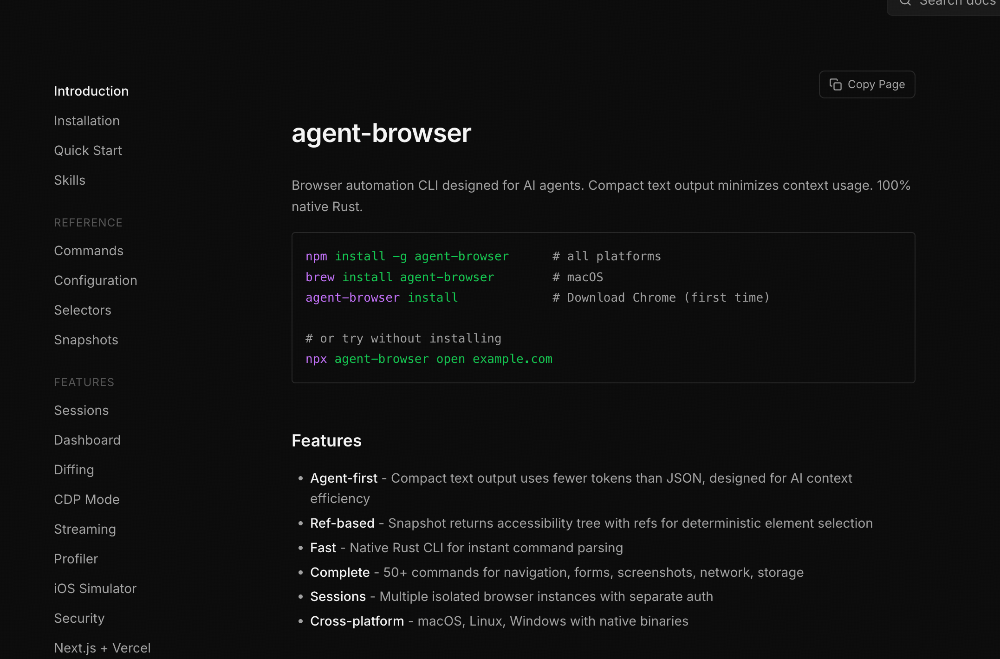
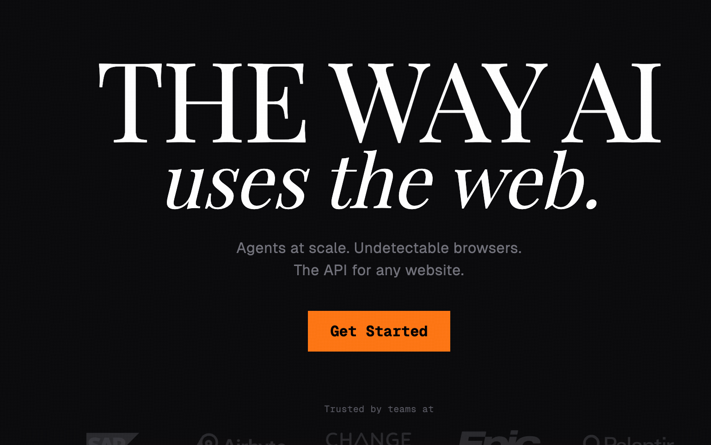
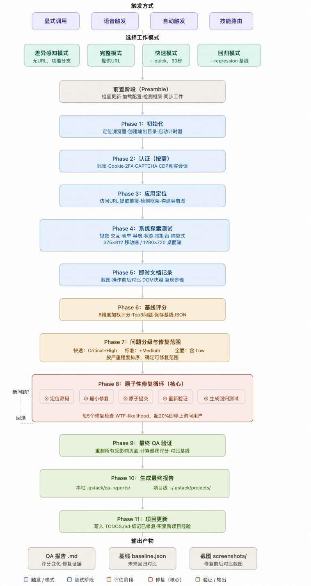

原文链接：[https://xiaobot.net/post/3d91f6b5-9a5f-418b-a538-6c045813feab](https://xiaobot.net/post/3d91f6b5-9a5f-418b-a538-6c045813feab)

上一章把用例写出来了。有结构、有优先级、能和规格对上号。

但写完是写完，跑起来是另一回事。

我们团队在开发的时候会有这样的问题——用例是有的，跑的时候要么靠人点，要么写了一堆 Playwright 脚本，改一次需求脚本跟着废一批，最后没人维护，E2E 测试就成了摆设。

这章聊的就是：上一章生成的那批用例，E2E 这层到底怎么跑？用什么工具？不同场景下，判断依据是什么。尤其是 AI 时代，跑自动化脚本简单了。

绕不开三个东西：**Agent Browser、browser-use、gstack 的 QA**。

先说清楚——这三个工具不是竞争关系，不存在"哪个最好"。它们解决的是同一个问题的三个不同侧面。搞清楚三者的世界观，比背功能表有用得多。

---

### 18.1 为什么不是「直接写 Playwright 脚本」

不是说 Playwright 不好，是在 SDD 工作流里，手搓脚本有一个根本问题：**脚本是实现，规格是意图，两者的同步成本极高。**

规格改了一个字段，脚本里选择器可能要改三处。UI 改了一层嵌套，locator（定位元素）直接废了。你写脚本的速度永远跟不上规格迭代的节奏，最后 E2E 测试变成"有也行没也行"的东西。

AI Agent 接管执行层之后，这个问题有了解法——但解法不是一个，是三条路，每条路的代价不一样。

---

### 18.2 三个工具，三种世界观

**Agent Browser：读代码的程序员**

[https://github.com/vercel-labs/agent-browser](https://github.com/vercel-labs/agent-browser)



它不看屏幕，只读 DOM。启动后解析 HTML 树，给每个可交互元素分配稳定引用——@e1、@e2……你（或者 Claude Code）告诉它"点 @e3，填 @e5，提交 @e12"，精准执行，不多不少。

Rust 写的，单操作响应 50ms 以内，**Token 消耗低。**10 步流程大概 7000 Token，这个数字很好看。

但硬盲区很清楚：**DOM 里没有的东西，它看不见。** Canvas、被遮挡的元素、纯视觉布局——抓不到，测试直接挂。另外它没有自主推理，你不告诉它每一步做什么，它什么都不会做。

一句话：极其精准的浏览器遥控器，需要有人（或 Agent）告诉它每步怎么走。

**browser-use：看屏幕的真人**

[https://browser-use.com/](https://browser-use.com/)



每次操作前先截屏，结合简化 DOM，让内置 LLM 判断"现在该点哪"，再通过 Playwright 执行。视觉感知意味着它能处理 Agent Browser 的盲区——元素遮挡、布局漂移、Canvas 交互，遇到意外弹窗会自己绕过去。

代价也直接：**慢，贵，偶尔飘。** 单用例平均 40 秒，Token 消耗是 Agent Browser 的十倍以上，视觉定位偶尔偏，同一个用例今天过明天不过，根因还不好查。

一句话：**能自主思考的视觉感知框架，每次思考都要花钱，结果有时候不稳定。**

**gstack /QA：带修复能力的 QA Lead**

[https://github.com/garrytan/gstack](https://github.com/garrytan/gstack)

这个跟前两个不是一个量级的东西——它不只是"执行测试"，而是“测试 → 发现 bug → 自动定位源码 → 最小化修复 → atomic commit → 回归验证”一条龙。

Garry Tan（YC CEO）亲自开源，gstack 23 个 slash command 里的 QA 模块，底层用真实 Chromium（Playwright 驱动）

很多人第一次用 /QA，觉得"不就是跑个浏览器测试嘛"。其实完全不是这回事——它内部是一条 11 个阶段的流水线，值得展开说清楚。

整体的流程图如下所示



**最核心的设计：diff-aware**

/QA 默认不做全量扫描。它先读 git diff main...HEAD，自动找出本次变更影响的页面和路由，**只测改动过的东西**。

这个设计很聪明。改了一个表单提交逻辑，它只测跟这个表单相关的路径，不去跑登录页、首页、设置页——测试时间砍掉一大半，结果还更精准。

**四种模式，按场景选**

/QA 有四档可以切：

差异感知模式是默认，适合日常开发验证——你刚提交了一批代码，/qa 直接跑，它自己知道该测哪里。

完整模式给一个 URL，适合上线前做完整验收——`/qa https://staging.app.com`，所有可访问页面全跑一遍。

快速模式 `--quick` 是 30 秒冒烟测试，只检查首页和前五个导航目标，确认部署没崩。

回归模式 `--regression <baseline.json>` 是我最喜欢的——第一次跑完会生成一份 `baseline.json`，下次跑的时候拿这个基线对比，哪些问题修了、哪些是新冒出来的，一目了然。版本迭代后的回归验证，这个模式最干净。

**探索测试：它在每个页面做什么**

进到每个页面之后，/QA 会跑一套标准化检查清单，不是随便点点——

视觉层：布局有没有乱、元素有没有缺、样式有没有错。

交互层：所有按钮、链接、控件挨个点，表单做空提交、无效输入、边界值测试。

导航层：所有进出路径，浏览器前进后退。

状态层：空状态、加载状态、错误状态、内容溢出。

每次交互之后还会查控制台——JS 报错不放过。

响应式这层也不省：375x812 移动端和 1280x720 桌面端两个视口都跑。

**健康评分：量化结果，不是感觉**

跑完不是给你一堆 log，而是一个 0-100 的健康评分，8 个维度加权计算：

| 维度 | 权重 |
|------|------|
| 功能完整性 | 20% |
| 用户体验 | 15% |
| 可访问性 | 15% |
| 控制台错误 | 15% |
| 视觉质量 | 10% |
| 性能 | 10% |
| 链接有效性 | 10% |
| 内容质量 | 5% |

控制台错误那个维度：0 个错误是 100 分，1-3 个降到 70，4-10 个降到 40，超过 10 个直接给 10 分——这个评分标准有点严，但现实场景里确实该这么要求。

基线分和最终分都会记录，如果修复之后分数反而下降，/QA 会发严重警告——这个保护机制很重要，防止修了一个 bug 引出两个。

**原子性修复循环：这才是最值钱的部分**

发现 bug 之后，/QA 的处理方式是：

定位源码 → 最小修复（只改直接相关的代码，不重构无关内容）→ atomic commit（格式：fix(qa): ISSUE-NNN — 简短描述）→ 重新验证 → 如果有测试框架，顺手生成对应的回归测试。

有两条硬约束值得注意：

一是**修复导致新问题立即回滚**——git revert HEAD，不留烂摊子。

二是**WTF-likelihood 自我限制**——每修复 5 个问题，它会计算一个"WTF 可能性"指标，超过 20% 就停下来问你，不会一路硬改到底。这个设计我很欣赏，说明它知道自己的边界在哪。

### 18.3 选型的核心逻辑：跟着场景走

理解了三者的世界观，选型逻辑其实很直接。

**日常快速验证 → Agent Browser**

上一章生成的用例里，操作步骤写的是"点击某按钮、填写某字段、提交表单"——DOM 里有节点，Agent Browser 精准执行，速度快、成本低。这类场景最典型：

- 规格迭代后的快速回归，确认核心流程没崩
- CI/CD 里挂的自动化测试，每次提交都跑一遍
- 企业级中后台，DOM 结构稳定，UI 改动频率低

需要注意的信号：如果用例里出现了"Canvas 交互"或"元素遮挡"，Agent Browser 进去会挂，这时候得换工具。

**视觉验收 / 动态场景 → browser-use**

用例里有这类验收标准就得用它：

- “验证弹窗未遮挡主内容”
- “移动端布局在 375px 下正常”
- “第三方嵌入页面的交互可用”

DOM 里没有这些的对应锚点，browser-use 的视觉感知是唯一解法。但用的时候要控制频率——它不适合高频回归，适合"这个版本上线前做一遍视觉验收"。

**feature branch 正式 QA → gstack /QA**

这是 /QA 最强的场景。一个 feature 开发完，准备合并或上 staging——这时候不只是想知道"测试有没有过"，还想知道"有没有 bug，bug 在哪，能不能自动修"。

直接在 Claude Code 里：

```
/qa
```

它自己读 git diff，找出改动影响的路由，全跑一遍，发现问题自动修，修完 atomic commit，再回归验证。交出来的结果是可以直接 review 的完整报告，不是一堆 log 让你自己看。

还有一个我很喜欢的用法：**先 /setup-browser-cookies 导入登录态，再跑 /qa**——登录态持久化，不用每次重新走登录流程，测试链路干净很多。

**最佳实践：三者都装，按场景自动选**

三个工具的安装成本都不高，装了之后 Claude Code 会根据上下文智能选择。我自己的工作流是：

- 日常改完代码快速确认 → Agent Browser，秒级响应
- 上线前视觉回归 → browser-use，专门跑视觉相关用例
- feature 合并前正式 QA → /qa，交完整报告

三层各司其职，互不干扰。

---

### 18.4 Agent Browser 接入：跟 Claude Code 配合的姿势

Agent Browser 在 SDD 工作流里最顺的姿势是跟 Claude Code 搭档——Claude Code 读 [spec.md](http://spec.md)，拆操作步骤，Agent Browser 执行。

一条命令装好：

```
npx skills add https://github.com/vercel-labs/agent-browser \
--skill agent-browser --agent claude-code -g -y
```

有一个配置细节值得注意：**快照过滤规则**。

默认快照会把整棵 DOM 树都吐出来，页面复杂的时候 Token 会飙。结合规格里定义的元素约束，用 --selector 或 -c/-d 参数缩小范围——只抓测试相关区域，消耗能再砍一半。

这一步很多人跳过，后来看账单才想起来。

---

### 18.5 gstack /QA 接入：一次 setup，长期受益

/QA 是 gstack 包的一部分，setup 比 Agent Browser 稍重，但装一次之后基本不用再动：

```
git clone --single-branch --depth 1 \
https://github.com/garrytan/gstack.git ~/.claude/skills/gstack \
&& cd ~/.claude/skills/gstack && ./setup
```

装完在项目根目录的 CLAUDE.md 里加一段：

```
/gstack
Use /browse from gstack for all web browsing. Never use mcp__claude-in-chrome__* tools.
Available skills: /qa, /qa-only, /browse, /open-gstack-browser ...
```

Claude Code 识别到之后，/qa、/qa-only、/browse 就全部可用了。

有一点要注意：**运行前 git working tree 必须干净**。有未提交的改动，/QA 会让你先 commit 或 stash，这不是 bug，是设计——防止修复逻辑和现有改动混在一起，提交记录乱掉。

如果只想要报告、不想让它自动改代码，用 /qa-only，这个模式只出 bug 报告，不动源码。

---

### 18.6 跑完之后：结果怎么和规格对上

E2E 跑完有结果，但结果本身不等于校验完成。

SDD 框架下，测试结果需要和规格里的验收标准一一对应——不只是"通过/失败"，还得能回答"这条用例对应的是 spec 里哪个 Scenario，THEN 里要求的状态变化是否真的发生了"。

我的做法是在上一章生成用例的时候，给每条用例打上规格节点的 ID 标注。Agent Browser 执行完日志里能看到每步操作的元素引用和结果；/QA 跑完直接出健康报告，维度齐全；browser-use 开录制，失败了回看视频。三种输出都能和规格节点对照。

失败了，先问这个问题：**是代码问题、工具偏差，还是规格生成的有歧义？**

**三种情况处理方式完全不同。如果是规格含糊导致的，要改的不是代码，是规格——测试失败反哺规格迭代，这是 SDD 闭环里被忽视最多的一步。**
